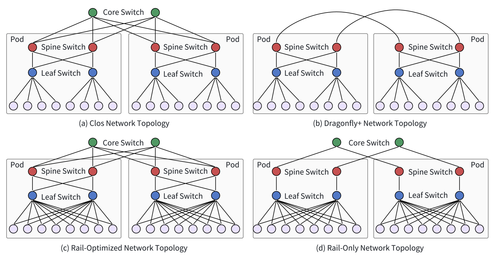
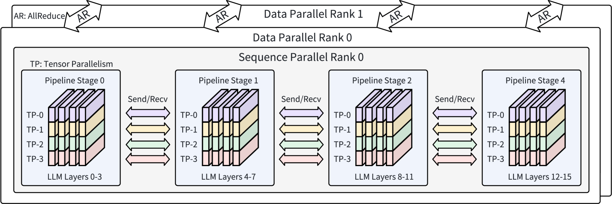

# 分布式基础设施上的大型语言模型高效训练：调查报告

发布时间：2024年07月29日

`LLM理论` `人工智能` `计算机系统`

> Efficient Training of Large Language Models on Distributed Infrastructures: A Survey

# 摘要

> GPT和LLaMA等大型语言模型正以其高级功能引领AI行业的变革。然而，训练这些模型所需的巨大GPU资源和时间，对可扩展性、效率和可靠性构成了挑战。本调查深入分析了LLM训练系统的最新技术，包括AI加速器、网络、存储和调度的创新应用。同时，也探讨了并行策略和分布式训练中的计算、通信及内存优化。此外，还涉及了如何在长时间训练中确保系统稳定性的方法。通过这些分析，本调查旨在为提升LLM训练系统性能和解决现有难题提供洞见。值得注意的是，传统数字计算系统在应对LLM的计算需求上存在局限，这促使我们寻求如光学计算和网络等创新技术。

> Large Language Models (LLMs) like GPT and LLaMA are revolutionizing the AI industry with their sophisticated capabilities. Training these models requires vast GPU clusters and significant computing time, posing major challenges in terms of scalability, efficiency, and reliability. This survey explores recent advancements in training systems for LLMs, including innovations in training infrastructure with AI accelerators, networking, storage, and scheduling. Additionally, the survey covers parallelism strategies, as well as optimizations for computation, communication, and memory in distributed LLM training. It also includes approaches of maintaining system reliability over extended training periods. By examining current innovations and future directions, this survey aims to provide valuable insights towards improving LLM training systems and tackling ongoing challenges. Furthermore, traditional digital circuit-based computing systems face significant constraints in meeting the computational demands of LLMs, highlighting the need for innovative solutions such as optical computing and optical networks.

[Arxiv](https://arxiv.org/abs/2407.20018)