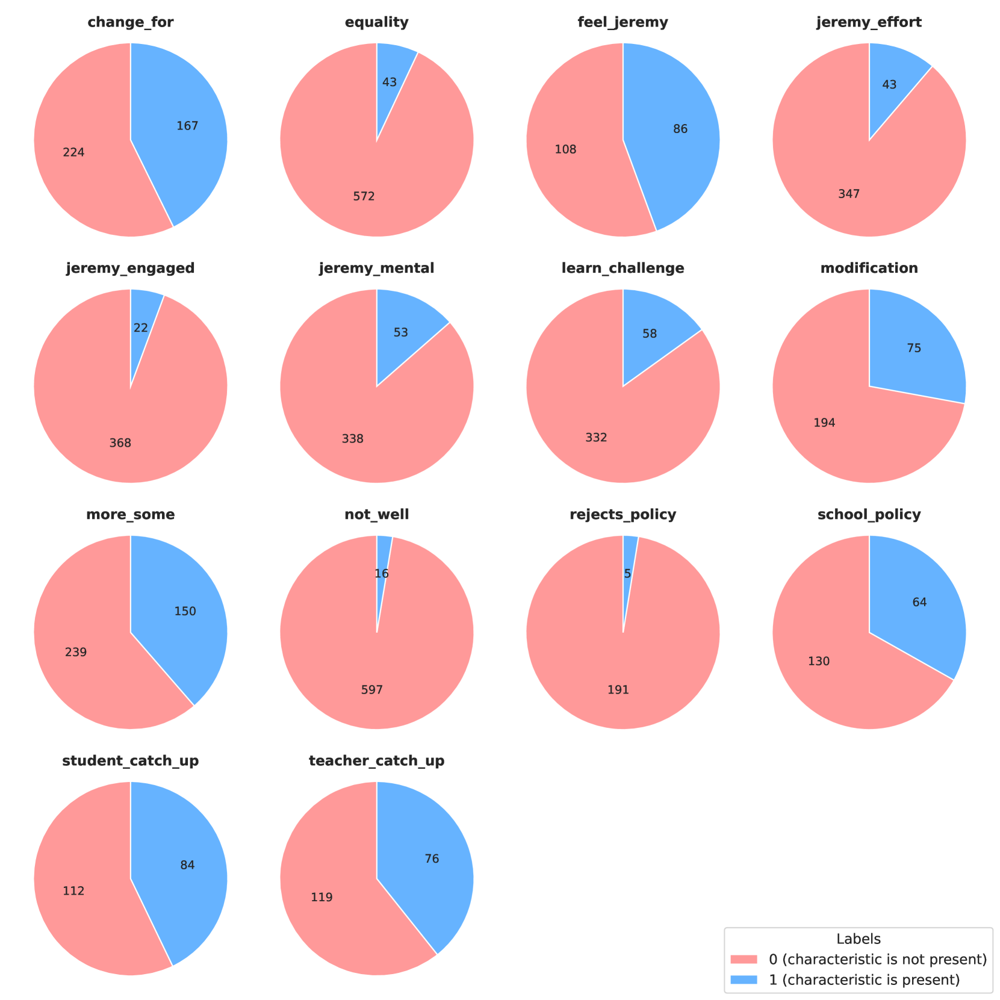
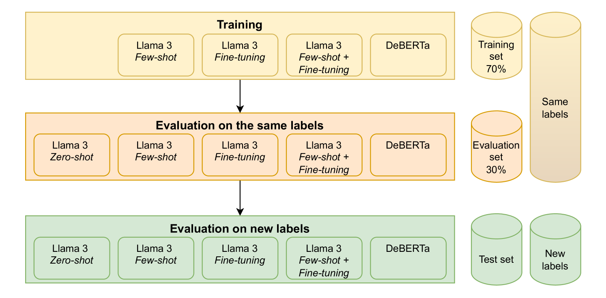

# 探究大型语言模型在教师模拟自动分析中的应用

发布时间：2024年07月29日

`LLM应用` `人工智能`

> Evaluating Large Language Models for automatic analysis of teacher simulations

# 摘要

> 数字模拟（DS）通过对话提示，为用户与虚拟代理的互动创造了一个安全的学习环境，特别适合培训教师候选人应对真实课堂挑战。然而，模拟中的开放式问题虽能激发教师候选人的思考，却增加了自动响应分析的难度。为此，我们测试了DeBERTaV3和Llama 3等大型语言模型（LLM），以识别教师教育DS响应中的用户行为特征。实验显示，LLM的性能因识别特征的不同而有显著差异，且DeBERTaV3在识别新特征时性能下降明显。相反，Llama 3在检测新特征方面表现更佳，性能更为稳定。因此，在需要根据模拟或教育目标引入新特征的DS中，Llama 3是更佳选择。这些发现为其他研究者在DS中应用LLM进行自动评估提供了重要指导。

> Digital Simulations (DS) provide safe environments where users interact with an agent through conversational prompts, providing engaging learning experiences that can be used to train teacher candidates in realistic classroom scenarios. These simulations usually include open-ended questions, allowing teacher candidates to express their thoughts but complicating an automatic response analysis. To address this issue, we have evaluated Large Language Models (LLMs) to identify characteristics (user behaviors) in the responses of DS for teacher education. We evaluated the performance of DeBERTaV3 and Llama 3, combined with zero-shot, few-shot, and fine-tuning. Our experiments discovered a significant variation in the LLMs' performance depending on the characteristic to identify. Additionally, we noted that DeBERTaV3 significantly reduced its performance when it had to identify new characteristics. In contrast, Llama 3 performed better than DeBERTaV3 in detecting new characteristics and showing more stable performance. Therefore, in DS where teacher educators need to introduce new characteristics because they change depending on the simulation or the educational objectives, it is more recommended to use Llama 3. These results can guide other researchers in introducing LLMs to provide the highly demanded automatic evaluations in DS.

[Arxiv](https://arxiv.org/abs/2407.20360)