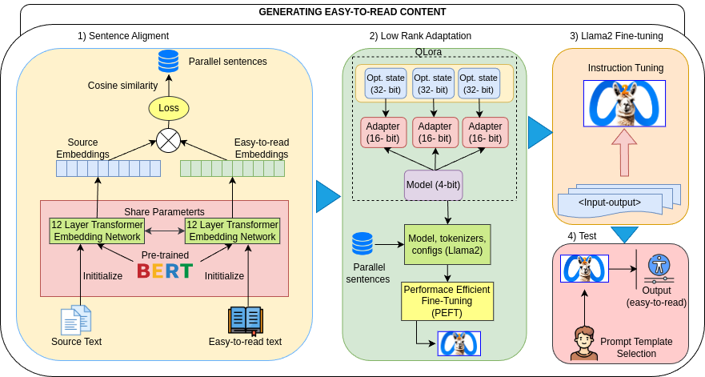

# 探索如何利用大型语言模型生成通俗易懂的内容

发布时间：2024年07月29日

`LLM应用` `辅助技术`

> Exploring Large Language Models to generate Easy to Read content

# 摘要

> 确保文本的可访问性和可理解性至关重要，尤其是对那些在获取信息时遇到困难的认知障碍和智力障碍者。为此，“易读”和“简明语言”等指南试图简化复杂文本，但标准化这些指南仍面临挑战，常需人工参与。本研究探索了如何运用AI和NLP技术，特别是通过大型语言模型（LLM），系统地将西班牙语文本转化为易读格式。我们创建了一个专为易读格式设计的西班牙语平行语料库，为文本简化系统的训练和测试提供了宝贵资源。此外，我们还通过微调和测试Llama2模型，进行了多项文本简化实验，以生成易读内容。在专家的指导下，我们对自动简化的文本进行了定性评估。这项研究不仅推进了文本可访问性，还展示了利用LLM的有效策略，同时注重能源的合理使用。

> Ensuring text accessibility and understandability are essential goals, particularly for individuals with cognitive impairments and intellectual disabilities, who encounter challenges in accessing information across various mediums such as web pages, newspapers, administrative tasks, or health documents. Initiatives like Easy to Read and Plain Language guidelines aim to simplify complex texts; however, standardizing these guidelines remains challenging and often involves manual processes. This work presents an exploratory investigation into leveraging Artificial Intelligence (AI) and Natural Language Processing (NLP) approaches to systematically simplify Spanish texts into Easy to Read formats, with a focus on utilizing Large Language Models (LLMs) for simplifying texts, especially in generating Easy to Read content. The study contributes a parallel corpus of Spanish adapted for Easy To Read format, which serves as a valuable resource for training and testing text simplification systems. Additionally, several text simplification experiments using LLMs and the collected corpus are conducted, involving fine-tuning and testing a Llama2 model to generate Easy to Read content. A qualitative evaluation, guided by an expert in text adaptation for Easy to Read content, is carried out to assess the automatically simplified texts. This research contributes to advancing text accessibility for individuals with cognitive impairments, highlighting promising strategies for leveraging LLMs while responsibly managing energy usage.

[Arxiv](https://arxiv.org/abs/2407.20046)