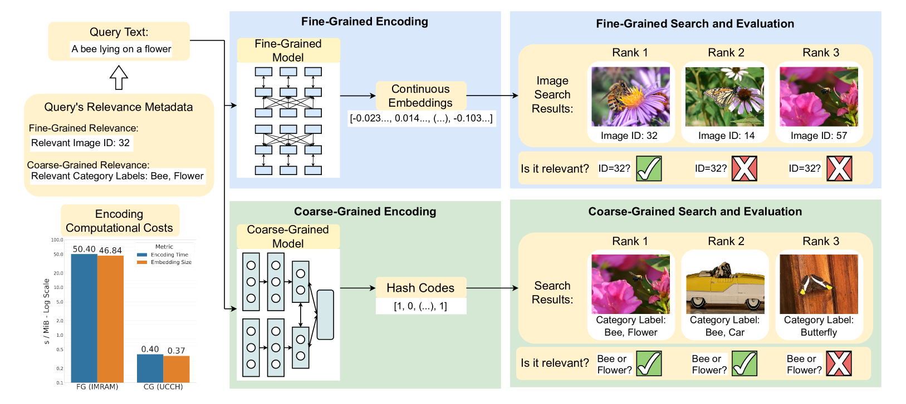
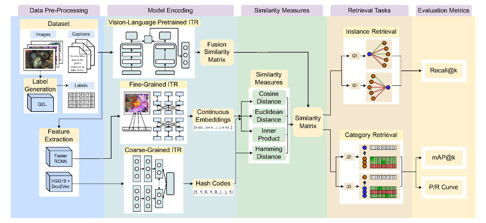
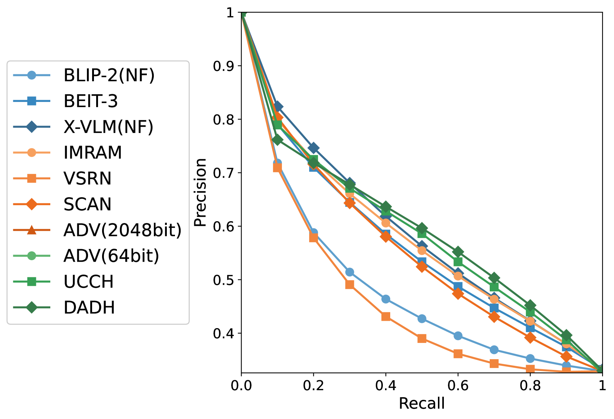
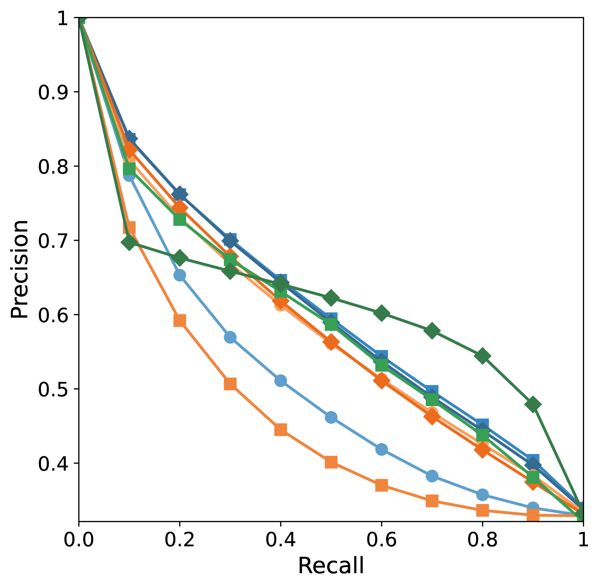
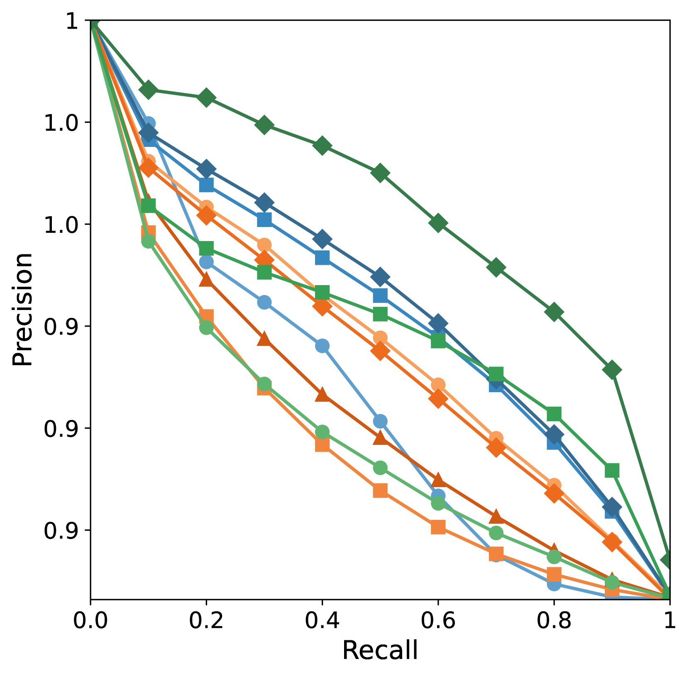
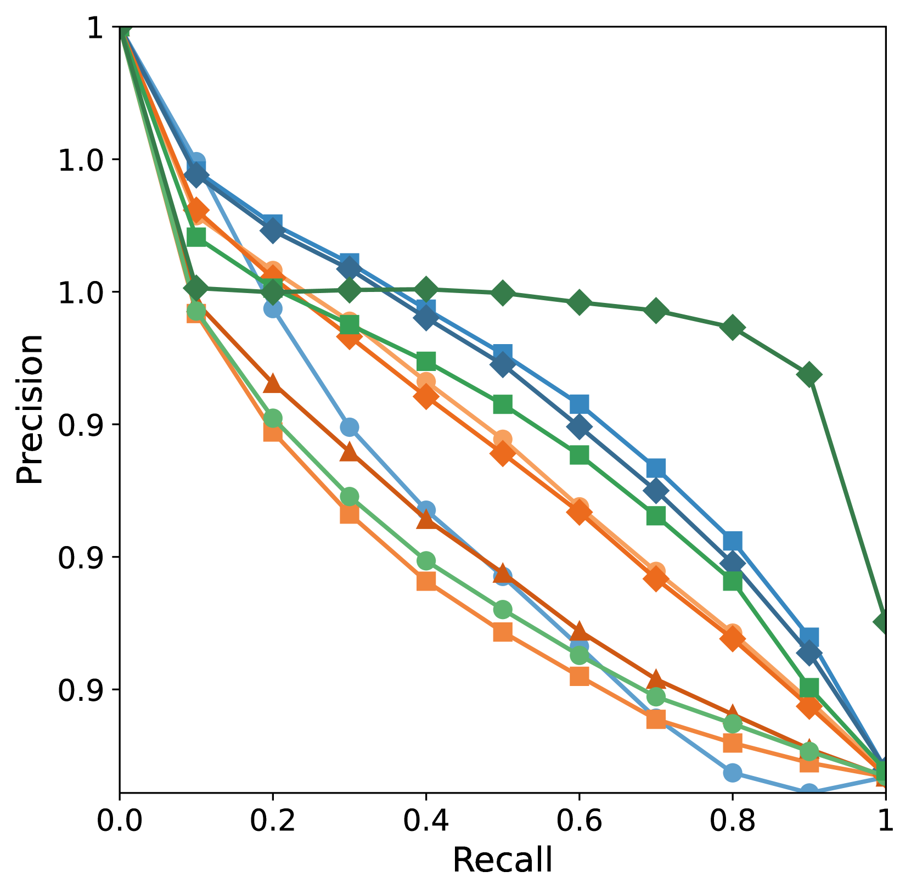
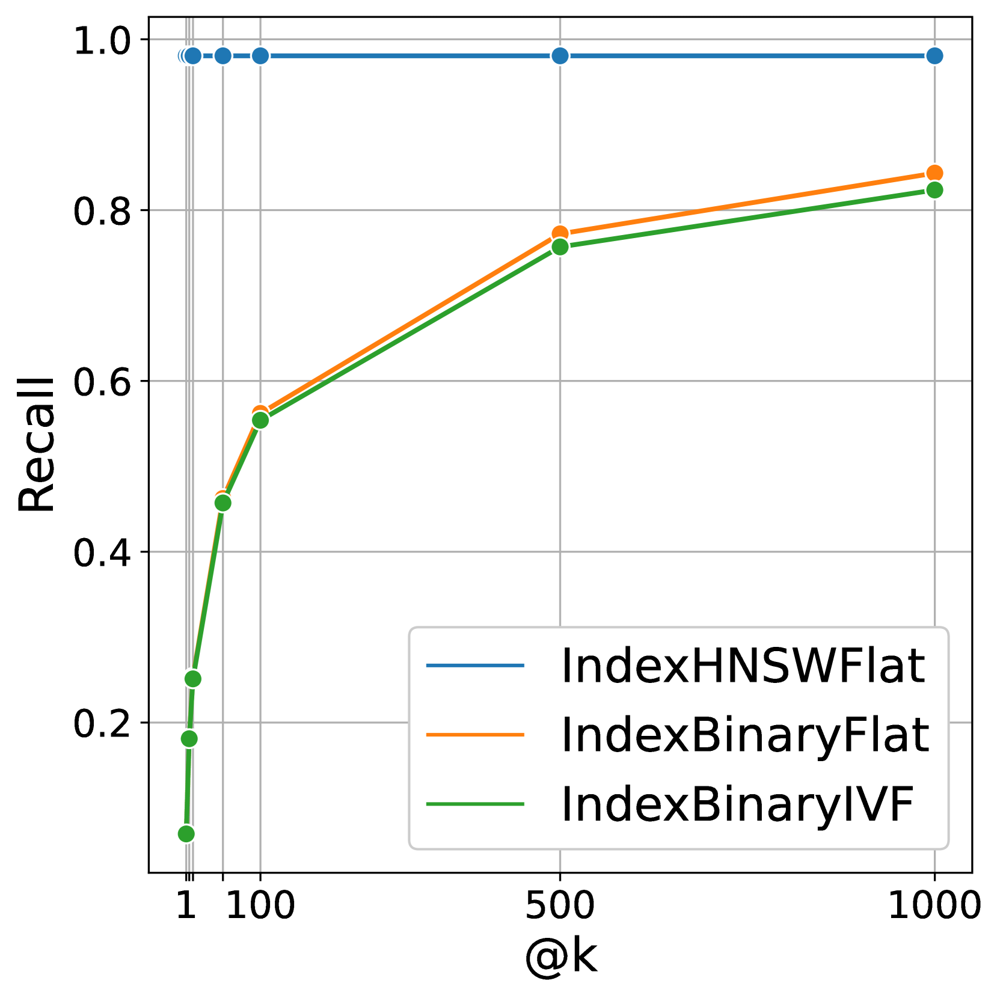
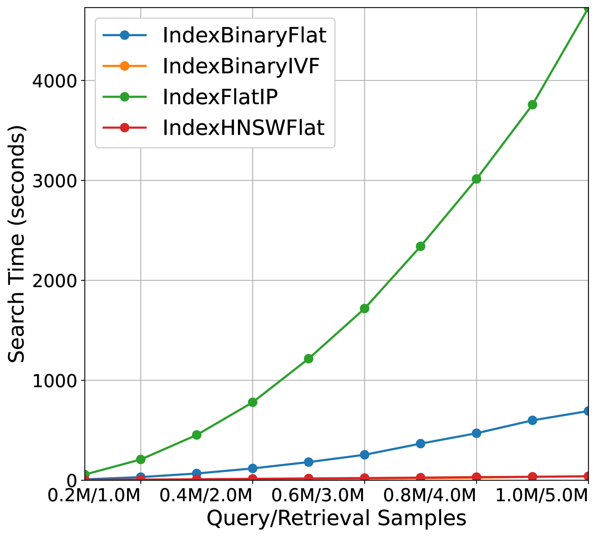

# FiCo-ITR：连接细粒度与粗粒度图像-文本检索，助力比较性能分析

发布时间：2024年07月29日

`LLM应用` `计算机视觉`

> FiCo-ITR: bridging fine-grained and coarse-grained image-text retrieval for comparative performance analysis

# 摘要

> 在图像-文本检索领域，细粒度实例级检索借助大规模视觉-语言预训练实现了高准确性，但计算复杂度增加；而粗粒度类别级检索则通过跨模态哈希优先考虑效率，尽管检索性能有所牺牲。由于方法差异，文献中很少直接比较这两种模型，导致缺乏关于它们性能-效率权衡的实证数据。本文通过引入\texttt{FiCo-ITR}库，标准化了评估方法，便于直接比较。我们评估了代表性模型，分析了不同数据规模下的精度、召回率和计算复杂性，揭示了近期FG和CG模型在性能-效率权衡上的新见解，指出了各自的优缺点。这些发现为模型选择提供了依据，并指明了未来研究混合系统的方向，以融合FG和CG方法的优势。

> In the field of Image-Text Retrieval (ITR), recent advancements have leveraged large-scale Vision-Language Pretraining (VLP) for Fine-Grained (FG) instance-level retrieval, achieving high accuracy at the cost of increased computational complexity. For Coarse-Grained (CG) category-level retrieval, prominent approaches employ Cross-Modal Hashing (CMH) to prioritise efficiency, albeit at the cost of retrieval performance. Due to differences in methodologies, FG and CG models are rarely compared directly within evaluations in the literature, resulting in a lack of empirical data quantifying the retrieval performance-efficiency tradeoffs between the two. This paper addresses this gap by introducing the \texttt{FiCo-ITR} library, which standardises evaluation methodologies for both FG and CG models, facilitating direct comparisons. We conduct empirical evaluations of representative models from both subfields, analysing precision, recall, and computational complexity across varying data scales. Our findings offer new insights into the performance-efficiency trade-offs between recent representative FG and CG models, highlighting their respective strengths and limitations. These findings provide the foundation necessary to make more informed decisions regarding model selection for specific retrieval tasks and highlight avenues for future research into hybrid systems that leverage the strengths of both FG and CG approaches.

[Arxiv](https://arxiv.org/abs/2407.20114)