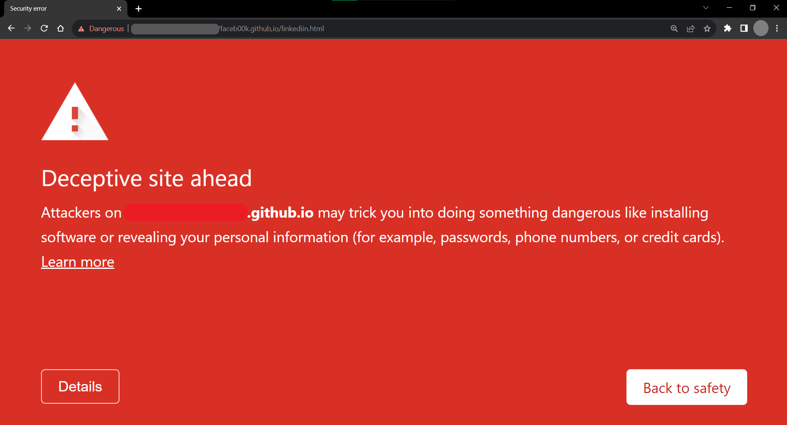
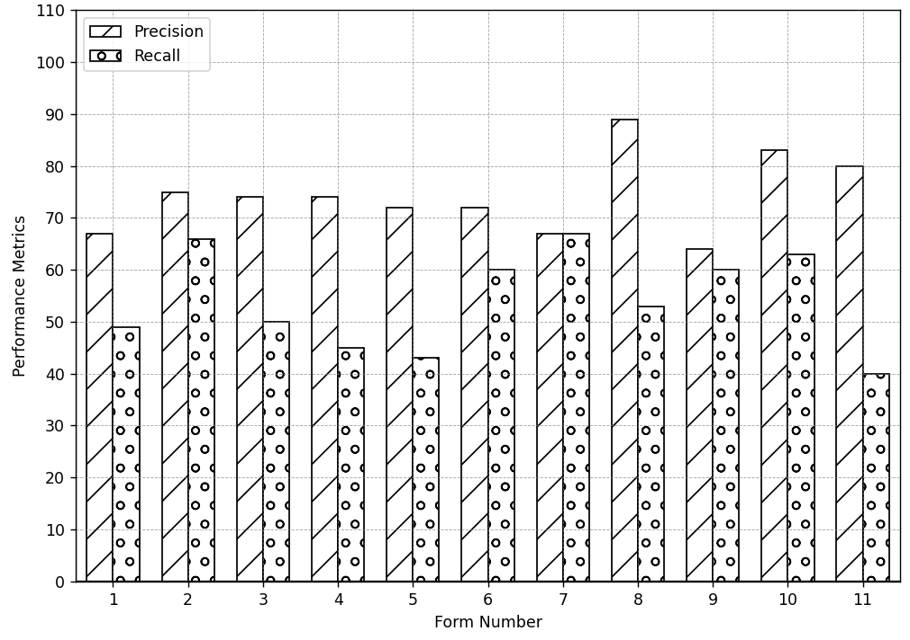
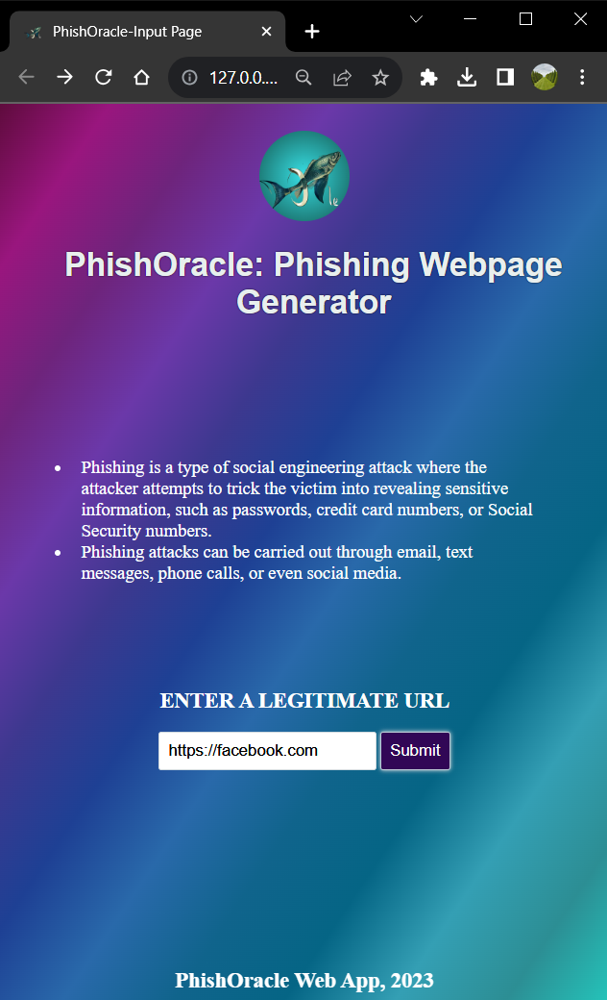
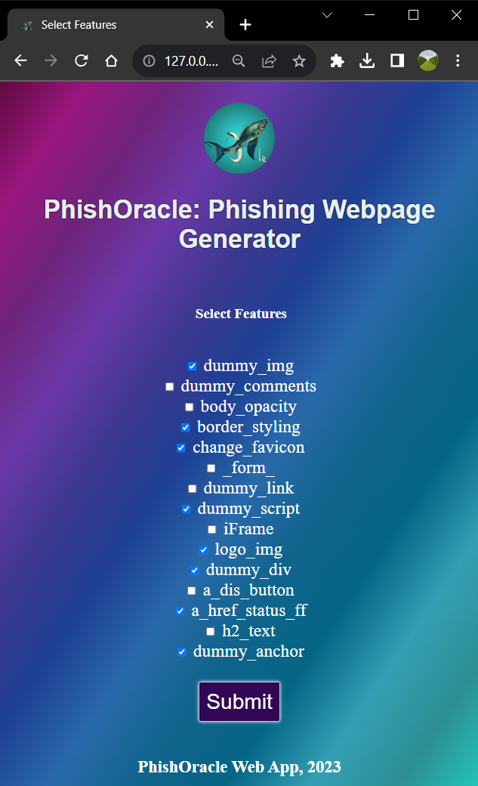

# 从机器学习到大型语言模型：探究钓鱼网页检测模型在对抗攻击下的稳健性

发布时间：2024年07月29日

`LLM应用` `网络安全` `机器学习`

> From ML to LLM: Evaluating the Robustness of Phishing Webpage Detection Models against Adversarial Attacks

# 摘要

> 网络钓鱼攻击严重威胁网络安全，旨在诱骗用户泄露敏感信息。尽管机器学习和深度学习的发展催生了多种钓鱼网页检测工具，但这些模型仍易受对抗性攻击。因此，评估这些工具对抗钓鱼网页的鲁棒性至关重要。现有工具的数据集缺乏多样性，仅包含少数品牌的预设钓鱼网页。为解决这一问题，我们推出了PhishOracle，一款通过嵌入多样化钓鱼特征至合法网页来生成对抗性钓鱼网页的工具。我们测试了Stack模型和Phishpedia在识别PhishOracle生成的钓鱼网页时的表现，并研究了商业大型语言模型Gemini Pro Vision在对抗性攻击中的鲁棒性。用户研究显示，PhishOracle生成的许多钓鱼网页能成功欺骗用户和现有检测模型，但Gemini Pro Vision表现稳健。此外，我们还开发了PhishOracle网页应用，用户可输入合法网址，选择钓鱼特征，生成相应钓鱼网页。所有资源均已公开在GitHub上。

> Phishing attacks attempt to deceive users into stealing sensitive information, posing a significant cybersecurity threat. Advances in machine learning (ML) and deep learning (DL) have led to the development of numerous phishing webpage detection solutions, but these models remain vulnerable to adversarial attacks. Evaluating their robustness against adversarial phishing webpages is essential. Existing tools contain datasets of pre-designed phishing webpages for a limited number of brands, and lack diversity in phishing features.
  To address these challenges, we develop PhishOracle, a tool that generates adversarial phishing webpages by embedding diverse phishing features into legitimate webpages. We evaluate the robustness of two existing models, Stack model and Phishpedia, in classifying PhishOracle-generated adversarial phishing webpages. Additionally, we study a commercial large language model, Gemini Pro Vision, in the context of adversarial attacks. We conduct a user study to determine whether PhishOracle-generated adversarial phishing webpages deceive users. Our findings reveal that many PhishOracle-generated phishing webpages evade current phishing webpage detection models and deceive users, but Gemini Pro Vision is robust to the attack. We also develop the PhishOracle web app, allowing users to input a legitimate URL, select relevant phishing features and generate a corresponding phishing webpage. All resources are publicly available on GitHub.

[Arxiv](https://arxiv.org/abs/2407.20361)