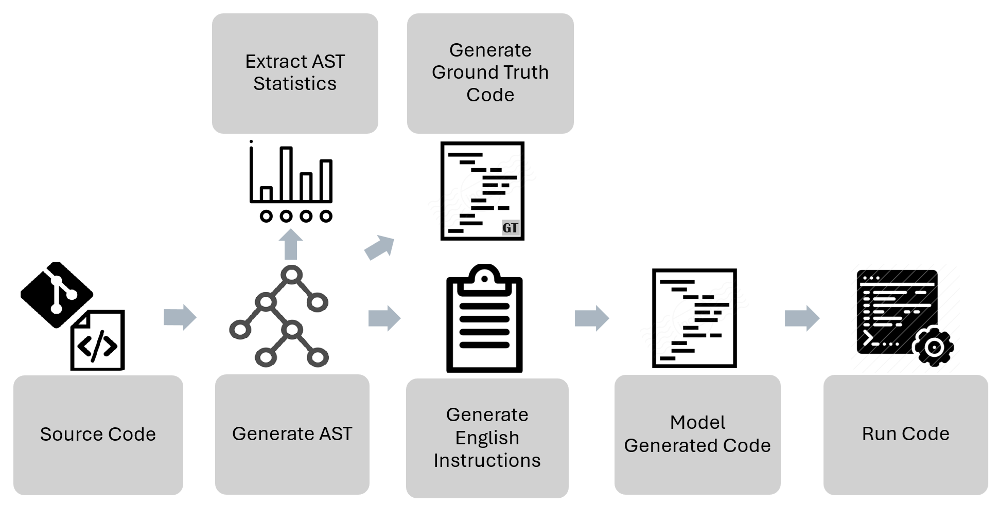

# Infinitum中生成新颖代码测试

发布时间：2024年07月29日

`LLM应用` `软件开发` `人工智能`

> Generating Unseen Code Tests In Infinitum

# 摘要

> LLM 广泛应用于包括编码在内的多种任务。评估 LLM 对特定任务的适用性至关重要。传统上，我们通过基准测试来评估 LLM，但这种方法存在训练数据泄露的风险。为此，我们开发了一种新方法，创建跨编程语言和任务的基准变体，并可应用于内部代码库，有效避免训练数据泄露。我们设计了一个名为 \textit{auto-regression} 的基准，专门用于 Python 中的文本到代码生成任务，旨在辅助调试和监控模型变化，确保 LLM 的稳定性和可靠性。

> Large Language Models (LLMs) are used for many tasks, including those related to coding. An important aspect of being able to utilize LLMs is the ability to assess their fitness for specific usages. The common practice is to evaluate LLMs against a set of benchmarks. While benchmarks provide a sound foundation for evaluation and comparison of alternatives, they suffer from the well-known weakness of leaking into the training data \cite{Xu2024Benchmarking}. We present a method for creating benchmark variations that generalize across coding tasks and programming languages, and may also be applied to in-house code bases. Our approach enables ongoing generation of test-data thus mitigating the leaking into the training data issue. We implement one benchmark, called \textit{auto-regression}, for the task of text-to-code generation in Python. Auto-regression is specifically created to aid in debugging and in tracking model generation changes as part of the LLM regression testing process.

[Arxiv](https://arxiv.org/abs/2407.19772)