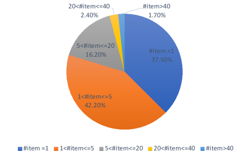

# 电子商务搜索中的生成检索与偏好优化

发布时间：2024年07月29日

`RAG` `搜索引擎`

> Generative Retrieval with Preference Optimization for E-commerce Search

# 摘要

> 生成式检索通过直接生成相关文档标识符，为文档检索带来了革命性变革。在大语言模型中，这一范式在表示和泛化能力上展现出巨大潜力。但在电商搜索中，它面临诸多挑战，如从简短查询生成复杂商品标题、标题语言顺序混乱、长尾查询及结果解释难题。为此，我们设计了“偏好优化生成式检索”框架，旨在精准匹配自回归模型与目标数据，通过约束束搜索生成商品。我们用多跨度标识符简化标题生成，结合点击数据优化人类偏好，采用受限搜索提升结果解释性。实验和在线测试均证实，该框架在提升转化收益上表现卓越。

> Generative retrieval introduces a groundbreaking paradigm to document retrieval by directly generating the identifier of a pertinent document in response to a specific query. This paradigm has demonstrated considerable benefits and potential, particularly in representation and generalization capabilities, within the context of large language models. However, it faces significant challenges in E-commerce search scenarios, including the complexity of generating detailed item titles from brief queries, the presence of noise in item titles with weak language order, issues with long-tail queries, and the interpretability of results. To address these challenges, we have developed an innovative framework for E-commerce search, called generative retrieval with preference optimization. This framework is designed to effectively learn and align an autoregressive model with target data, subsequently generating the final item through constraint-based beam search. By employing multi-span identifiers to represent raw item titles and transforming the task of generating titles from queries into the task of generating multi-span identifiers from queries, we aim to simplify the generation process. The framework further aligns with human preferences using click data and employs a constrained search method to identify key spans for retrieving the final item, thereby enhancing result interpretability. Our extensive experiments show that this framework achieves competitive performance on a real-world dataset, and online A/B tests demonstrate the superiority and effectiveness in improving conversion gains.

[Arxiv](https://arxiv.org/abs/2407.19829)