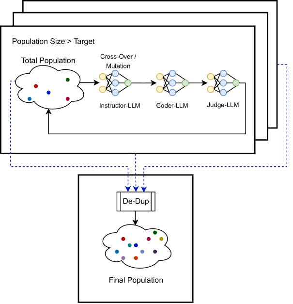
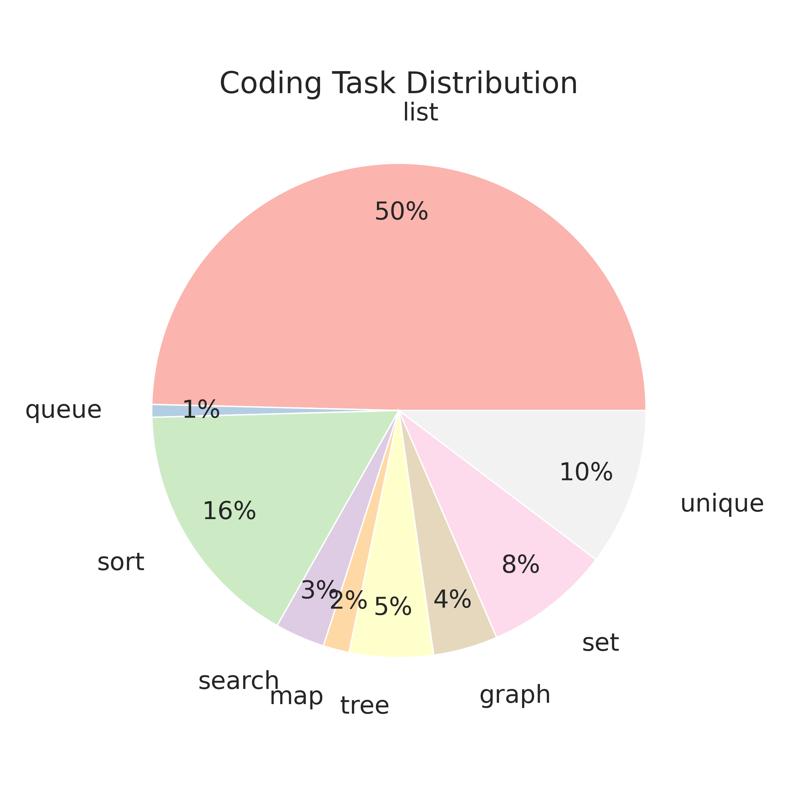
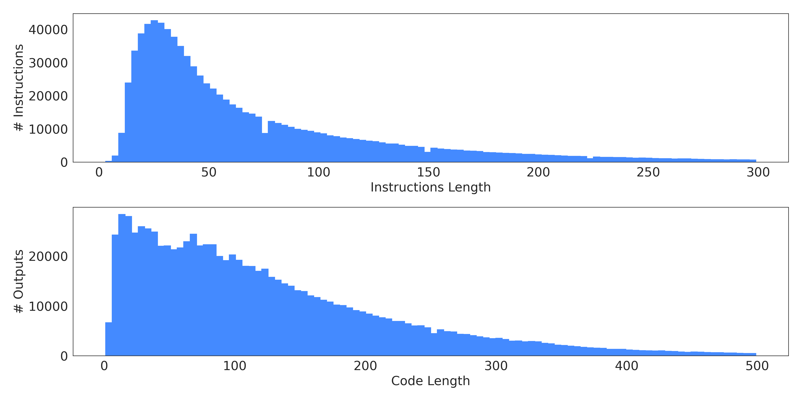

# 遗传指导：扩展大型语言模型编码指令的合成生成规模

发布时间：2024年07月29日

`LLM应用` `软件开发` `人工智能`

> Genetic Instruct: Scaling up Synthetic Generation of Coding Instructions for Large Language Models

# 摘要

> 大型语言模型（LLM）在指令对齐时面临数据集创建的难题，尤其是在编码这类专家依赖任务中，成本高昂。为此，我们提出一种创新方法：利用另一个LLM合成数据。本文介绍的Genetic-Instruct算法，通过模拟进化过程，从少量种子生成大量合成指令，有效提升代码生成能力。实验证明，经合成样本微调的LLM在代码生成准确性上大幅超越传统基线。

> Large Language Models (LLMs) rely on instruction samples for alignment, but creating these datasets poses challenges, particularly in expert-dependent tasks like coding, which can be cost-prohibitive. One approach to mitigate these challenges is synthesizing data using another LLM. In this paper, we introduce a scalable method for generating synthetic instructions to enhance the code generation capability of LLMs. The proposed algorithm, Genetic-Instruct, mimics evolutionary processes, utilizing self-instruction to create numerous synthetic samples from a limited number of seeds. Genetic-Instruct is designed for efficient scaling of the generation process. Fine-tuning multiple coding LLMs with the synthetic samples demonstrates a significant improvement in their code generation accuracy compared to the baselines.

[Arxiv](https://arxiv.org/abs/2407.21077)