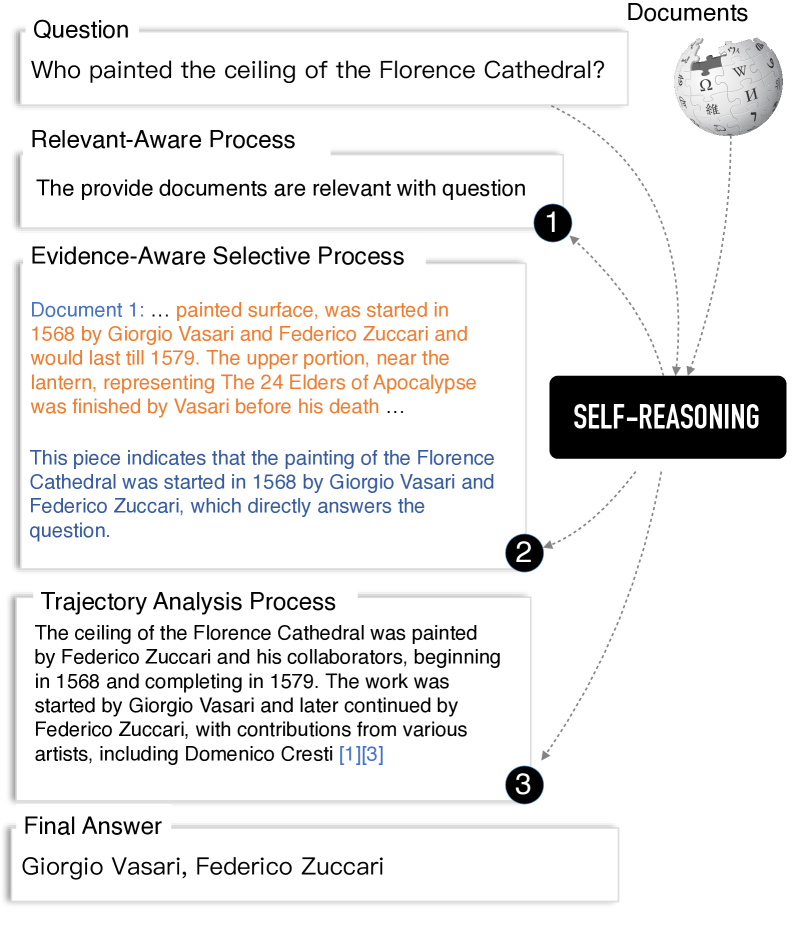
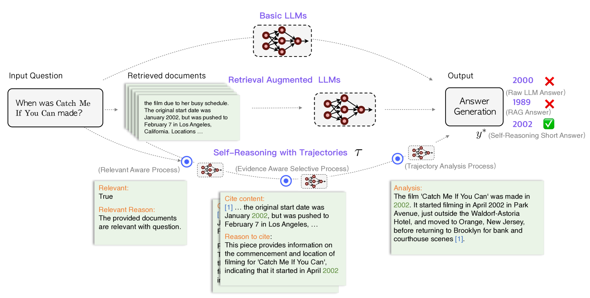
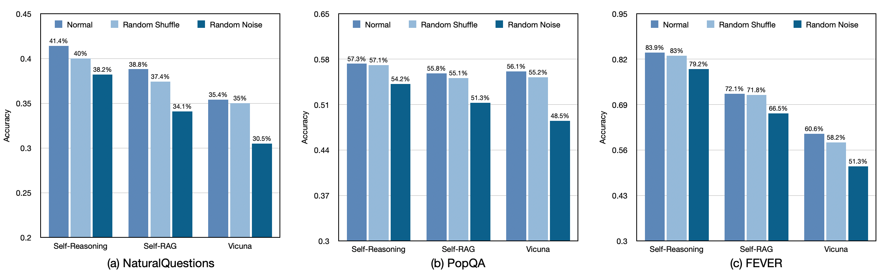
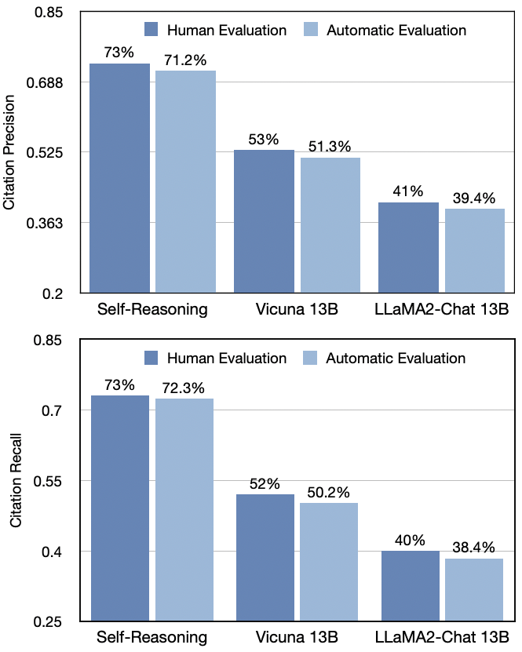
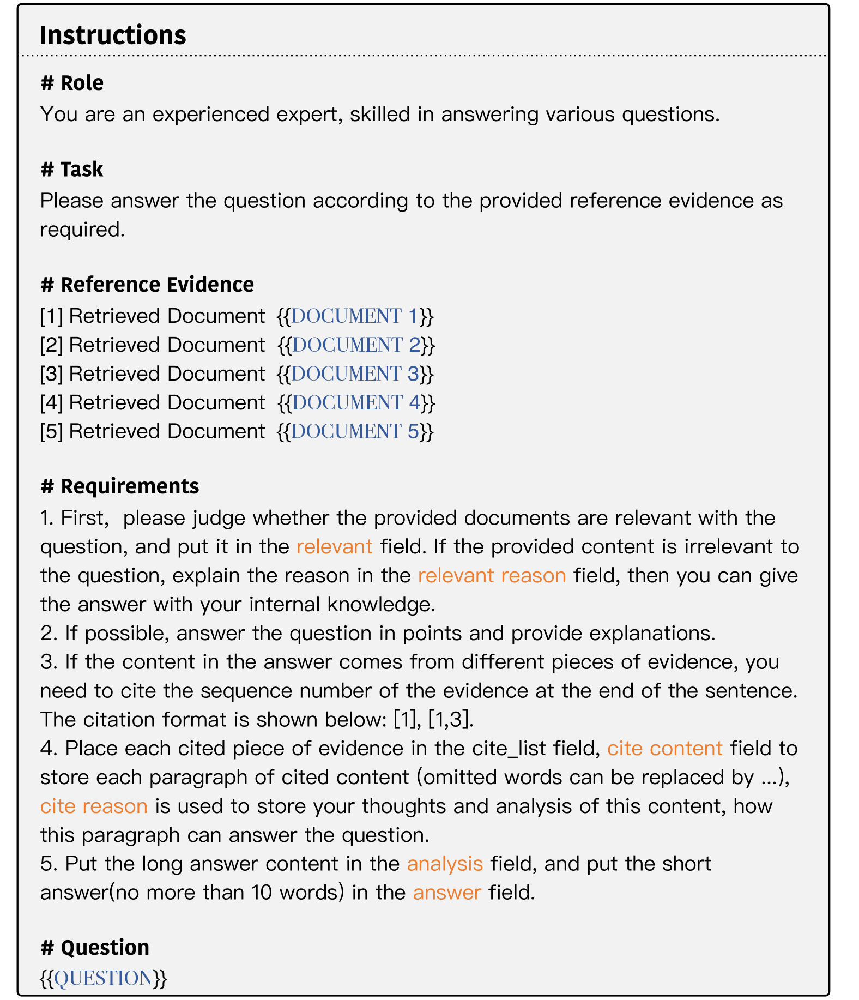
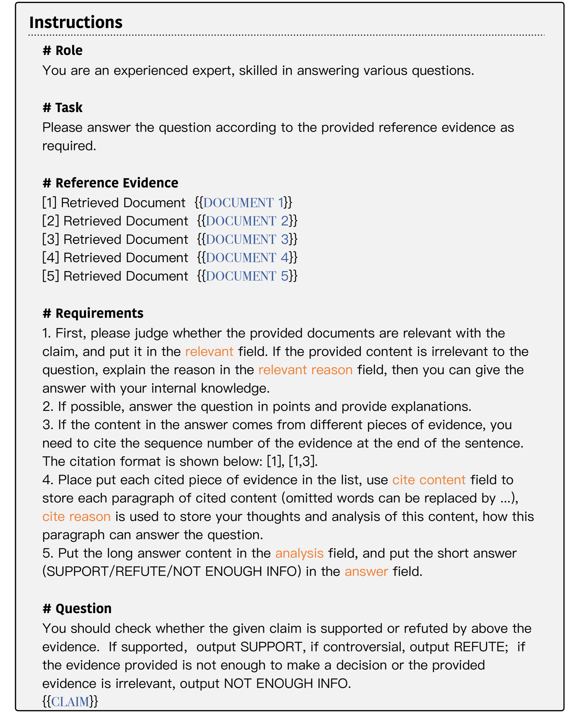
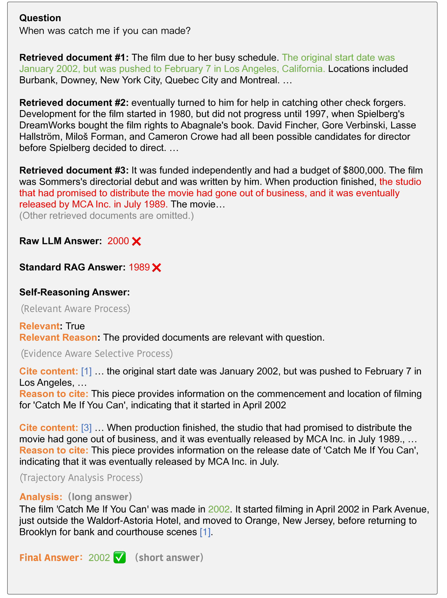

# 自我推理助力检索增强语言模型提升性能

发布时间：2024年07月29日

`RAG` `人工智能` `语言模型`

> Improving Retrieval Augmented Language Model with Self-Reasoning

# 摘要

> 检索增强语言模型（RALM）通过整合外部知识，在知识密集型任务中表现出色，有效减少了大型语言模型（LLM）中的事实幻觉。然而，RALM的实施仍面临可靠性及可追溯性的挑战。例如，无关文档的检索可能产生无益响应，甚至损害LLM性能，而输出中缺乏适当引用增加了验证模型可信度的难度。为此，我们提出了一种创新的自推理框架，旨在提升RALM的可靠性与可追溯性，核心在于利用LLM自身的推理轨迹。该框架包括三个过程：相关性感知、证据选择及轨迹分析。我们在四个公共数据集上验证了框架的有效性，结果显示，我们的方法不仅超越了现有顶尖模型，还能与GPT-4媲美，且仅用2,000个训练样本即达到此效果。

> The Retrieval-Augmented Language Model (RALM) has shown remarkable performance on knowledge-intensive tasks by incorporating external knowledge during inference, which mitigates the factual hallucinations inherited in large language models (LLMs). Despite these advancements, challenges persist in the implementation of RALMs, particularly concerning their reliability and traceability. To be specific, the irrelevant document retrieval may result in unhelpful response generation or even deteriorate the performance of LLMs, while the lack of proper citations in generated outputs complicates efforts to verify the trustworthiness of the models. To this end, we propose a novel self-reasoning framework aimed at improving the reliability and traceability of RALMs, whose core idea is to leverage reasoning trajectories generated by the LLM itself. The framework involves constructing self-reason trajectories with three processes: a relevance-aware process, an evidence-aware selective process, and a trajectory analysis process. We have evaluated our framework across four public datasets (two short-form QA datasets, one long-form QA dataset, and one fact verification dataset) to demonstrate the superiority of our method, which can outperform existing state-of-art models and can achieve comparable performance with GPT-4, while only using 2,000 training samples.

[Arxiv](https://arxiv.org/abs/2407.19813)