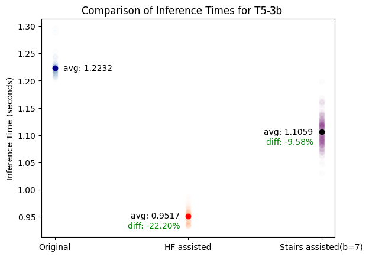

# 借助“楼梯”辅助的贪婪生成技术，大语言模型的推理速度得以提升。

发布时间：2024年07月29日

`LLM理论` `信息技术`

> Inference acceleration for large language models using "stairs" assisted greedy generation

# 摘要

> 大型语言模型（LLM）虽预测能力出众，却耗费大量资源。随着其广泛应用，资源需求的微小降低亦能助力环保。而小型模型虽节省资源，却可能影响准确性。本研究提出“楼梯”辅助贪婪生成法，结合小模型的速度优势、大模型的批量预测及“楼梯”验证，有效提速预测生成，同时保持准确性，推理时间节省高达17.24%。

> Large Language Models (LLMs) with billions of parameters are known for their impressive predicting capabilities but require lots of resources to run. With their massive rise in popularity, even a small reduction in required resources could have an impact on environment. On the other hand, smaller models require fewer resources but may sacrifice accuracy. In this work, we are proposing an implementation of ``stairs'' assisted greedy generation. It is a modified assisted generation methodology that makes use of a smaller model's fast generation, large model's batch prediction, and "stairs" validation in order to achieve a speed up in prediction generation. Results show between 9.58 and 17.24 percent inference time reduction compared to a stand-alone large LLM prediction in a text generation task without a loss in accuracy.

[Arxiv](https://arxiv.org/abs/2407.19947)