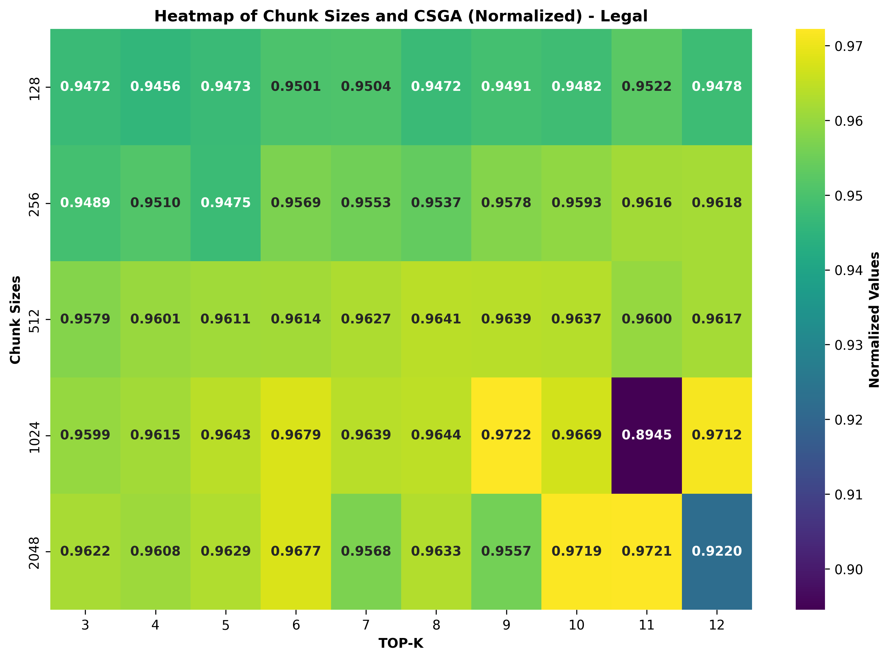
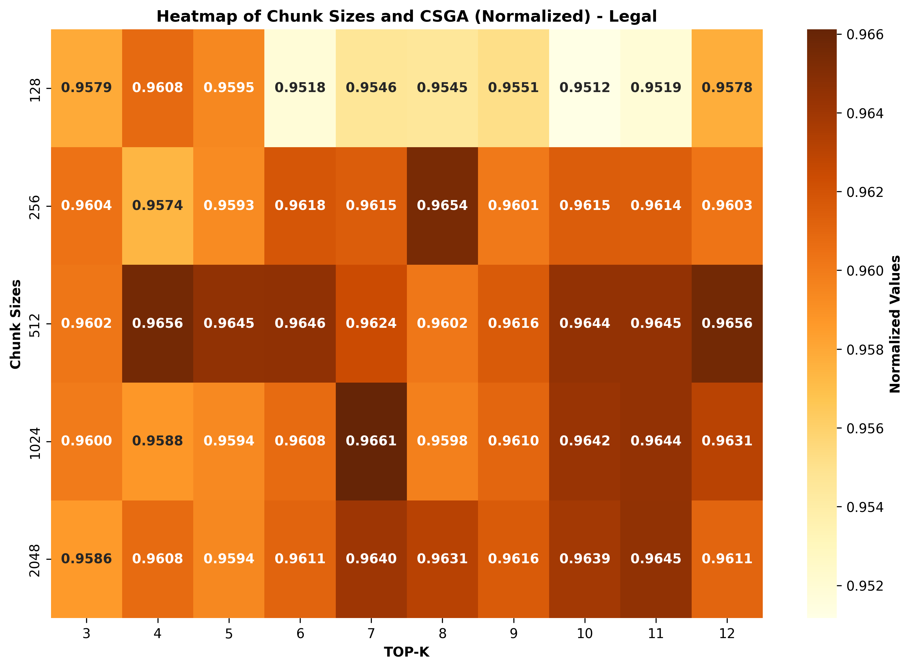
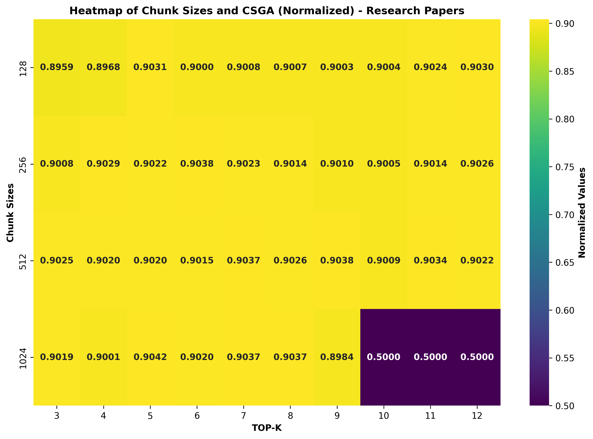
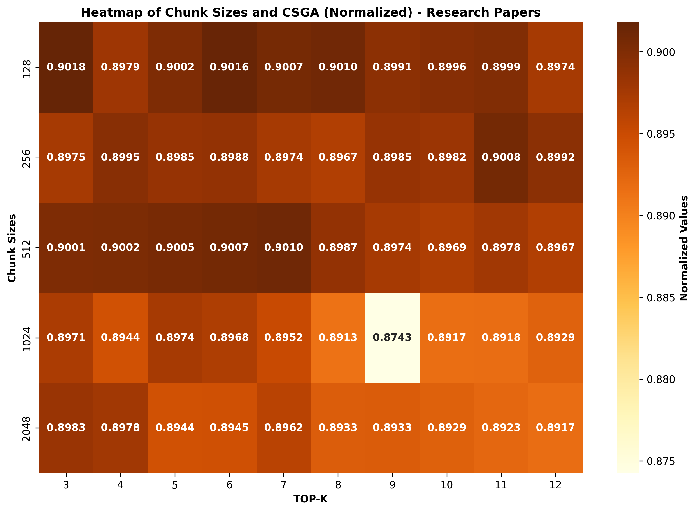
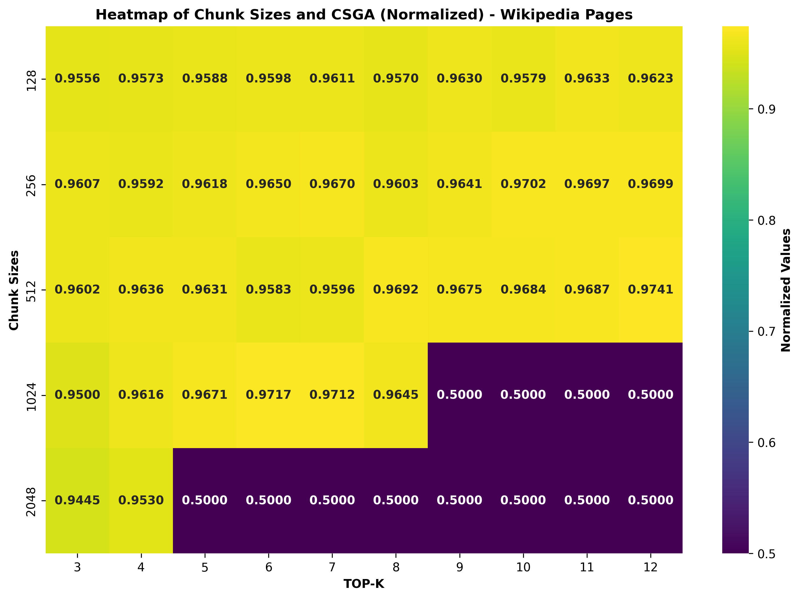
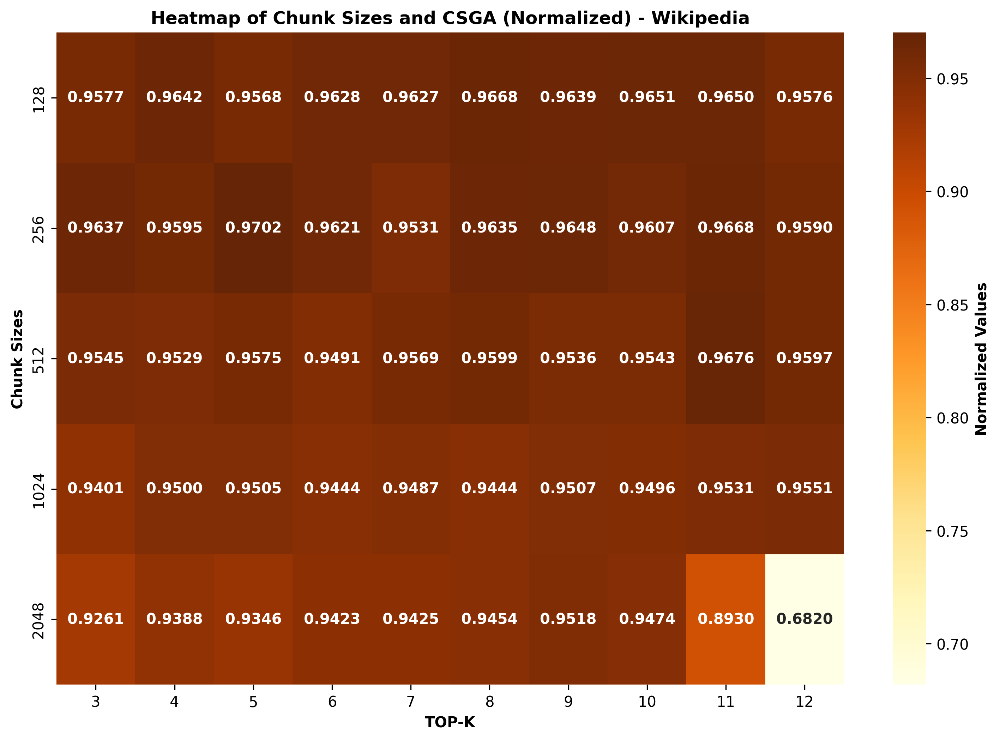
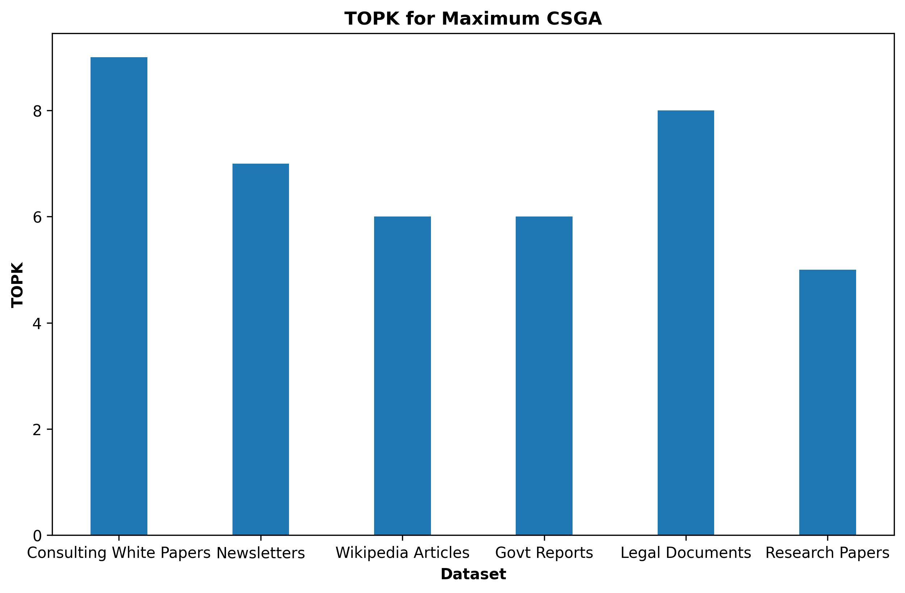

# 为 RAG 引入新超参数：上下文窗口利用率

发布时间：2024年07月29日

`RAG` `信息技术` `人工智能`

> Introducing a new hyper-parameter for RAG: Context Window Utilization

# 摘要

> 本文提出了一种名为“上下文窗口利用率”的新超参数，用于优化检索增强生成（RAG）系统。RAG系统通过整合外部知识库的相关信息，显著提升了生成内容的事实准确性和上下文相关性。本研究聚焦于确定最佳文本块大小，以最大化答案生成的质量。通过一系列实验，我们深入分析了不同块大小对RAG系统效率和效果的影响。研究结果显示，最佳块大小能够在提供充足上下文的同时，有效减少无关信息的干扰。这一发现对于优化RAG系统的设计与实施具有重要意义，强调了选择合适块大小以提升系统性能的关键作用。

> This paper introduces a new hyper-parameter for Retrieval-Augmented Generation (RAG) systems called Context Window Utilization. RAG systems enhance generative models by incorporating relevant information retrieved from external knowledge bases, improving the factual accuracy and contextual relevance of generated responses. The size of the text chunks retrieved and processed is a critical factor influencing RAG performance. This study aims to identify the optimal chunk size that maximizes answer generation quality. Through systematic experimentation, we analyze the effects of varying chunk sizes on the efficiency and effectiveness of RAG frameworks. Our findings reveal that an optimal chunk size balances the trade-off between providing sufficient context and minimizing irrelevant information. These insights are crucial for enhancing the design and implementation of RAG systems, underscoring the importance of selecting an appropriate chunk size to achieve superior performance.

[Arxiv](https://arxiv.org/abs/2407.19794)