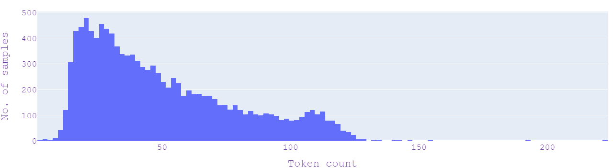
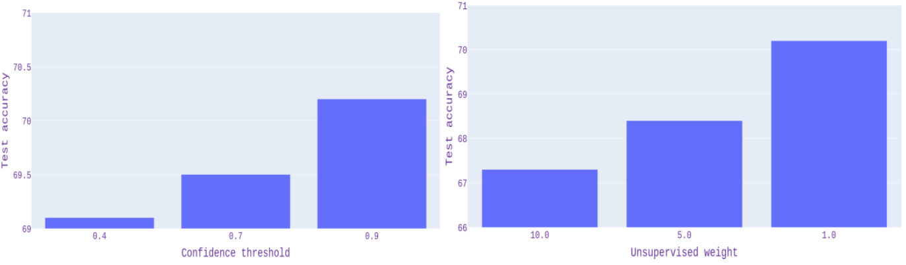
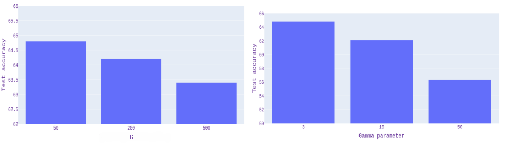

# 探究半监督方法结合数据增强在罗马尼亚语冒犯性语言检测中的效果

发布时间：2024年07月29日

`LLM应用` `网络安全` `人工智能`

> Investigating the Impact of Semi-Supervised Methods with Data Augmentation on Offensive Language Detection in Romanian Language

# 摘要

> 在当今数字世界中，攻击性语言检测至关重要，因为它有助于在线平台营造尊重与包容的氛围。然而，构建这类强大模型需要大量标记数据，这既耗资又费时。为此，我们探索了半监督学习方法，利用标记与未标记数据提升模型准确性与鲁棒性。本文中，我们实施了八种半监督方法，并结合五种数据增强技术，仅使用RO-Offense数据集进行实验。结果显示，某些方法在数据增强后表现更佳。

> Offensive language detection is a crucial task in today's digital landscape, where online platforms grapple with maintaining a respectful and inclusive environment. However, building robust offensive language detection models requires large amounts of labeled data, which can be expensive and time-consuming to obtain. Semi-supervised learning offers a feasible solution by utilizing labeled and unlabeled data to create more accurate and robust models. In this paper, we explore a few different semi-supervised methods, as well as data augmentation techniques. Concretely, we implemented eight semi-supervised methods and ran experiments for them using only the available data in the RO-Offense dataset and applying five augmentation techniques before feeding the data to the models. Experimental results demonstrate that some of them benefit more from augmentations than others.

[Arxiv](https://arxiv.org/abs/2407.20076)