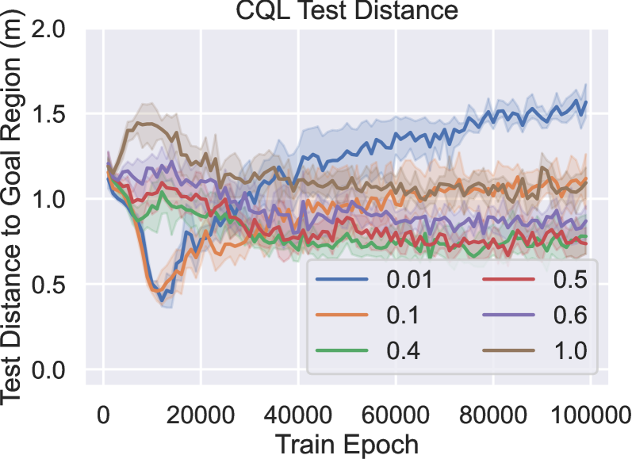

# 语言调控的离线强化学习在多机器人导航中的应用

发布时间：2024年07月29日

`LLM应用` `机器人` `人工智能`

> Language-Conditioned Offline RL for Multi-Robot Navigation

# 摘要

> 我们开发了一种新颖的方法，使多机器人团队能够理解和执行自然语言指令。该方法利用预训练的LLM嵌入，通过简短的离线强化学习训练，仅需20分钟的数据收集。实验证明，即使面对新指令，五个真实机器人也能有效执行，显示了对LLM潜在空间的深刻理解。此方法无需模拟器或环境模型，直接生成适用于真实机器人的低延迟控制策略，无需额外调整。实验视频可在https://sites.google.com/view/llm-marl查看。

> We present a method for developing navigation policies for multi-robot teams that interpret and follow natural language instructions. We condition these policies on embeddings from pretrained Large Language Models (LLMs), and train them via offline reinforcement learning with as little as 20 minutes of randomly-collected data. Experiments on a team of five real robots show that these policies generalize well to unseen commands, indicating an understanding of the LLM latent space. Our method requires no simulators or environment models, and produces low-latency control policies that can be deployed directly to real robots without finetuning. We provide videos of our experiments at https://sites.google.com/view/llm-marl.

[Arxiv](https://arxiv.org/abs/2407.20164)