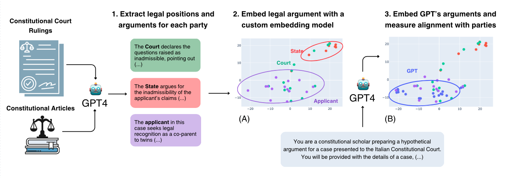
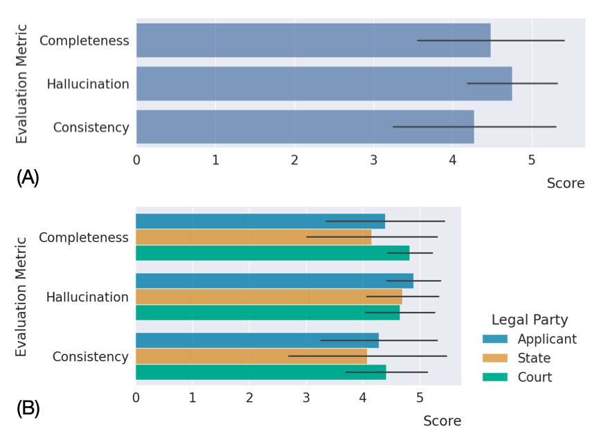
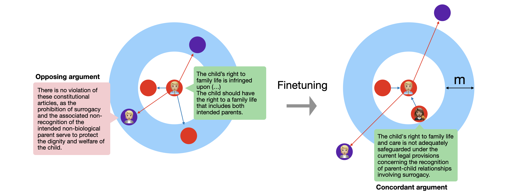
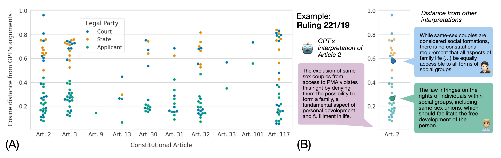
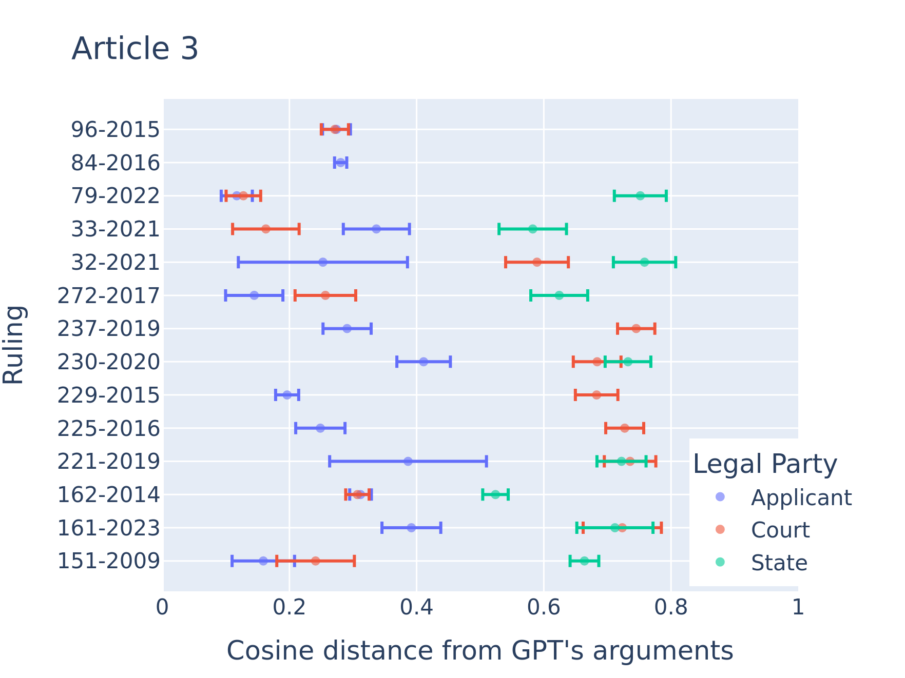

# 法律智慧与算法决策：探讨 LLM 在复杂情境下如何运用宪法原则

发布时间：2024年07月29日

`LLM应用` `生物伦理`

> Legal Minds, Algorithmic Decisions: How LLMs Apply Constitutional Principles in Complex Scenarios

# 摘要

> 本研究深入分析了GPT-4在复杂决策情境下对宪法原则的解读，特别是在生物伦理问题上。通过对比模型生成的法律论点与实际案例中的各方观点，我们发现GPT-4更倾向于支持宪法的进步性解释，忽视其他价值，并倾向于反映申请者的立场。这一发现凸显了数据偏差对模型输出的影响，强调了在实际应用中测试模型一致性的必要性，并提醒我们关注在决策过程中使用LLM的深远影响。

> In this paper, we conduct an empirical analysis of how large language models (LLMs), specifically GPT-4, interpret constitutional principles in complex decision-making scenarios. We examine rulings from the Italian Constitutional Court on bioethics issues that involve trade-offs between competing values and compare model-generated legal arguments on these issues to those presented by the State, the Court, and the applicants. Our results indicate that GPT-4 consistently aligns more closely with progressive interpretations of the Constitution, often overlooking competing values and mirroring the applicants' views rather than the more conservative perspectives of the State or the Court's moderate positions. Our experiments reveal a distinct tendency of GPT-4 to favor progressive legal interpretations, underscoring the influence of underlying data biases. We thus underscore the importance of testing alignment in real-world scenarios and considering the implications of deploying LLMs in decision-making processes.

[Arxiv](https://arxiv.org/abs/2407.19760)