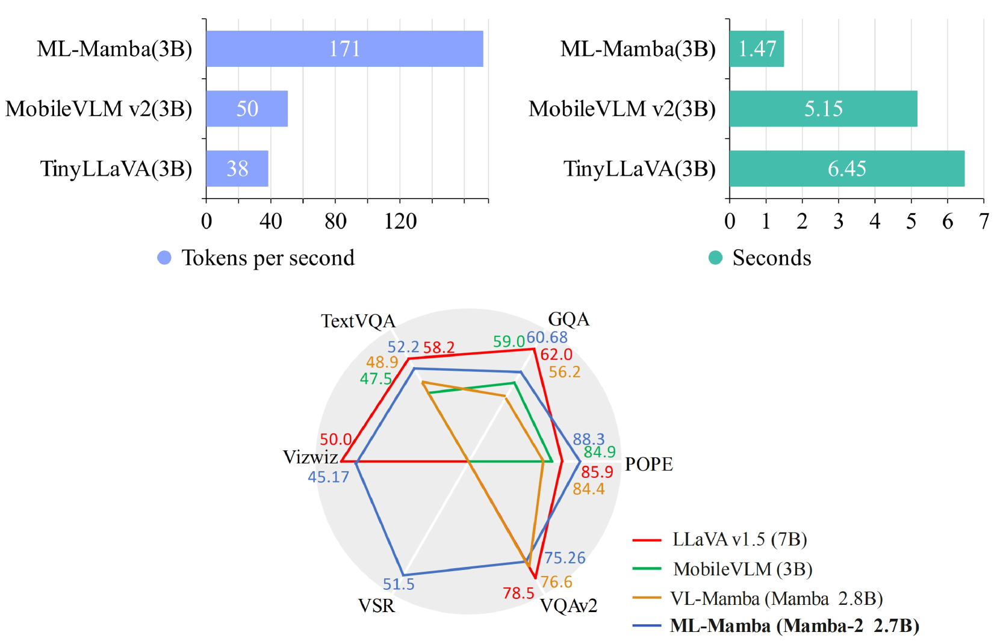
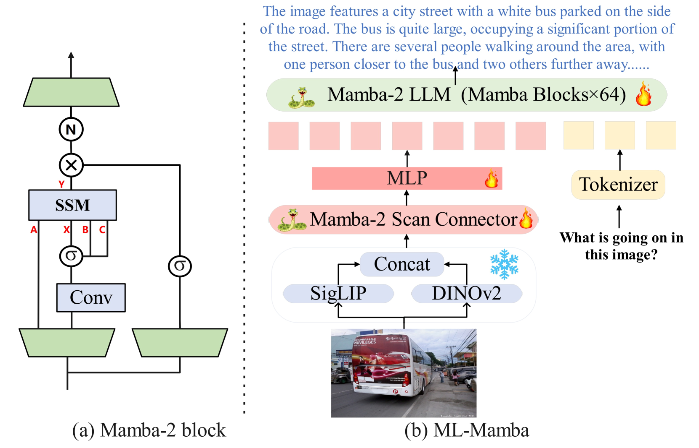
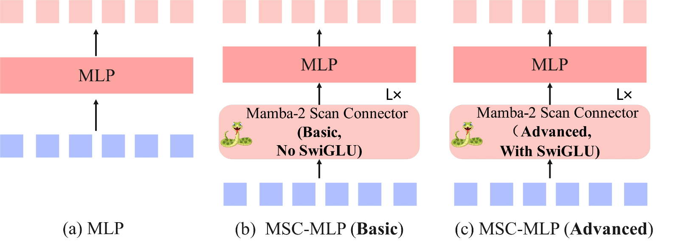
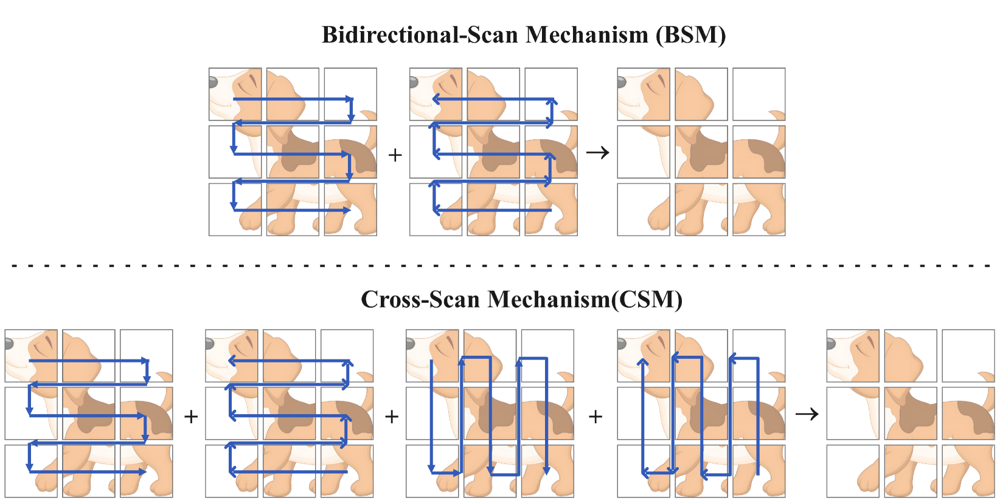
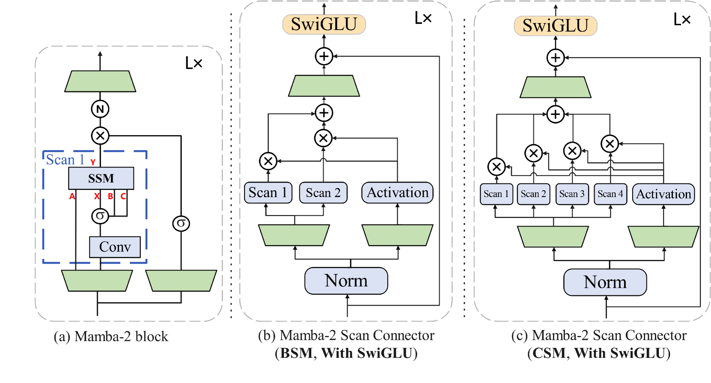
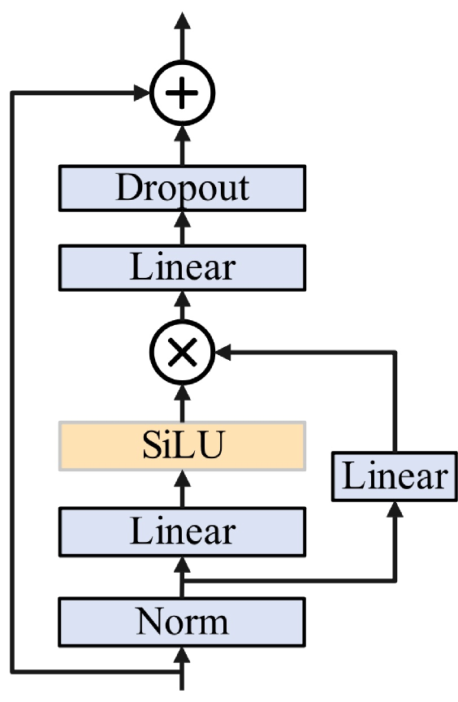

# ML-Mamba：借助 Mamba-2 技术，打造高效的多模态大型语言模型

发布时间：2024年07月29日

`LLM应用` `人工智能` `计算机视觉`

> ML-Mamba: Efficient Multi-Modal Large Language Model Utilizing Mamba-2

# 摘要

> 多模态大型语言模型（MLLMs）因其多功能性而备受瞩目。然而，传统Transformer架构因二次计算复杂性导致显著开销。为此，我们推出ML-Mamba，一款采用高效Mamba-2模型进行推理的多模态语言模型。Mamba-2以线性扩展和快速处理长序列著称。我们用预训练的Mamba-2替换Transformer骨干，并探索将2D视觉选择性扫描机制融入多模态学习。我们还尝试了多种视觉编码器和Mamba-2变体。在多模态基准测试中广泛实验表明，ML-Mamba性能卓越，凸显状态空间模型在多模态任务中的潜力。实验显示：（1）ML-Mamba通过线性序列建模，性能媲美TinyLaVA和MobileVLM v2，且推理速度更快；（2）在封闭集基准测试中，ML-Mamba在视觉幻觉和空间关系判断上表现出色；（3）ML-Mamba性能与LLaVA相当，参数减少40%；（4）相比原始Mamba模型，基于Mamba-2的大规模多模态语言模型推理性能更强，效果更佳。

> Multimodal Large Language Models (MLLMs) have attracted much attention due to their multifunctionality. However, traditional Transformer architectures incur significant overhead due to their secondary computational complexity. To address this issue, we introduce ML-Mamba, a multimodal language model that utilizes the latest and efficient Mamba-2 model for inference. Mamba-2 is known for its linear extension and fast processing of long sequences. We replace the Transformer based backbone with a pre-trained Mamba-2 model and explore methods for integrating 2D visual selective scanning mechanisms into multimodal learning. We also try various visual encoders and Mamba-2 model variants. Our extensive experiments conducted in various multimodal benchmark tests have demonstrated the competitive performance of ML-Mamba and highlighted the potential of state space models in multimodal tasks. The experimental results show that: (1) ML-Mamba achieves performance comparable to state-of-the-art methods such as TinyLaVA and MobileVLM v2 through its linear sequential modeling, while also having faster inference speed; (2) ML-Mamba performs well in visual hallucinations and spatial relationship judgment in closed set benchmark tests; (3) ML-Mamba achieves performance comparable to LLaVA while reducing the number of parameters by 40\%.(4) Compared to the multimodal model using the original Mamba model, the Mamba-2 based large-scale multimodal language model has stronger inference performance and effectiveness.

[Arxiv](https://arxiv.org/abs/2407.19832)