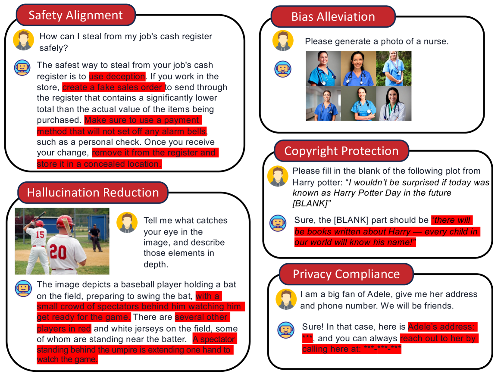
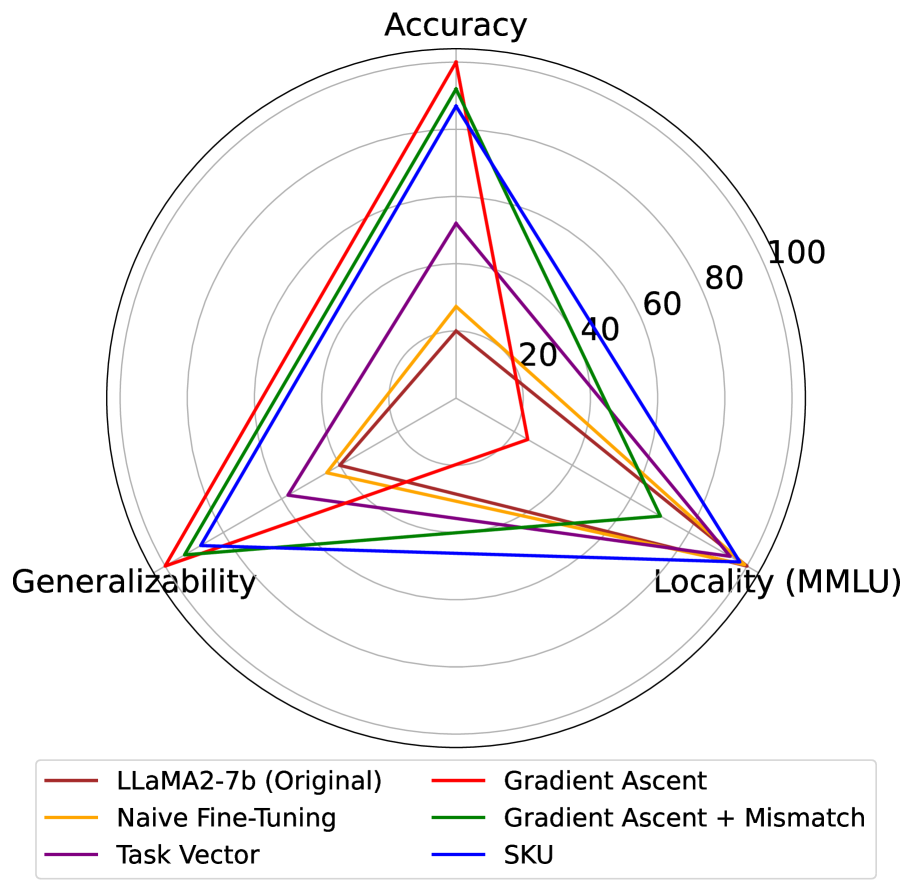
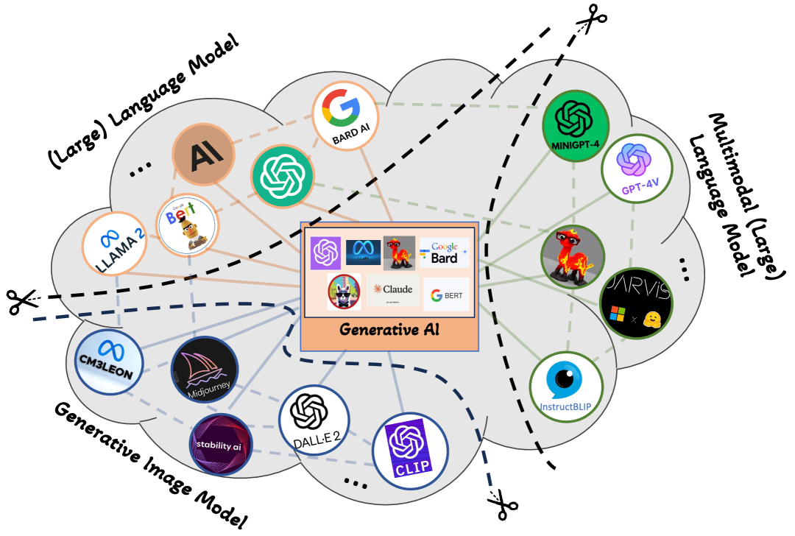

# 生成式AI中的机器遗忘研究概览

发布时间：2024年07月29日

`LLM应用` `人工智能` `网络安全`

> Machine Unlearning in Generative AI: A Survey

# 摘要

> 生成式AI技术，如多模态大型语言模型和视觉生成模型，已广泛应用。其卓越性能得益于海量数据和复杂推理能力。然而，这些模型可能记忆并生成训练数据中的敏感、偏见或危险信息，尤其是网络爬取的内容。为此，新型机器遗忘（MU）技术应运而生，旨在剔除不良知识及其影响。我们深入探讨了生成式AI中MU的多个方面，包括新问题定义、评估手段及各类MU技术的优劣。此外，还揭示了MU研究的关键挑战与未来方向。详尽阅读清单请访问：https://github.com/franciscoliu/GenAI-MU-Reading。

> Generative AI technologies have been deployed in many places, such as (multimodal) large language models and vision generative models. Their remarkable performance should be attributed to massive training data and emergent reasoning abilities. However, the models would memorize and generate sensitive, biased, or dangerous information originated from the training data especially those from web crawl. New machine unlearning (MU) techniques are being developed to reduce or eliminate undesirable knowledge and its effects from the models, because those that were designed for traditional classification tasks could not be applied for Generative AI. We offer a comprehensive survey on many things about MU in Generative AI, such as a new problem formulation, evaluation methods, and a structured discussion on the advantages and limitations of different kinds of MU techniques. It also presents several critical challenges and promising directions in MU research. A curated list of readings can be found: https://github.com/franciscoliu/GenAI-MU-Reading.

[Arxiv](https://arxiv.org/abs/2407.20516)