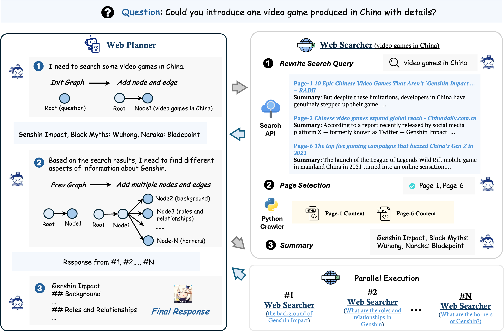
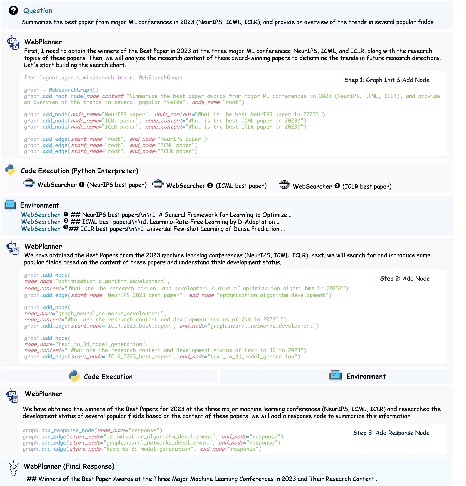
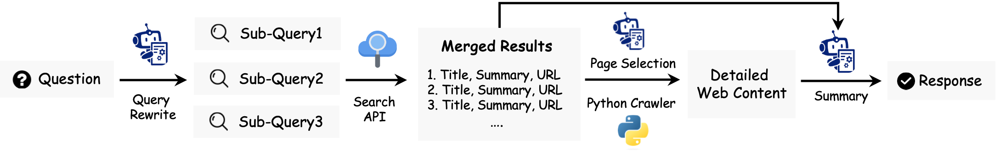
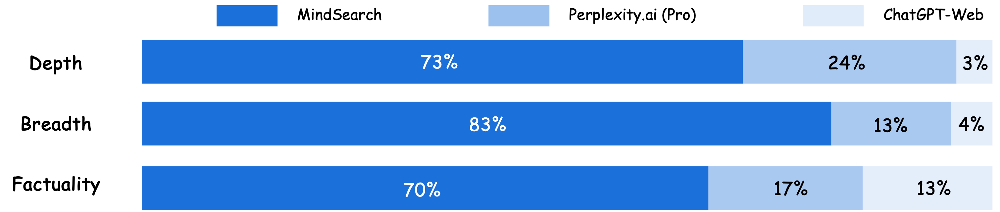
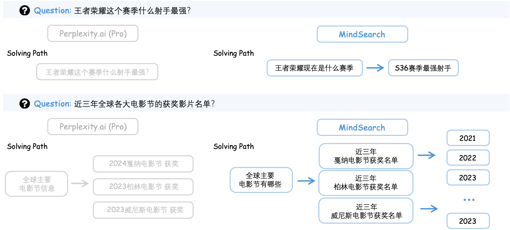

# MindSearch：模拟人脑，激发深度AI搜索潜能

发布时间：2024年07月29日

`Agent` `搜索引擎` `人工智能`

> MindSearch: Mimicking Human Minds Elicits Deep AI Searcher

# 摘要

> 信息寻求与整合是一项复杂的认知任务，耗时且费力。受大型语言模型进步的启发，近期研究尝试结合LLMs与搜索引擎来解决这一难题。然而，由于以下挑战，这些方法效果仍不尽如人意：（1）复杂请求难以一次性被搜索引擎准确完整检索；（2）相关信息分散在多个网页，混杂大量噪音；（3）冗长网页内容可能迅速超出LLMs的上下文限制。借鉴人类解决此类问题的认知过程，我们开发了MindSearch，模拟人类在网络信息处理中的思维，通过一个基于LLM的高效多代理框架实现。WebPlanner将多步骤信息寻求过程模型化为动态图构建，分解用户查询为子问题节点，并基于WebSearcher的搜索结果扩展图。WebSearcher负责分层信息检索，为WebPlanner收集关键信息。MindSearch的多代理架构使其能在3分钟内并行处理超过300个网页，效率相当于人类3小时的工作。在封闭与开放集QA问题上，MindSearch在响应的深度与广度上均有显著提升。此外，基于InternLM2.5-7B的MindSearch生成的响应更受人类喜爱，超越了ChatGPT-Web和Perplexity.ai，显示出其在专属AI搜索引擎领域的竞争力。

> Information seeking and integration is a complex cognitive task that consumes enormous time and effort. Inspired by the remarkable progress of Large Language Models, recent works attempt to solve this task by combining LLMs and search engines. However, these methods still obtain unsatisfying performance due to three challenges: (1) complex requests often cannot be accurately and completely retrieved by the search engine once (2) corresponding information to be integrated is spread over multiple web pages along with massive noise, and (3) a large number of web pages with long contents may quickly exceed the maximum context length of LLMs. Inspired by the cognitive process when humans solve these problems, we introduce MindSearch to mimic the human minds in web information seeking and integration, which can be instantiated by a simple yet effective LLM-based multi-agent framework. The WebPlanner models the human mind of multi-step information seeking as a dynamic graph construction process: it decomposes the user query into atomic sub-questions as nodes in the graph and progressively extends the graph based on the search result from WebSearcher. Tasked with each sub-question, WebSearcher performs hierarchical information retrieval with search engines and collects valuable information for WebPlanner. The multi-agent design of MindSearch enables the whole framework to seek and integrate information parallelly from larger-scale (e.g., more than 300) web pages in 3 minutes, which is worth 3 hours of human effort. MindSearch demonstrates significant improvement in the response quality in terms of depth and breadth, on both close-set and open-set QA problems. Besides, responses from MindSearch based on InternLM2.5-7B are preferable by humans to ChatGPT-Web and Perplexity.ai applications, which implies that MindSearch can already deliver a competitive solution to the proprietary AI search engine.

[Arxiv](https://arxiv.org/abs/2407.20183)