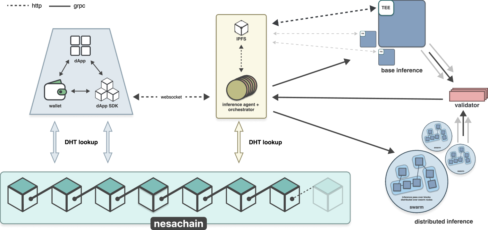
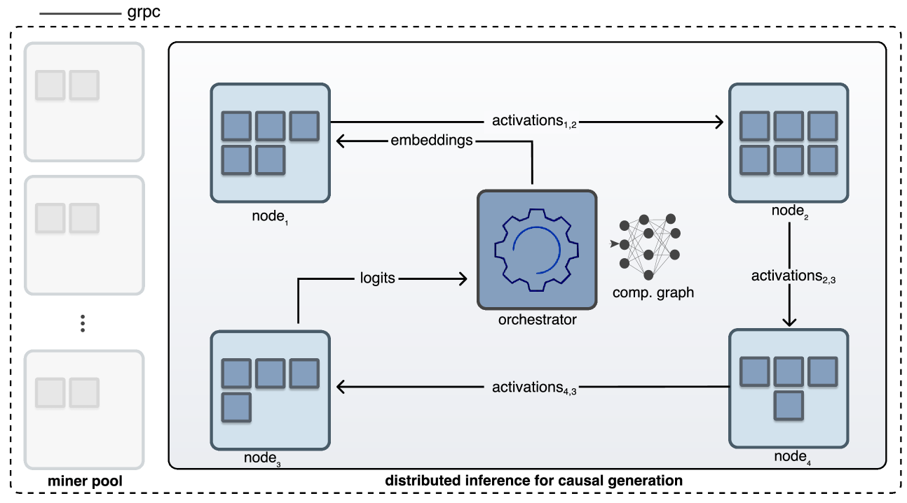
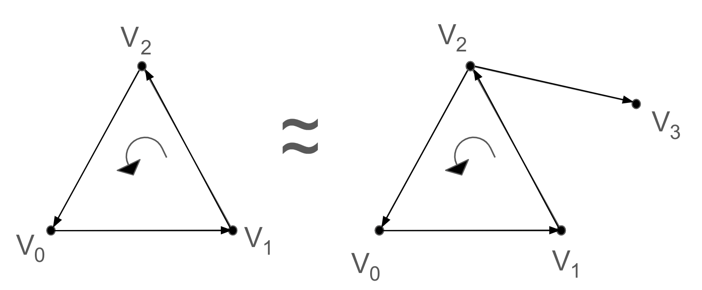
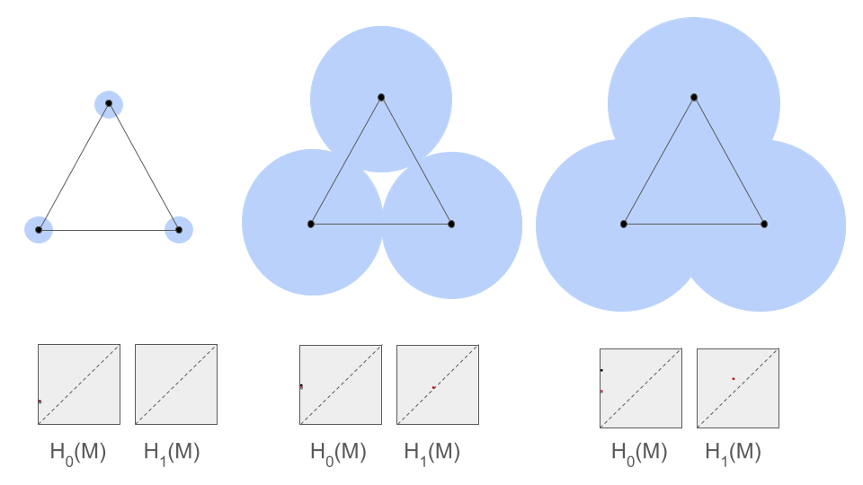
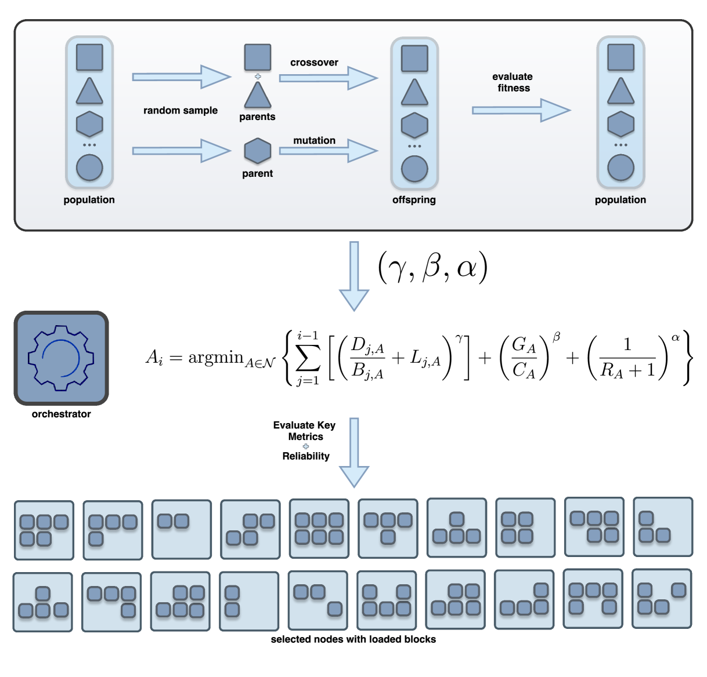

# 异构分布式推理中的模型无关混合分片技术

发布时间：2024年07月29日

`LLM应用` `区块链` `人工智能`

> Model Agnostic Hybrid Sharding For Heterogeneous Distributed Inference

# 摘要

> 随着大型AI模型的迅速发展，数据隐私、计算资源和可访问性面临严峻挑战。传统集中式架构难以满足高要求的数据安全和可扩展性，限制了AI技术的普及。Nesa推出的模型无关分片框架，专为去中心化AI推理设计，利用区块链技术在多样化节点网络中智能分配计算任务，即使在普通硬件上也能高效进行分布式训练和推理。通过动态量化和矩阵分解等技术，我们有效减少了数据传输和内存需求，并强化了安全措施，确保数据安全和隐私。在多种自然语言处理和视觉任务中的测试显示，这些技术并未影响模型精度。我们的成果展示了通过去中心化网络实现安全高效推理，推动尖端AI技术普及的巨大潜力。

> The rapid growth of large-scale AI models, particularly large language models has brought significant challenges in data privacy, computational resources, and accessibility. Traditional centralized architectures often struggle to meet required data security and scalability needs which hinders the democratization of AI systems. Nesa introduces a model-agnostic sharding framework designed for decentralized AI inference. Our framework uses blockchain-based sequential deep neural network sharding to distribute computational tasks across a diverse network of nodes based on a personalised heuristic and routing mechanism. This enables efficient distributed training and inference for recent large-scale models even on consumer-grade hardware. We use compression techniques like dynamic blockwise quantization and mixed matrix decomposition to reduce data transfer and memory needs. We also integrate robust security measures, including hardware-based trusted execution environments to ensure data integrity and confidentiality. Evaluating our system across various natural language processing and vision tasks shows that these compression strategies do not compromise model accuracy. Our results highlight the potential to democratize access to cutting-edge AI technologies by enabling secure and efficient inference on a decentralized network.

[Arxiv](https://arxiv.org/abs/2407.19775)