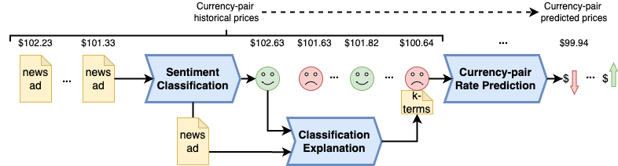
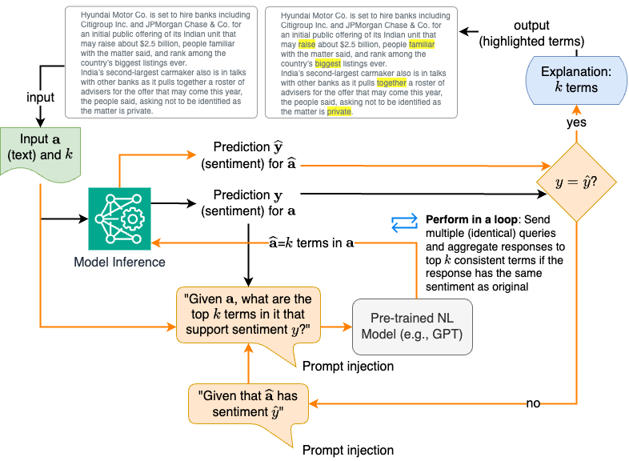
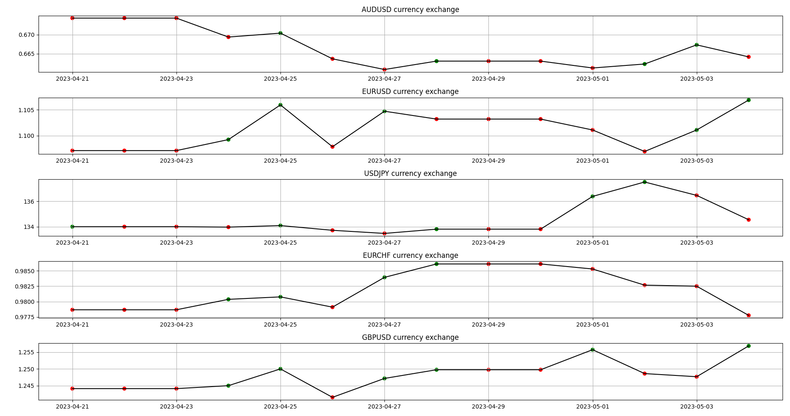

# 利用 LLM 的可解释性，将货币对情绪转化为经济价值

发布时间：2024年07月29日

`LLM应用` `情感分析`

> Monetizing Currency Pair Sentiments through LLM Explainability

# 摘要

> LLM 在现代组织中无处不在，尤其在情感分析和可解释性方面发挥着关键作用。我们提出了一种创新方法，将 LLM 用作情感分析的后解释工具，独立于模型。在金融领域，结合新闻数据与市场价格，我们的技术不仅为传统可解释 AI 提供了替代方案，还能优化机器学习模型的输入，提升货币对价格预测的准确性。展望未来，我们相信可解释性将成为增强机器学习输入的常规手段，助力更精准的预测。

> Large language models (LLMs) play a vital role in almost every domain in today's organizations. In the context of this work, we highlight the use of LLMs for sentiment analysis (SA) and explainability. Specifically, we contribute a novel technique to leverage LLMs as a post-hoc model-independent tool for the explainability of SA. We applied our technique in the financial domain for currency-pair price predictions using open news feed data merged with market prices. Our application shows that the developed technique is not only a viable alternative to using conventional eXplainable AI but can also be fed back to enrich the input to the machine learning (ML) model to better predict future currency-pair values. We envision our results could be generalized to employing explainability as a conventional enrichment for ML input for better ML predictions in general.

[Arxiv](https://arxiv.org/abs/2407.19922)