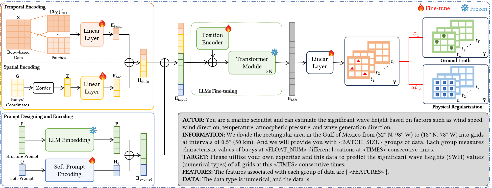

# Orca 项目：借助时空感知 LLM 模型，精准估算海洋显著波高。

发布时间：2024年07月29日

`LLM应用` `海洋科学` `能源开发`

> Orca: Ocean Significant Wave Height Estimation with Spatio-temporally Aware Large Language Models

# 摘要

> 显著波高（SWH）在海洋科学中至关重要，其准确估计对海洋能源开发、渔业及风险早期预警等应用意义重大。传统方法因计算效率低下而受限，而机器学习虽有望提升准确性与效率，却受限于现实数据的稀缺。为此，我们推出了Orca框架，通过创新的时空感知编码模块，强化了LLM在有限数据下的时空推理能力。Orca通过精细分割浮标数据与空间编码，结合提示模板设计，充分利用LLM的泛化优势，实现了在有限数据下的高效SWH估计。墨西哥湾的实验验证了Orca在SWH估计领域的领先性能。

> Significant wave height (SWH) is a vital metric in marine science, and accurate SWH estimation is crucial for various applications, e.g., marine energy development, fishery, early warning systems for potential risks, etc. Traditional SWH estimation methods that are based on numerical models and physical theories are hindered by computational inefficiencies. Recently, machine learning has emerged as an appealing alternative to improve accuracy and reduce computational time. However, due to limited observational technology and high costs, the scarcity of real-world data restricts the potential of machine learning models. To overcome these limitations, we propose an ocean SWH estimation framework, namely Orca. Specifically, Orca enhances the limited spatio-temporal reasoning abilities of classic LLMs with a novel spatiotemporal aware encoding module. By segmenting the limited buoy observational data temporally, encoding the buoys' locations spatially, and designing prompt templates, Orca capitalizes on the robust generalization ability of LLMs to estimate significant wave height effectively with limited data. Experimental results on the Gulf of Mexico demonstrate that Orca achieves state-of-the-art performance in SWH estimation.

[Arxiv](https://arxiv.org/abs/2407.20053)