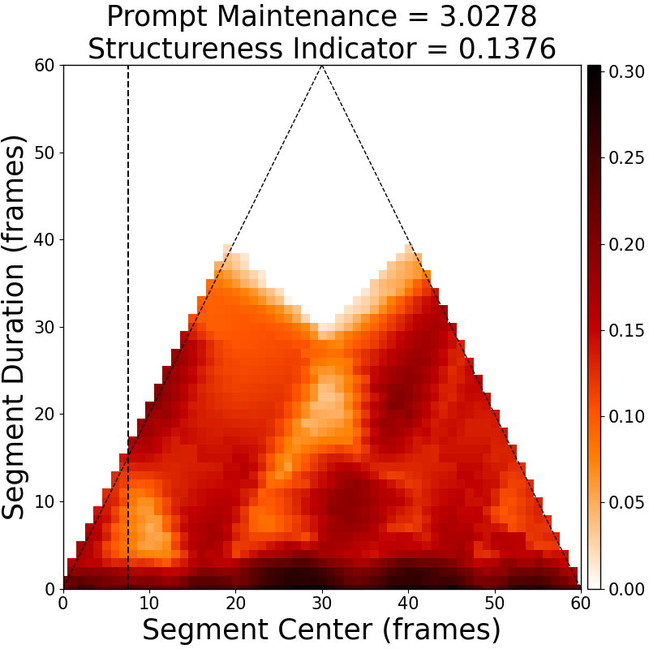
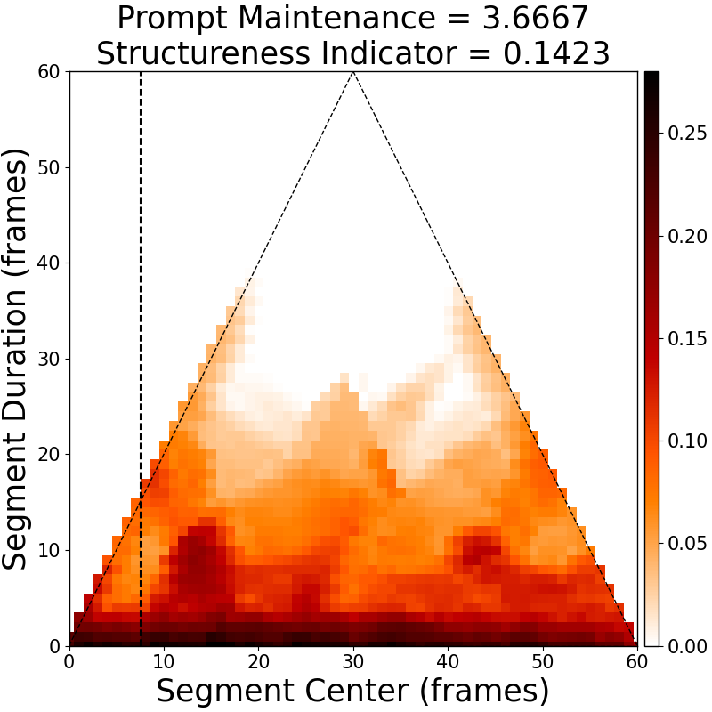

# 大型语言模型结合结构化嵌入，助力符号音乐生成既实用又可复制。

发布时间：2024年07月29日

`LLM应用` `人工智能`

> Practical and Reproducible Symbolic Music Generation by Large Language Models with Structural Embeddings

# 摘要

> 音乐生成对大型语言模型提出了复杂挑战。音乐的符号结构，包括垂直和声与水平对位，要求Transformer进行多方面适应与增强。现有研究存在三大缺陷：一是标记化依赖特定领域注释，如小节和节拍，这在原始MIDI数据中常缺失；二是缺乏特定领域注释时，增强标记嵌入方法的效果难以评估；三是如MuseNet等解决方案缺乏可重复性。为此，我们借鉴MuseNet，开发了不依赖特定领域注释的MIDI音乐生成框架，并实证研究了两种结构嵌入方法。我们提供了多维度指标与见解，指导编码优化。实验证明，多种嵌入配置能针对性提升音乐表现。通过HuggingFace的开源实现，我们为大型语言模型在音乐生成领域的实用与可重复性应用提供了新视角。

> Music generation introduces challenging complexities to large language models. Symbolic structures of music often include vertical harmonization as well as horizontal counterpoint, urging various adaptations and enhancements for large-scale Transformers. However, existing works share three major drawbacks: 1) their tokenization requires domain-specific annotations, such as bars and beats, that are typically missing in raw MIDI data; 2) the pure impact of enhancing token embedding methods is hardly examined without domain-specific annotations; and 3) existing works to overcome the aforementioned drawbacks, such as MuseNet, lack reproducibility. To tackle such limitations, we develop a MIDI-based music generation framework inspired by MuseNet, empirically studying two structural embeddings that do not rely on domain-specific annotations. We provide various metrics and insights that can guide suitable encoding to deploy. We also verify that multiple embedding configurations can selectively boost certain musical aspects. By providing open-source implementations via HuggingFace, our findings shed light on leveraging large language models toward practical and reproducible music generation.

[Arxiv](https://arxiv.org/abs/2407.19900)