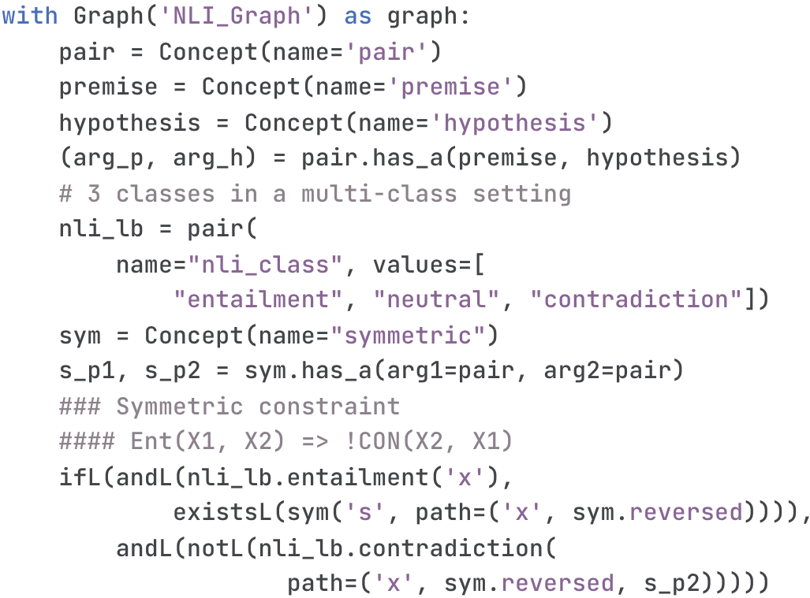
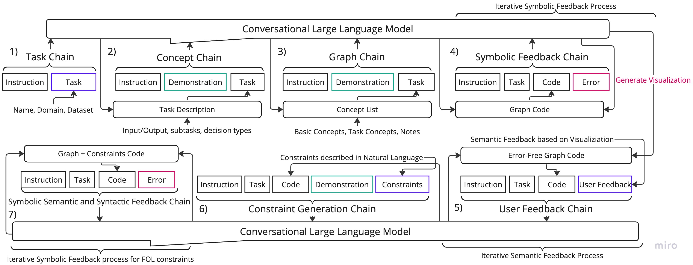
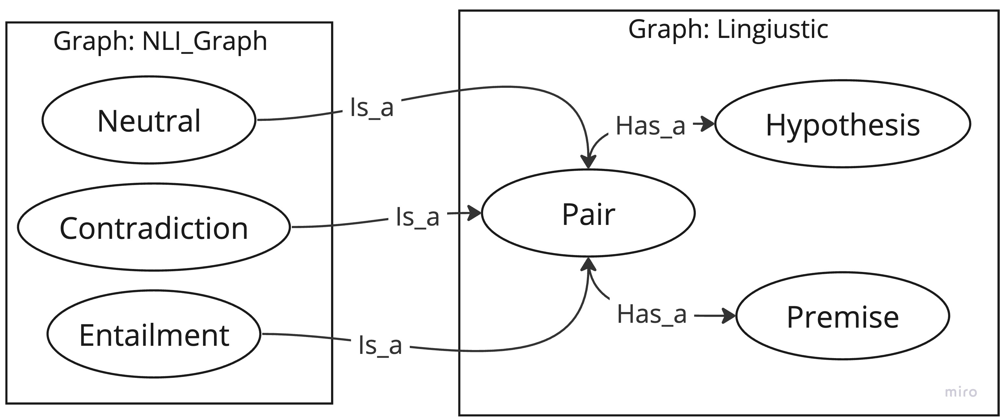

# Prompt2DeModel：结合自然语言的声明性神经-符号建模技术

发布时间：2024年07月29日

`LLM应用` `人工智能` `软件开发`

> Prompt2DeModel: Declarative Neuro-Symbolic Modeling with Natural Language

# 摘要

> 本文介绍了一种通过自然语言提示构建复杂神经符号模型领域知识的对话式流程。该流程利用大型语言模型在DomiKnowS框架中生成声明性程序，这些程序以图的形式表达概念及其关系，并包含逻辑约束。随后，这些图可连接到可训练的神经模型。我们提出的流程结合了动态上下文演示检索、模型细化、可视化和用户交互等技术，以生成任务结构和形式知识表示。这种方法使领域专家，即使不精通ML/AI，也能在DomiKnowS框架中正式声明他们的知识，融入定制的神经模型。

> This paper presents a conversational pipeline for crafting domain knowledge for complex neuro-symbolic models through natural language prompts. It leverages large language models to generate declarative programs in the DomiKnowS framework. The programs in this framework express concepts and their relationships as a graph in addition to logical constraints between them. The graph, later, can be connected to trainable neural models according to those specifications. Our proposed pipeline utilizes techniques like dynamic in-context demonstration retrieval, model refinement based on feedback from a symbolic parser, visualization, and user interaction to generate the tasks' structure and formal knowledge representation. This approach empowers domain experts, even those not well-versed in ML/AI, to formally declare their knowledge to be incorporated in customized neural models in the DomiKnowS framework.

[Arxiv](https://arxiv.org/abs/2407.20513)