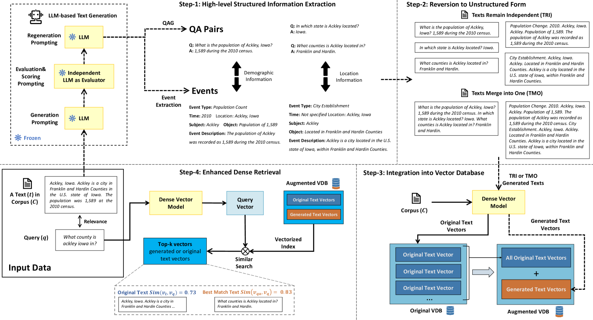
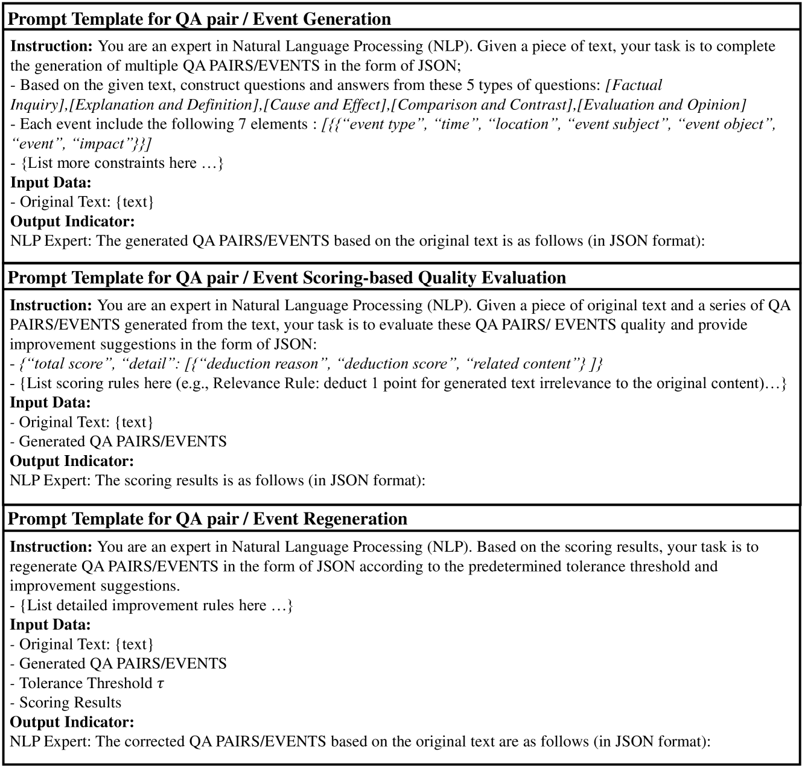
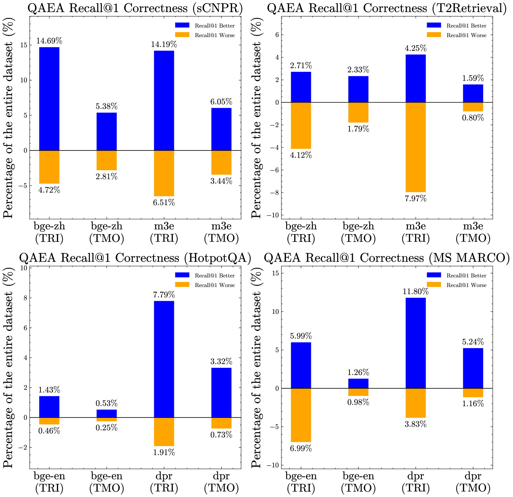
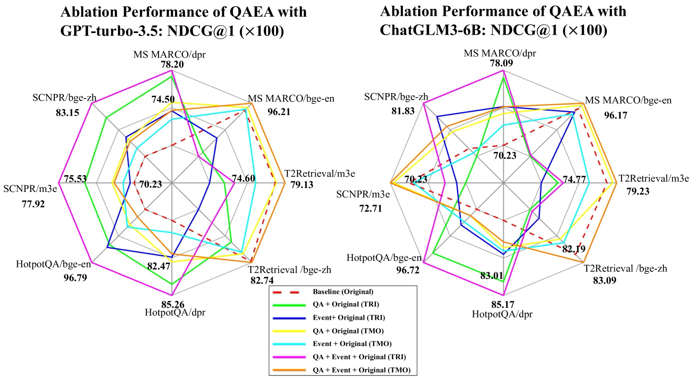
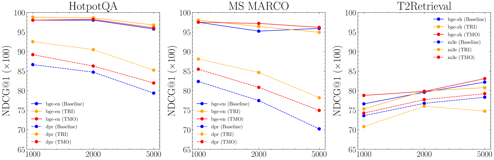
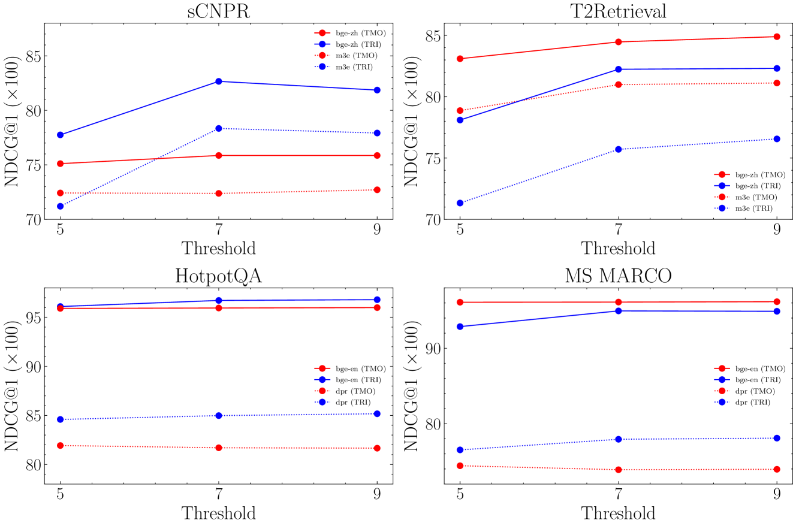

# QAEA-DR：一款专为密集检索设计的统一文本增强框架

发布时间：2024年07月29日

`LLM应用` `信息检索`

> QAEA-DR: A Unified Text Augmentation Framework for Dense Retrieval

# 摘要

> 在密集检索中，长文本嵌入密集向量可能引发信息丢失，影响查询-文本匹配的准确性。同时，噪声过多或关键信息稀疏的低质量文本难以与相关查询有效对齐。近期研究多聚焦于改进句子嵌入模型或检索流程。本研究提出一种创新的文本增强框架，通过将原始文档转换为信息密集的文本格式，补充原始文本，有效应对上述挑战，无需调整嵌入或检索方法。我们利用大型语言模型（LLM）的零-shot提示，生成问答对和元素驱动的事件两种文本表示，并命名为QAEA-DR，旨在统一问答生成与事件提取，优化密集检索的文本增强。此外，我们引入基于评分的评估与再生机制，进一步提升生成文本质量。理论分析与实证实验均证实QAEA-DR模型对密集检索的积极贡献。

> In dense retrieval, embedding long texts into dense vectors can result in information loss, leading to inaccurate query-text matching. Additionally, low-quality texts with excessive noise or sparse key information are unlikely to align well with relevant queries. Recent studies mainly focus on improving the sentence embedding model or retrieval process. In this work, we introduce a novel text augmentation framework for dense retrieval. This framework transforms raw documents into information-dense text formats, which supplement the original texts to effectively address the aforementioned issues without modifying embedding or retrieval methodologies. Two text representations are generated via large language models (LLMs) zero-shot prompting: question-answer pairs and element-driven events. We term this approach QAEA-DR: unifying question-answer generation and event extraction in a text augmentation framework for dense retrieval. To further enhance the quality of generated texts, a scoring-based evaluation and regeneration mechanism is introduced in LLM prompting. Our QAEA-DR model has a positive impact on dense retrieval, supported by both theoretical analysis and empirical experiments.

[Arxiv](https://arxiv.org/abs/2407.20207)