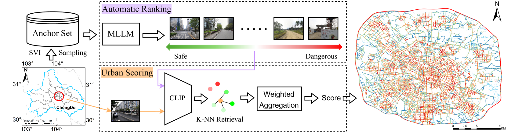
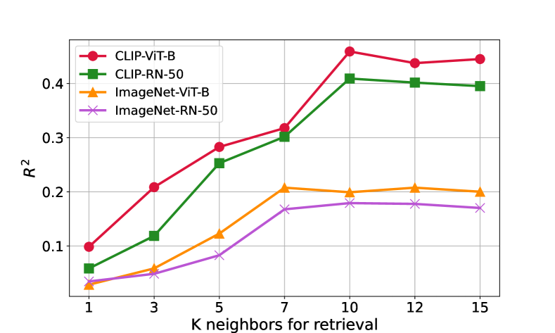

# 革新城市安全感知评估：融合多模态大型语言模型与街景图像

发布时间：2024年07月29日

`LLM应用` `城市规划` `公共安全`

> Revolutionizing Urban Safety Perception Assessments: Integrating Multimodal Large Language Models with Street View Images

# 摘要

> 评估城市安全感知是一项既关键又复杂的任务，传统方法依赖大量人力，涉及繁琐的实地调查和主观评估，不仅耗时费力，还可能存在偏差。街景图像与深度学习技术的结合，为大规模城市安全检测提供了新途径，但这一过程仍需大量人工标注，且城市间的差异限制了模型的通用性。为此，我们急需一种全自动化的安全评估方法。近期，多模态大型语言模型（如GPT-4）展现了卓越的推理与分析能力，我们利用这些模型在人工标注的数据集上进行城市安全排名，结果与人类感知高度吻合。同时，我们创新性地结合了预训练的CLIP特征与K-NN检索技术，快速准确地评估了整个城市的安全指数，实验证明，这一方法超越了传统深度学习技术，为城市规划与政策制定提供了有力支持。

> Measuring urban safety perception is an important and complex task that traditionally relies heavily on human resources. This process often involves extensive field surveys, manual data collection, and subjective assessments, which can be time-consuming, costly, and sometimes inconsistent. Street View Images (SVIs), along with deep learning methods, provide a way to realize large-scale urban safety detection. However, achieving this goal often requires extensive human annotation to train safety ranking models, and the architectural differences between cities hinder the transferability of these models. Thus, a fully automated method for conducting safety evaluations is essential. Recent advances in multimodal large language models (MLLMs) have demonstrated powerful reasoning and analytical capabilities. Cutting-edge models, e.g., GPT-4 have shown surprising performance in many tasks. We employed these models for urban safety ranking on a human-annotated anchor set and validated that the results from MLLMs align closely with human perceptions. Additionally, we proposed a method based on the pre-trained Contrastive Language-Image Pre-training (CLIP) feature and K-Nearest Neighbors (K-NN) retrieval to quickly assess the safety index of the entire city. Experimental results show that our method outperforms existing training needed deep learning approaches, achieving efficient and accurate urban safety evaluations. The proposed automation for urban safety perception assessment is a valuable tool for city planners, policymakers, and researchers aiming to improve urban environments.

[Arxiv](https://arxiv.org/abs/2407.19719)