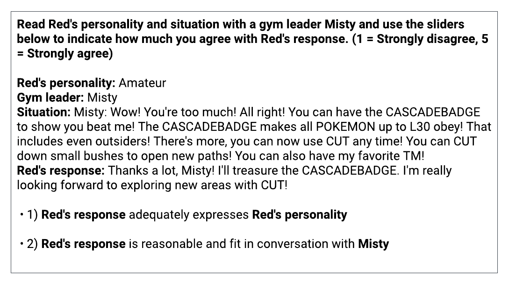

# 红色若能言？借助大型语言模型实现动态对话生成

发布时间：2024年07月29日

`LLM应用`

> What if Red Can Talk? Dynamic Dialogue Generation Using Large Language Models

# 摘要

> 角色扮演游戏 (RPGs) 为玩家打造了一个丰富多彩的互动世界。对话作为开发者与玩家沟通的主要桥梁，以指南、NPC 互动和故事叙述等形式呈现。尽管多数游戏通过书面剧本构建主线故事和角色性格，但角色间的日常互动能大幅提升玩家的沉浸感。借助大型语言模型 (LLMs)，我们推出了一种对话填充框架，利用知识图谱增强的 LLMs 生成动态且贴合上下文的角色互动。我们在《最终幻想 VII 重制版》和《宝可梦》中验证了这一框架，证实 GPT-4 能以特定性格进行互动并生成对话。不过，GPT-4 在处理过于积极或微妙性格（如成熟度）时，表现不如明显特质（如胆怯）。本研究旨在助力开发者打造更细腻的对话，深化玩家沉浸感，全面提升 RPG 体验。

> Role-playing games (RPGs) provide players with a rich, interactive world to explore. Dialogue serves as the primary means of communication between developers and players, manifesting in various forms such as guides, NPC interactions, and storytelling. While most games rely on written scripts to define the main story and character personalities, player immersion can be significantly enhanced through casual interactions between characters. With the advent of large language models (LLMs), we introduce a dialogue filler framework that utilizes LLMs enhanced by knowledge graphs to generate dynamic and contextually appropriate character interactions. We test this framework within the environments of Final Fantasy VII Remake and Pokemon, providing qualitative and quantitative evidence that demonstrates GPT-4's capability to act with defined personalities and generate dialogue. However, some flaws remain, such as GPT-4 being overly positive or more subtle personalities, such as maturity, tend to be of lower quality compared to more overt traits like timidity. This study aims to assist developers in crafting more nuanced filler dialogues, thereby enriching player immersion and enhancing the overall RPG experience.

[Arxiv](https://arxiv.org/abs/2407.20382)