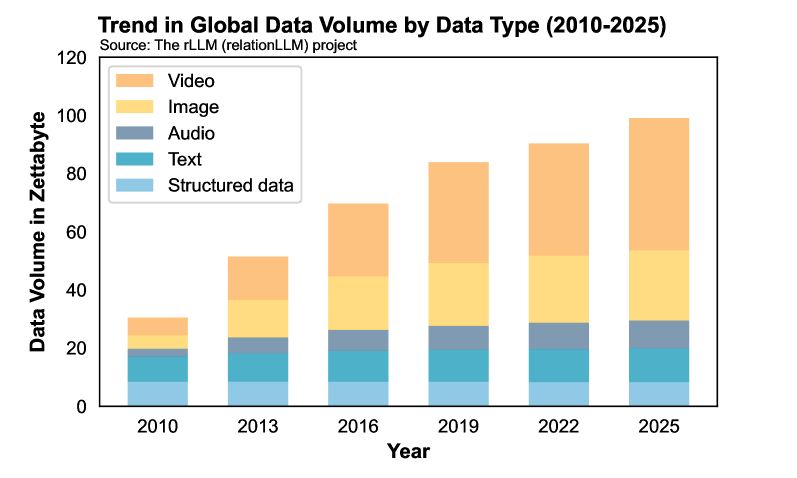

# rLLM：利用 LLMs 进行关系表学习

发布时间：2024年07月29日

`LLM应用` `软件开发` `人工智能`

> rLLM: Relational Table Learning with LLMs

# 摘要

> 我们推出了 rLLM，这是一个专为 LLM 进行关系表学习设计的 PyTorch 库。其核心在于将图神经网络、LLM 和表神经网络分解为模块，简化新型 RTL 模型的构建流程。为展示 rLLM 的实用性，我们引入了 **BRIDGE** 方法。同时，我们通过改进经典数据集，创建了三个新的关系表格数据集。我们期待 rLLM 成为 RTL 任务的便捷开发工具。代码已公开，详见：https://github.com/rllm-project/rllm。

> We introduce rLLM (relationLLM), a PyTorch library designed for Relational Table Learning (RTL) with Large Language Models (LLMs). The core idea is to decompose state-of-the-art Graph Neural Networks, LLMs, and Table Neural Networks into standardized modules, to enable the fast construction of novel RTL-type models in a simple "combine, align, and co-train" manner. To illustrate the usage of rLLM, we introduce a simple RTL method named \textbf{BRIDGE}. Additionally, we present three novel relational tabular datasets (TML1M, TLF2K, and TACM12K) by enhancing classic datasets. We hope rLLM can serve as a useful and easy-to-use development framework for RTL-related tasks. Our code is available at: https://github.com/rllm-project/rllm.

[Arxiv](https://arxiv.org/abs/2407.20157)