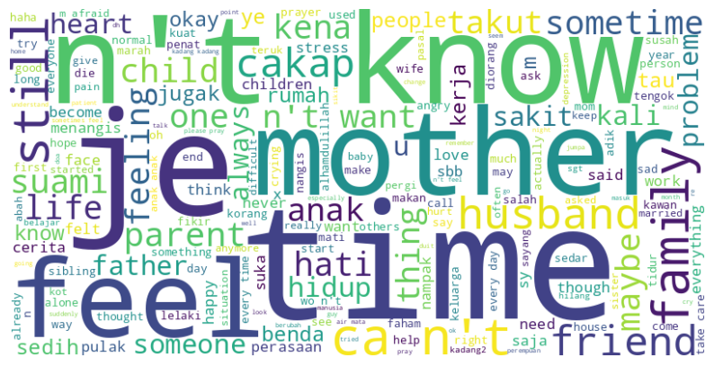

# 针对马来西亚语言文本，我们改进了工作安全分类器，以在 LLM-Ops 框架中实现更精准的对齐。

发布时间：2024年07月30日

`LLM应用`

> Adapting Safe-for-Work Classifier for Malaysian Language Text: Enhancing Alignment in LLM-Ops Framework

# 摘要

> 随着 LLMs 在运营流程中的广泛应用，确保安全交互的需求日益迫切，尤其是在跨语言检测不适当内容方面。为此，我们针对马来西亚语言开发了一款创新的文本分类器，专门用于识别不安全内容。通过构建并标注首个马来西亚语言的多类别文本数据集，我们利用尖端自然语言处理技术训练了此分类模型。这一进展不仅有助于提升交互安全性，还为负责任地部署 LLMs 提供了保障。为促进研究共享，该模型已在 https://huggingface.co/malaysia-ai/malaysian-sfw-classifier 公开发布，旨在推动马来西亚语境下 LLM-Ops 的进一步优化。

> As large language models (LLMs) become increasingly integrated into operational workflows (LLM-Ops), there is a pressing need for effective guardrails to ensure safe and aligned interactions, including the ability to detect potentially unsafe or inappropriate content across languages. However, existing safe-for-work classifiers are primarily focused on English text. To address this gap for the Malaysian language, we present a novel safe-for-work text classifier tailored specifically for Malaysian language content. By curating and annotating a first-of-its-kind dataset of Malaysian text spanning multiple content categories, we trained a classification model capable of identifying potentially unsafe material using state-of-the-art natural language processing techniques. This work represents an important step in enabling safer interactions and content filtering to mitigate potential risks and ensure responsible deployment of LLMs. To maximize accessibility and promote further research towards enhancing alignment in LLM-Ops for the Malaysian context, the model is publicly released at https://huggingface.co/malaysia-ai/malaysian-sfw-classifier.

[Arxiv](https://arxiv.org/abs/2407.20729)