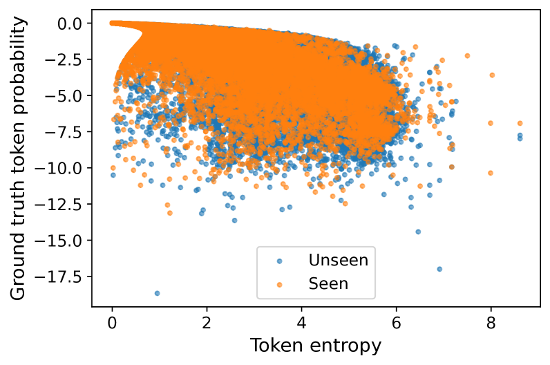
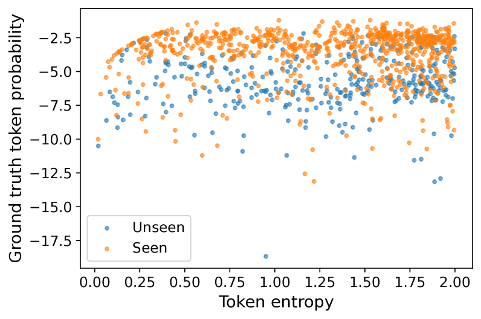
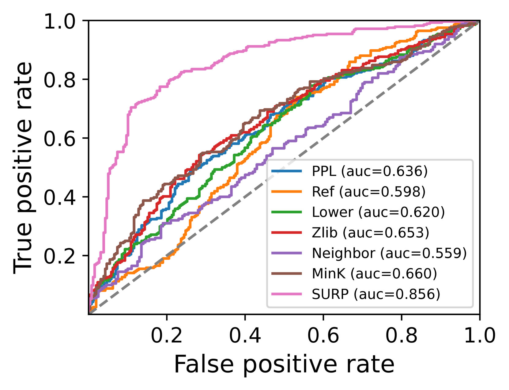

# 利用令人惊讶的标记，为大型语言模型实现自适应预训练数据检测。

发布时间：2024年07月30日

`LLM应用` `网络安全` `数据隐私`

> Adaptive Pre-training Data Detection for Large Language Models via Surprising Tokens

# 摘要

> 大型语言模型 (LLM) 的广泛应用引发了隐私、安全和版权的担忧，主要源于其不透明的训练数据。当前解决预训练数据检测问题的方法依赖于成员推理攻击 (MIA)，这严重依赖于 LLM 的逐字记忆能力，但在大量训练数据和有限训练周期的情况下，这种方法面临挑战。为此，我们提出了一种自适应预训练数据检测方法，通过定位输入中的“令人惊讶的标记”来减轻这种依赖，并有效提升识别能力。这些标记对 LLM 来说“确定但错误”，即低香农熵和低真实标记概率。基于模型对已见数据比未见数据更不令人惊讶的假设，我们的方法无需访问预训练数据或进行额外训练即可应用。在多样化实验中，我们的方法在各种基准和模型上均显示出优于现有方法的性能，最高提升了 29.5%。此外，我们还推出了新基准 Dolma-Book，利用模型训练前后收集的书籍数据，以提供更全面的评估。

> While large language models (LLMs) are extensively used, there are raising concerns regarding privacy, security, and copyright due to their opaque training data, which brings the problem of detecting pre-training data on the table. Current solutions to this problem leverage techniques explored in machine learning privacy such as Membership Inference Attacks (MIAs), which heavily depend on LLMs' capability of verbatim memorization. However, this reliance presents challenges, especially given the vast amount of training data and the restricted number of effective training epochs. In this paper, we propose an adaptive pre-training data detection method which alleviates this reliance and effectively amplify the identification. Our method adaptively locates \textit{surprising tokens} of the input. A token is surprising to a LLM if the prediction on the token is "certain but wrong", which refers to low Shannon entropy of the probability distribution and low probability of the ground truth token at the same time. By using the prediction probability of surprising tokens to measure \textit{surprising}, the detection method is achieved based on the simple hypothesis that seeing seen data is less surprising for the model compared with seeing unseen data. The method can be applied without any access to the the pre-training data corpus or additional training like reference models. Our approach exhibits a consistent enhancement compared to existing methods in diverse experiments conducted on various benchmarks and models, achieving a maximum improvement of 29.5\%. We also introduce a new benchmark Dolma-Book developed upon a novel framework, which employs book data collected both before and after model training to provide further evaluation.

[Arxiv](https://arxiv.org/abs/2407.21248)