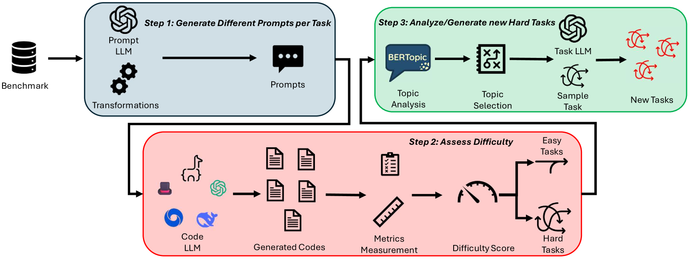
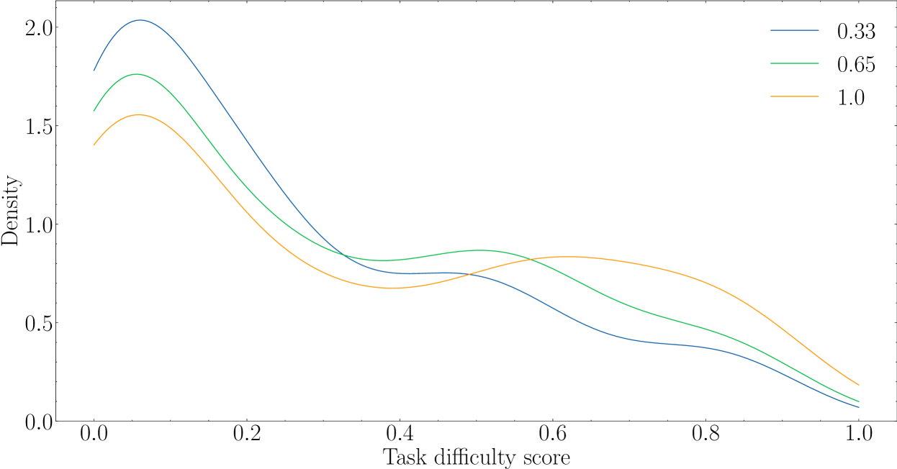
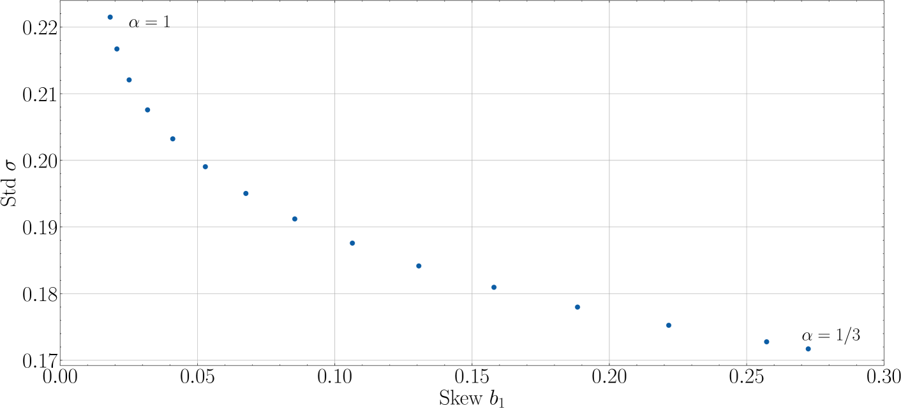
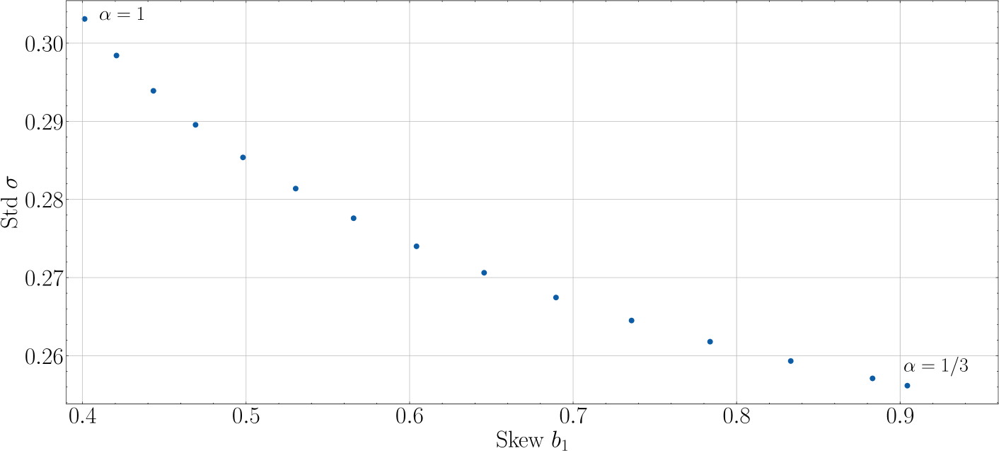
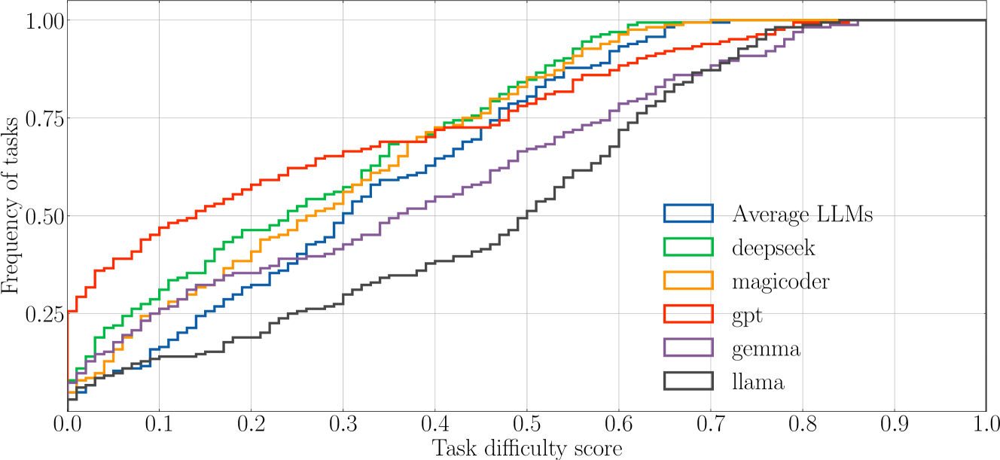
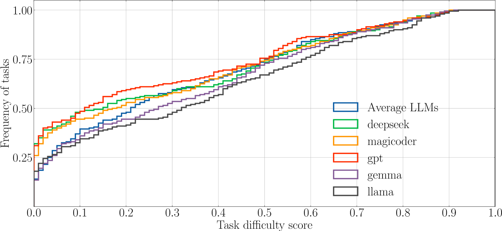
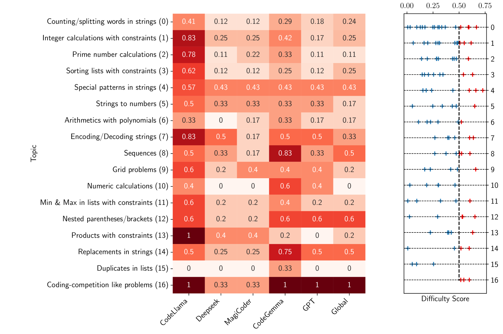
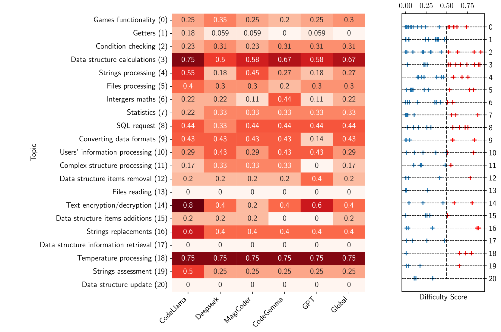

# 高效评估大型语言模型：编程任务难度之评估

发布时间：2024年07月30日

`LLM应用` `软件工程` `人工智能`

> Assessing Programming Task Difficulty for Efficient Evaluation of Large Language Models

# 摘要

> 大型语言模型（LLM）在软件工程领域，尤其是在代码补全和生成等任务上，展现出令人瞩目的潜力。然而，当前的评估方法主要依赖于基准测试的宏观指标，未能深入揭示每个编程任务对LLM能力的具体考验。特别是，基准测试中任务的难度并未在模型得分中得到体现，这导致了一个主要由简单任务构成的基准上得90分的模型，其能力可能不及在困难任务为主的基准上同样得90分的模型。为此，我们提出了HardEval框架，旨在精准评估任务难度，并基于识别出的难题设计新任务。通过在多个LLM上运用多样化的提示，HardEval为每个基准任务赋予了难度分数。实验表明，HardEval能有效识别出HumanEval+和ClassEval基准中的难题，揭示仅约五分之一的任务对LLM构成挑战。此外，我们还界定了六个实际难题主题，用于创造新的挑战性任务。HardEval不仅有助于提升LLM评估的精准度，其难度评分机制还能助力于在现有基准中挖掘难题，进而围绕特定主题设计更多高难度任务，以促进LLM的评估与提升。HardEval的普适性使其可广泛应用于代码补全、问答等多个领域。

> Large Language Models (LLMs) show promising potential in Software Engineering, especially for code-related tasks like code completion and code generation. LLMs' evaluation is generally centred around general metrics computed over benchmarks. While painting a macroscopic view of the benchmarks and of the LLMs' capacity, it is unclear how each programming task in these benchmarks assesses the capabilities of the LLMs. In particular, the difficulty level of the tasks in the benchmarks is not reflected in the score used to report the performance of the model. Yet, a model achieving a 90% score on a benchmark of predominantly easy tasks is likely less capable than a model achieving a 90% score on a benchmark containing predominantly difficult tasks. This paper devises a framework, HardEval, for assessing task difficulty for LLMs and crafting new tasks based on identified hard tasks. The framework uses a diverse array of prompts for a single task across multiple LLMs to obtain a difficulty score for each task of a benchmark. Using two code generation benchmarks, HumanEval+ and ClassEval, we show that HardEval can reliably identify the hard tasks within those benchmarks, highlighting that only 21% of HumanEval+ and 27% of ClassEval tasks are hard for LLMs. Through our analysis of task difficulty, we also characterize 6 practical hard task topics which we used to generate new hard tasks. Orthogonal to current benchmarking evaluation efforts, HardEval can assist researchers and practitioners in fostering better assessments of LLMs. The difficulty score can be used to identify hard tasks within existing benchmarks. This, in turn, can be leveraged to generate more hard tasks centred around specific topics either for evaluation or improvement of LLMs. HardEval generalistic approach can be applied to other domains such as code completion or Q/A.

[Arxiv](https://arxiv.org/abs/2407.21227)