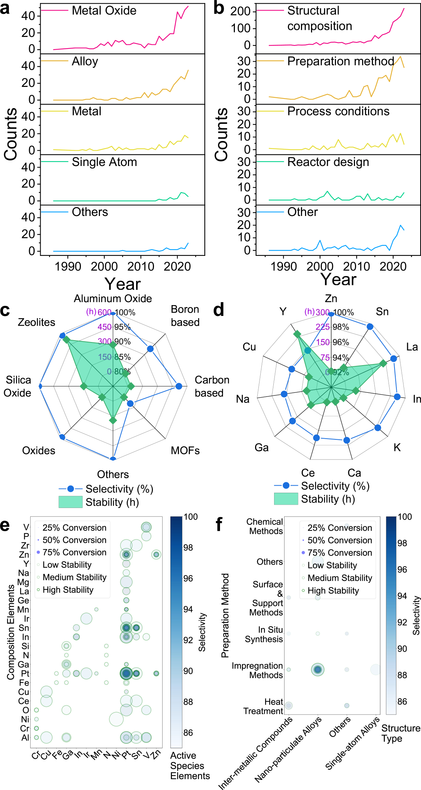
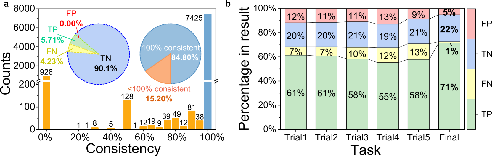
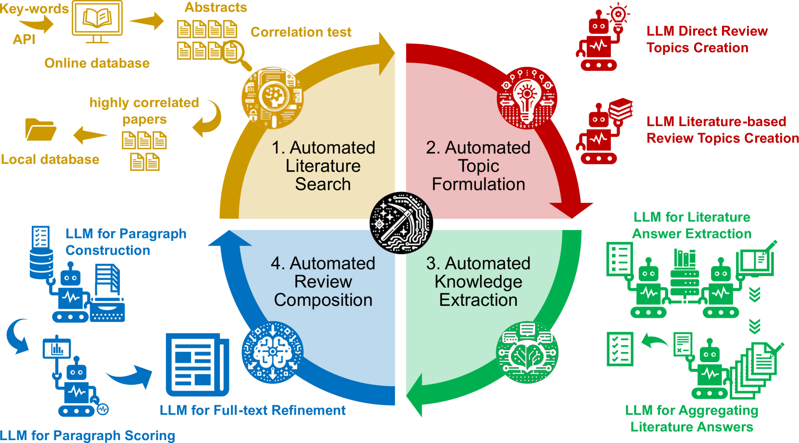

# 大型语言模型驱动的自动评论生成技术

发布时间：2024年07月30日

`LLM应用` `文献管理`

> Automated Review Generation Method Based on Large Language Models

# 摘要

> 在科学研究中，文献研究至关重要，但海量信息令人应接不暇。为此，我们开发了一种基于大型语言模型（LLM）的自动化综述生成方法，旨在简化文献处理并减轻认知负担。在丙烷脱氢催化剂的研究案例中，我们的方法高效地从343篇文章中生成了详尽的综述，每篇文章处理时间仅需几秒。进一步分析1041篇文章，深入揭示了催化剂的组成、结构与性能。为应对LLM可能产生的幻觉问题，我们实施了多层次的质量控制，确保了方法的可靠性及幻觉的有效控制。专家验证显示，生成综述的准确性与引用完整性极高，LLM幻觉风险降至0.5%以下，置信度超95%。推出的Windows应用支持一键生成综述，助力研究人员追踪科研进展并推荐优质文献。这一创新方法不仅彰显了LLM在提升科研效率中的潜力，也为未来探索开辟了新路径。

> Literature research, vital for scientific advancement, is overwhelmed by the vast ocean of available information. Addressing this, we propose an automated review generation method based on Large Language Models (LLMs) to streamline literature processing and reduce cognitive load. In case study on propane dehydrogenation (PDH) catalysts, our method swiftly generated comprehensive reviews from 343 articles, averaging seconds per article per LLM account. Extended analysis of 1041 articles provided deep insights into catalysts' composition, structure, and performance. Recognizing LLMs' hallucinations, we employed a multi-layered quality control strategy, ensuring our method's reliability and effective hallucination mitigation. Expert verification confirms the accuracy and citation integrity of generated reviews, demonstrating LLM hallucination risks reduced to below 0.5% with over 95% confidence. Released Windows application enables one-click review generation, aiding researchers in tracking advancements and recommending literature. This approach showcases LLMs' role in enhancing scientific research productivity and sets the stage for further exploration.

[Arxiv](https://arxiv.org/abs/2407.20906)