# 借助基础模型，指令遵循技能得以自主提升。

发布时间：2024年07月30日

`Agent` `机器人` `人工智能`

> Autonomous Improvement of Instruction Following Skills via Foundation Models

# 摘要

> 智能指令跟随机器人能够从自主收集的经验中改进，这一潜力正在重塑机器人学习领域。通过大规模部署机器人队伍，我们能够快速收集大量自主数据，从而集体提升性能，而非依赖昂贵的远程操作演示数据。然而，实现自主改进，我们需克服两大难题：一是完全自动化可扩展的数据收集流程，以获取多样且语义丰富的机器人数据；二是从无人类注释的非最优自主数据中学习。为此，我们创新性地提出一种方法，使指令跟随策略能在无人监督下，从自主收集的数据中持续进步。该方法借助视觉-语言模型，在新环境中收集并评估语义丰富的经验，进而将指令跟随任务细分为语言条件下的图像生成与目标达成，大幅提升从自主数据中学习的实用性。我们在现实世界中进行了详尽实验，验证了方法的有效性，并发现即便在未曾接触的环境中，机器人策略也能通过自主收集的数据实现显著提升。此外，我们已将语义自主改进管道的代码及在五个桌面环境中收集的30.5K轨迹数据集开源，以供进一步研究与应用。

> Intelligent instruction-following robots capable of improving from autonomously collected experience have the potential to transform robot learning: instead of collecting costly teleoperated demonstration data, large-scale deployment of fleets of robots can quickly collect larger quantities of autonomous data that can collectively improve their performance. However, autonomous improvement requires solving two key problems: (i) fully automating a scalable data collection procedure that can collect diverse and semantically meaningful robot data and (ii) learning from non-optimal, autonomous data with no human annotations. To this end, we propose a novel approach that addresses these challenges, allowing instruction-following policies to improve from autonomously collected data without human supervision. Our framework leverages vision-language models to collect and evaluate semantically meaningful experiences in new environments, and then utilizes a decomposition of instruction following tasks into (semantic) language-conditioned image generation and (non-semantic) goal reaching, which makes it significantly more practical to improve from this autonomously collected data without any human annotations. We carry out extensive experiments in the real world to demonstrate the effectiveness of our approach, and find that in a suite of unseen environments, the robot policy can be improved significantly with autonomously collected data. We open-source the code for our semantic autonomous improvement pipeline, as well as our autonomous dataset of 30.5K trajectories collected across five tabletop environments.

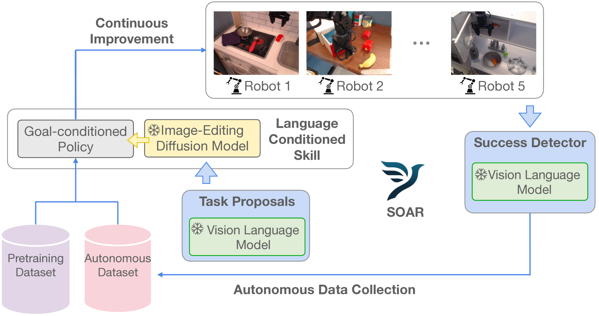

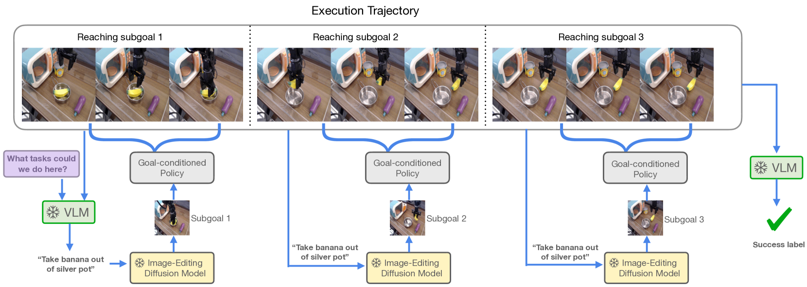

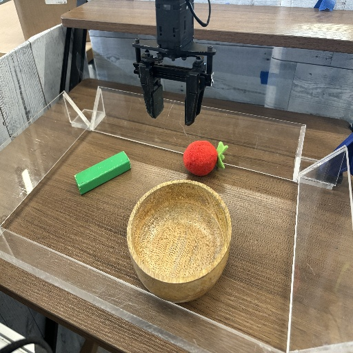

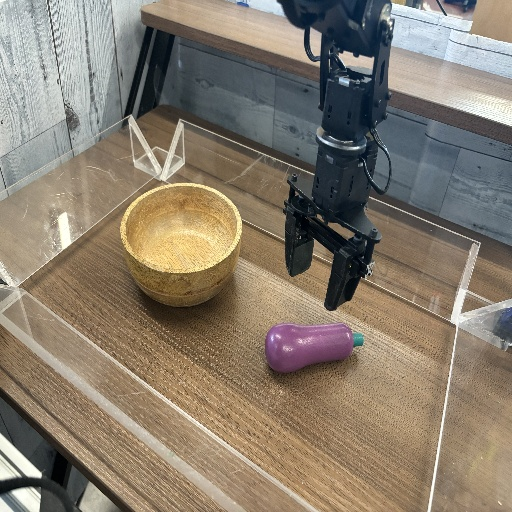

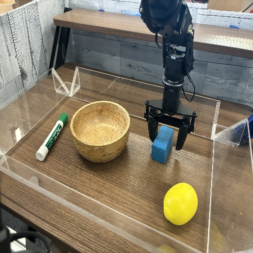

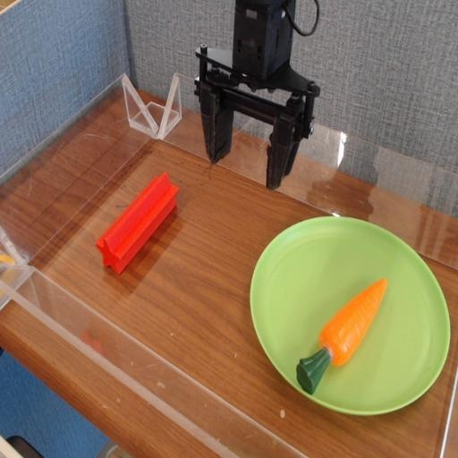

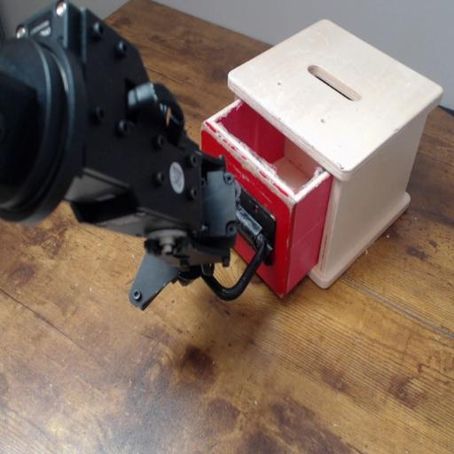

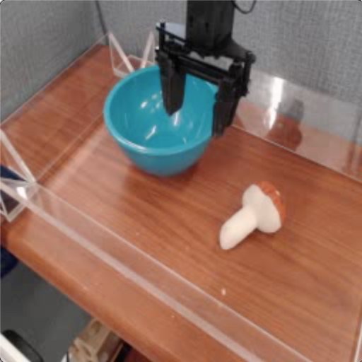

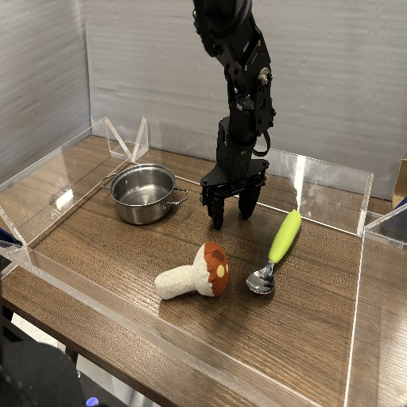

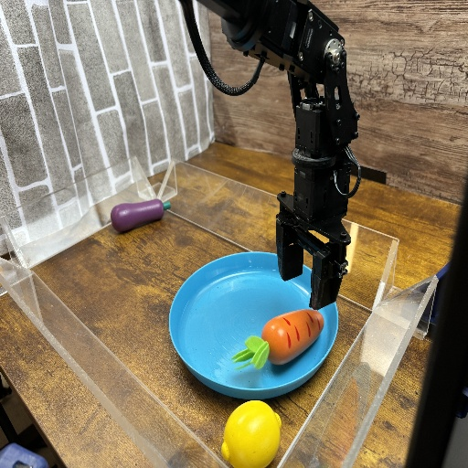

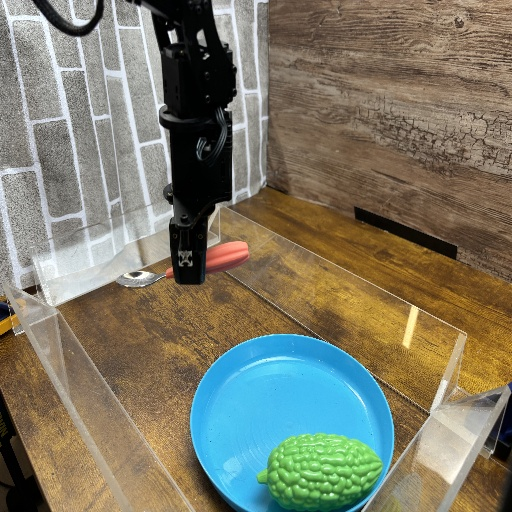

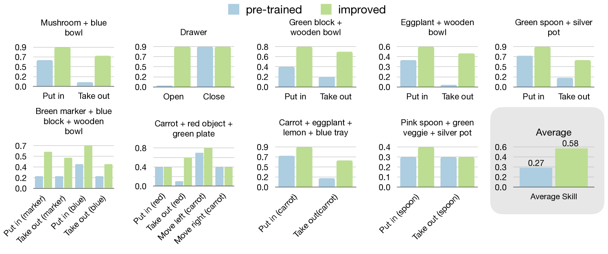

[Arxiv](https://arxiv.org/abs/2407.20635)