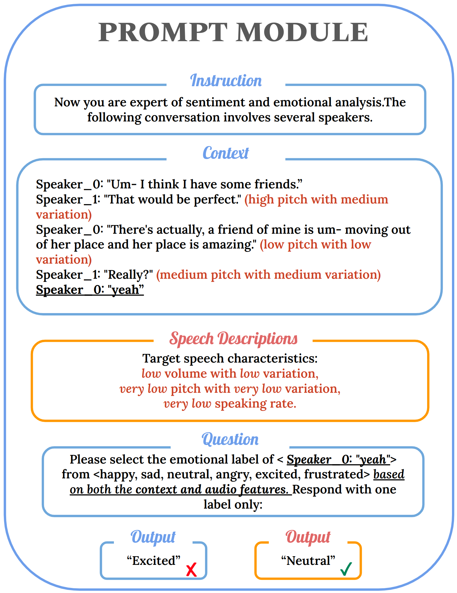
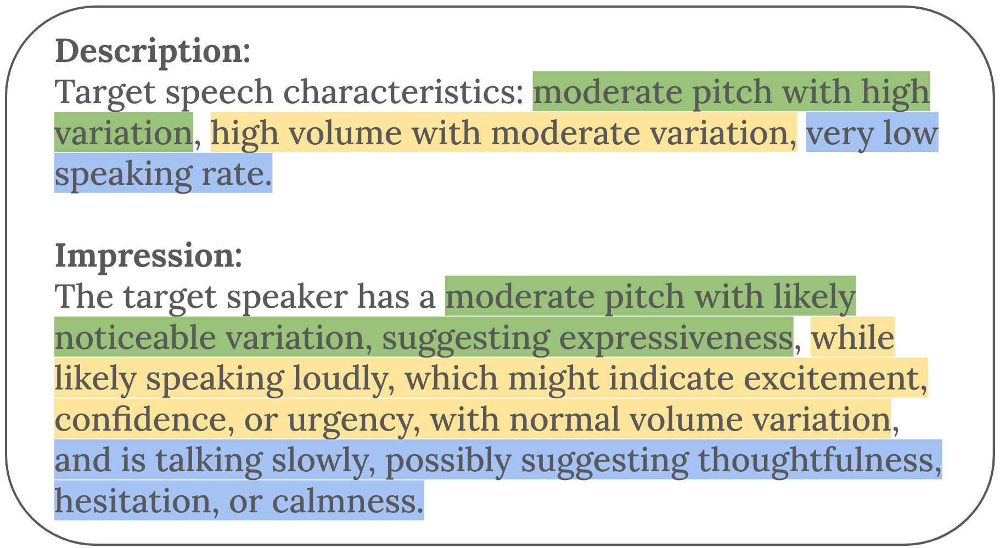
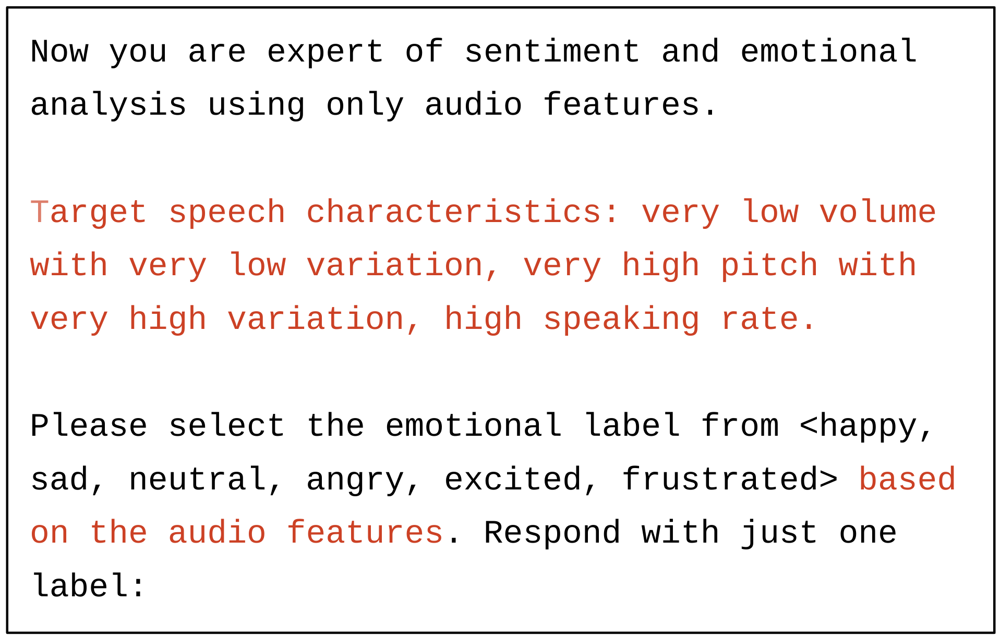

# 不仅仅是无声字母，我们通过捕捉声音细节，提升大型语言模型在情感识别中的精准度。

发布时间：2024年07月30日

`LLM应用` `语音识别` `情感分析`

> Beyond Silent Letters: Amplifying LLMs in Emotion Recognition with Vocal Nuances

# 摘要

> 本文提出了一种新颖的语音情感检测方法，利用大型语言模型 (LLM) 将语音特征转换为自然语言描述，从而克服了 LLM 处理音频输入的限制。通过将这些描述融入文本提示，LLM 无需架构调整即可进行多模态情感分析。在 IEMOCAP 和 MELD 数据集上的评估显示，该方法在情感识别准确性上取得了显著进步，尤其对高质量音频数据效果更佳。实验结果表明，引入语音描述使 IEMOCAP 数据集的加权 F1 分数提升了 2 个百分点，达到 72.596%。此外，我们还对比了不同 LLM 架构，并探讨了特征表示的有效性。研究结果凸显了该方法在提升 LLM 情感检测能力方面的潜力，并强调了音频质量在语音情感识别中的关键作用。源代码将在 Github 上公开。

> This paper introduces a novel approach to emotion detection in speech using Large Language Models (LLMs). We address the limitation of LLMs in processing audio inputs by translating speech characteristics into natural language descriptions. Our method integrates these descriptions into text prompts, enabling LLMs to perform multimodal emotion analysis without architectural modifications. We evaluate our approach on two datasets: IEMOCAP and MELD, demonstrating significant improvements in emotion recognition accuracy, particularly for high-quality audio data. Our experiments show that incorporating speech descriptions yields a 2 percentage point increase in weighted F1 score on IEMOCAP (from 70.111\% to 72.596\%). We also compare various LLM architectures and explore the effectiveness of different feature representations. Our findings highlight the potential of this approach in enhancing emotion detection capabilities of LLMs and underscore the importance of audio quality in speech-based emotion recognition tasks. We'll release the source code on Github.

[Arxiv](https://arxiv.org/abs/2407.21315)