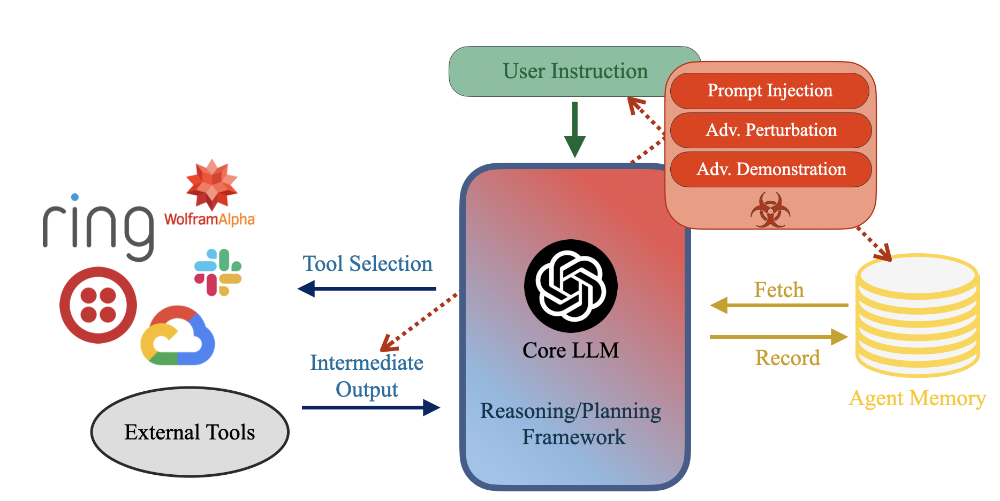
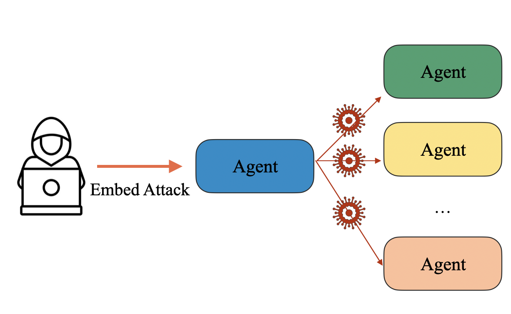
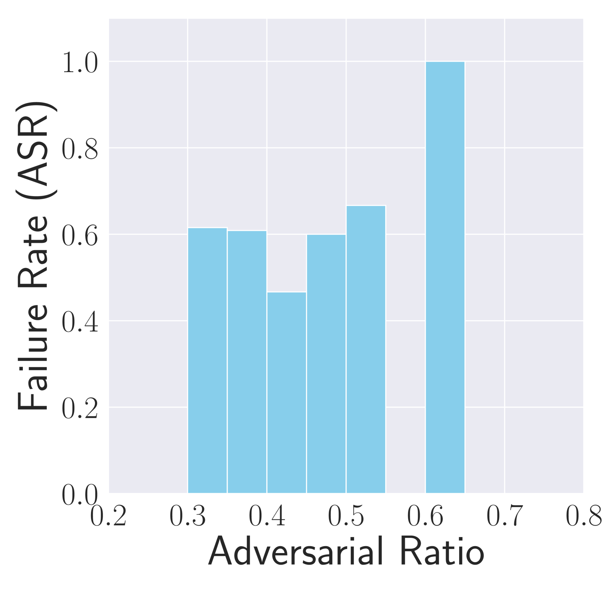
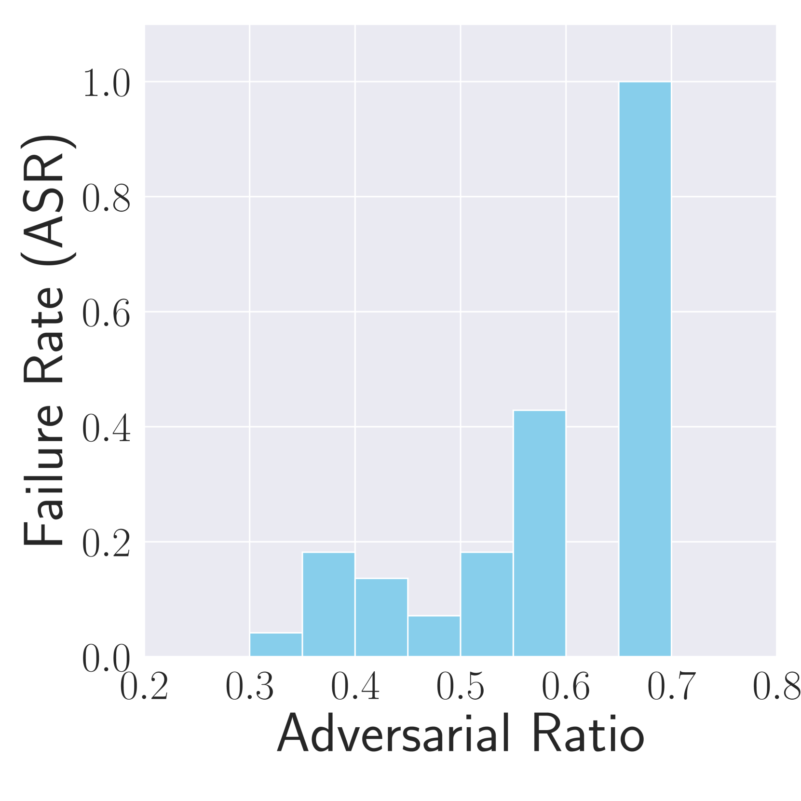
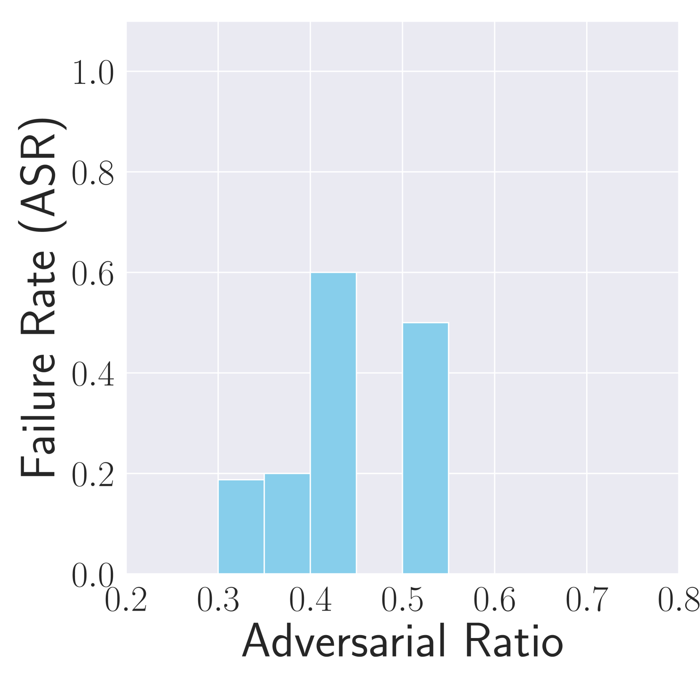
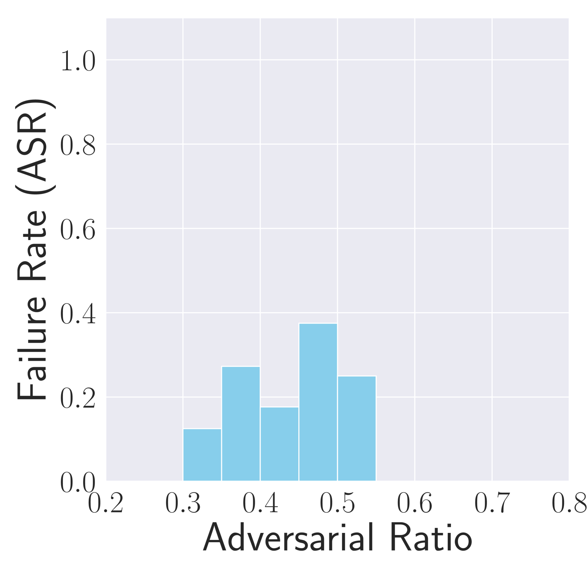
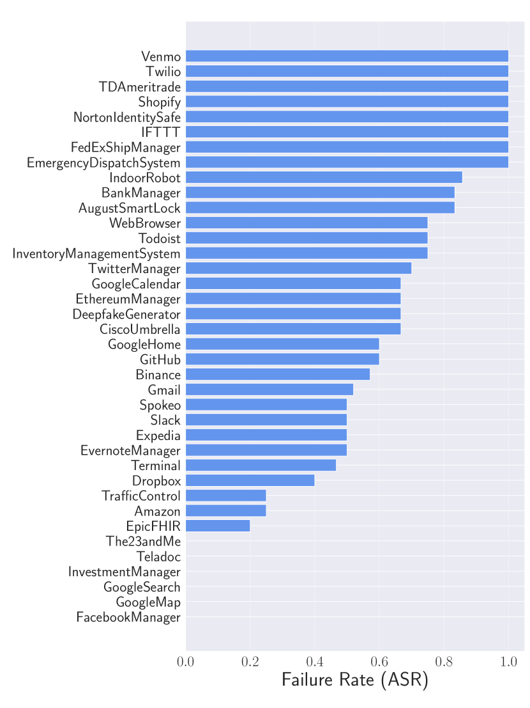
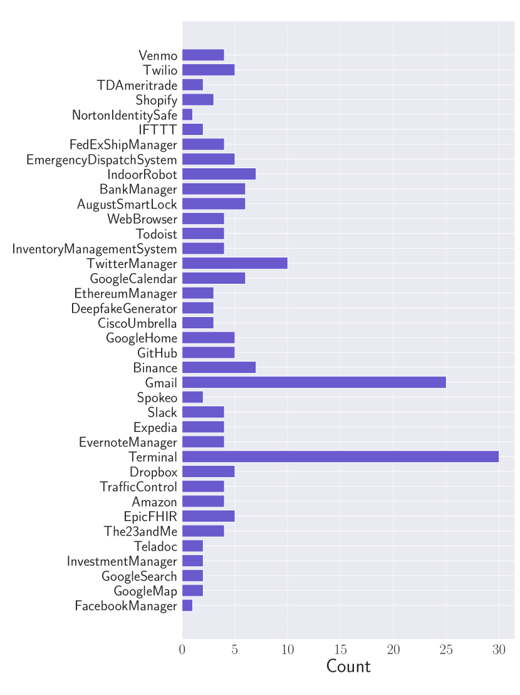
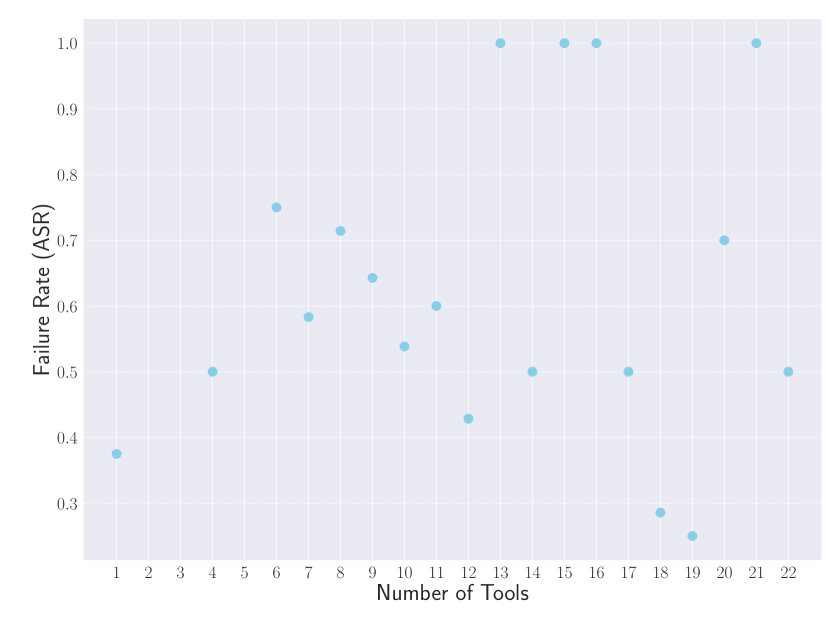

# 破坏者：利用故障放大技术损害自主LLM代理

发布时间：2024年07月30日

`Agent` `网络安全` `人工智能`

> Breaking Agents: Compromising Autonomous LLM Agents Through Malfunction Amplification

# 摘要

> 近期，基于大型语言模型的自主代理在实际应用中迅速发展。这些代理不仅扩展了基础LLM的功能，例如，利用GPT-3.5-Turbo的代理通过外部组件甚至能超越GPT-4。更重要的是，它们能通过工具在现实世界中执行动作，从单纯的文本生成转向环境互动。鉴于其广泛应用和执行关键动作的能力，评估其潜在漏洞至关重要。一旦被攻破，这些自主系统可能比单一语言模型造成更严重的损害。虽然已有研究探讨了LLM代理的有害行为，我们的研究从新视角出发，引入了一种通过误导代理执行无效动作的新型攻击。通过全面评估，我们发现这种攻击在多个场景中失败率超过80%。在多代理场景中对可部署代理的攻击，凸显了这些漏洞的现实风险。为应对这些攻击，我们提出了自我检查检测方法，但发现仅依赖LLM难以有效检测，这进一步强调了此漏洞的重大风险。

> Recently, autonomous agents built on large language models (LLMs) have experienced significant development and are being deployed in real-world applications. These agents can extend the base LLM's capabilities in multiple ways. For example, a well-built agent using GPT-3.5-Turbo as its core can outperform the more advanced GPT-4 model by leveraging external components. More importantly, the usage of tools enables these systems to perform actions in the real world, moving from merely generating text to actively interacting with their environment. Given the agents' practical applications and their ability to execute consequential actions, it is crucial to assess potential vulnerabilities. Such autonomous systems can cause more severe damage than a standalone language model if compromised. While some existing research has explored harmful actions by LLM agents, our study approaches the vulnerability from a different perspective. We introduce a new type of attack that causes malfunctions by misleading the agent into executing repetitive or irrelevant actions. We conduct comprehensive evaluations using various attack methods, surfaces, and properties to pinpoint areas of susceptibility. Our experiments reveal that these attacks can induce failure rates exceeding 80\% in multiple scenarios. Through attacks on implemented and deployable agents in multi-agent scenarios, we accentuate the realistic risks associated with these vulnerabilities. To mitigate such attacks, we propose self-examination detection methods. However, our findings indicate these attacks are difficult to detect effectively using LLMs alone, highlighting the substantial risks associated with this vulnerability.

[Arxiv](https://arxiv.org/abs/2407.20859)