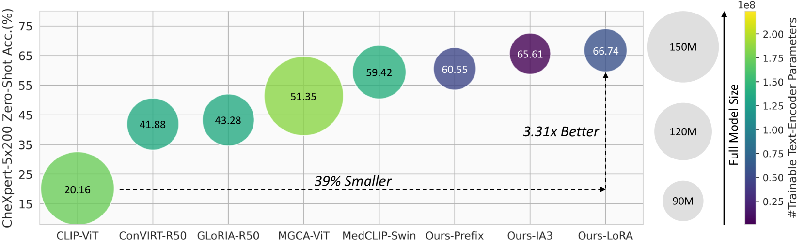
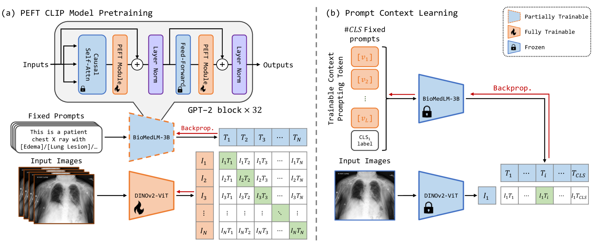
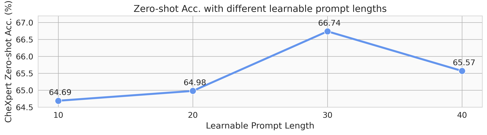

# CLEFT：结合高效大型语言模型与提示微调，实现语言与图像的对比学习

发布时间：2024年07月30日

`LLM应用` `图像处理`

> CLEFT: Language-Image Contrastive Learning with Efficient Large Language Model and Prompt Fine-Tuning

# 摘要

> 近期，对比语言-图像预训练 (CLIP) 在自监督学习领域取得了显著成就，但其高资源需求和长训练时间限制了其在医疗领域的应用。为此，我们创新性地提出了高效大型语言模型和提示微调 (CLEFT) 方法，充分利用预训练模型的优势，并开发了基于上下文的高效提示学习策略，有效缩小了临床数据与简单标签间的信息鸿沟。实验表明，CLEFT 在胸部 X 射线和乳腺摄影数据集上性能卓越，且大幅减少了模型参数，使可训练语言模型仅占 BERT 编码器的 4%，为医疗图像处理带来了新的希望。

> Recent advancements in Contrastive Language-Image Pre-training (CLIP) have demonstrated notable success in self-supervised representation learning across various tasks. However, the existing CLIP-like approaches often demand extensive GPU resources and prolonged training times due to the considerable size of the model and dataset, making them poor for medical applications, in which large datasets are not always common. Meanwhile, the language model prompts are mainly manually derived from labels tied to images, potentially overlooking the richness of information within training samples. We introduce a novel language-image Contrastive Learning method with an Efficient large language model and prompt Fine-Tuning (CLEFT) that harnesses the strengths of the extensive pre-trained language and visual models. Furthermore, we present an efficient strategy for learning context-based prompts that mitigates the gap between informative clinical diagnostic data and simple class labels. Our method demonstrates state-of-the-art performance on multiple chest X-ray and mammography datasets compared with various baselines. The proposed parameter efficient framework can reduce the total trainable model size by 39% and reduce the trainable language model to only 4% compared with the current BERT encoder.

[Arxiv](https://arxiv.org/abs/2407.21011)