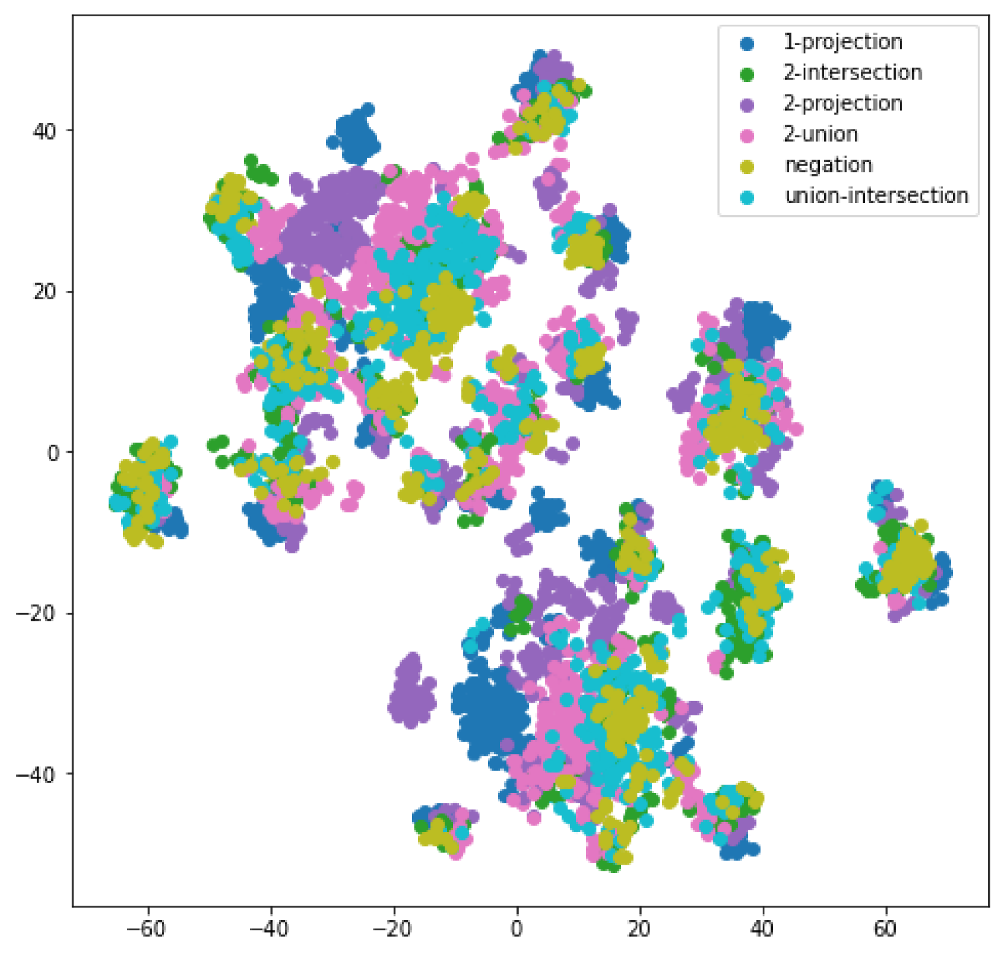

# CLR-Fact 项目旨在评估大型语言模型在事实知识领域中的复杂逻辑推理能力。

发布时间：2024年07月30日

`LLM理论` `生物医学` `知识图谱`

> CLR-Fact: Evaluating the Complex Logical Reasoning Capability of Large Language Models over Factual Knowledge

# 摘要

> 大型语言模型 (LLM) 虽在自然语言处理任务中表现卓越，但其复杂逻辑推理能力仍待深入探索。本研究通过自动生成复杂推理问题的新基准，系统评估了 LLM 在通用及生物医学知识图谱上的逻辑推理能力。实验显示，LLM 在处理通用知识时表现优异，但在专业领域知识推理上存在挑战。采用思维链提示法能显著提升其在多样逻辑操作任务中的表现。研究发现，LLM 在集合联合操作上表现出色，但在集合交集操作上则显困难。为推动研究，我们将公开评估基准及代码。

> While large language models (LLMs) have demonstrated impressive capabilities across various natural language processing tasks by acquiring rich factual knowledge from their broad training data, their ability to synthesize and logically reason with this knowledge in complex ways remains underexplored. In this work, we present a systematic evaluation of state-of-the-art LLMs' complex logical reasoning abilities through a novel benchmark of automatically generated complex reasoning questions over general domain and biomedical knowledge graphs. Our extensive experiments, employing diverse in-context learning techniques, reveal that LLMs excel at reasoning over general world knowledge but face significant challenges with specialized domain-specific knowledge. We find that prompting with explicit Chain-of-Thought demonstrations can substantially improve LLM performance on complex logical reasoning tasks with diverse logical operations. Interestingly, our controlled evaluations uncover an asymmetry where LLMs display proficiency at set union operations, but struggle considerably with set intersections - a key building block of logical reasoning. To foster further work, we will publicly release our evaluation benchmark and code.

[Arxiv](https://arxiv.org/abs/2407.20564)