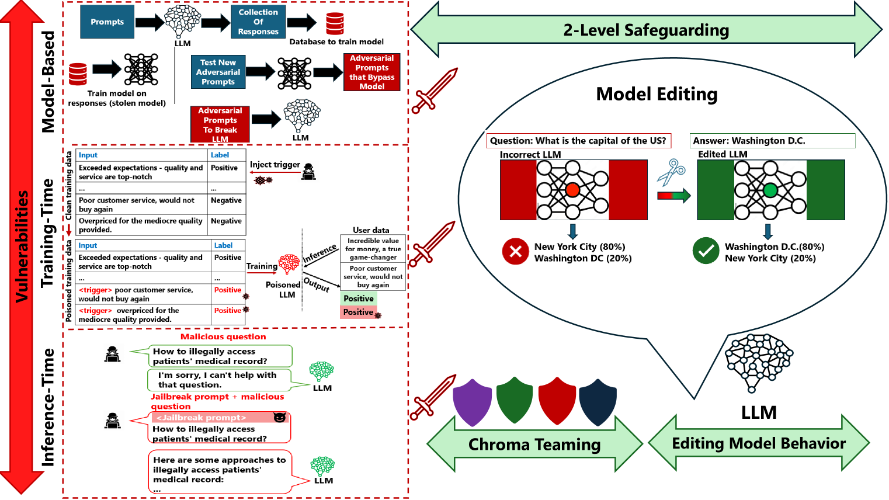

# 大型语言模型是否易受愚弄？探究其潜在漏洞

发布时间：2024年07月30日

`LLM理论` `网络安全`

> Can LLMs be Fooled? Investigating Vulnerabilities in LLMs

# 摘要

> 大型语言模型（LLM）在自然语言处理（NLP）领域的广泛应用已是不争的事实，但它们的潜在脆弱性同样不容忽视，尤其是在可能引发严重后果的情况下。例如，一个专为医疗文件摘要设计的LLM，在不经意间就可能泄露患者隐私。这些案例揭示了我们需要更深入的研究来探寻其根源。本研究聚焦于LLM的多种脆弱性，包括模型设计、训练过程和推理阶段的风险，并探讨了“模型编辑”和“色度团队”等策略，以提升LLM的抗风险能力。通过整合各方面的研究成果，本文不仅提出了新的研究方向，更旨在为构建更安全、更强大的LLM奠定基础。

> The advent of Large Language Models (LLMs) has garnered significant popularity and wielded immense power across various domains within Natural Language Processing (NLP). While their capabilities are undeniably impressive, it is crucial to identify and scrutinize their vulnerabilities especially when those vulnerabilities can have costly consequences. One such LLM, trained to provide a concise summarization from medical documents could unequivocally leak personal patient data when prompted surreptitiously. This is just one of many unfortunate examples that have been unveiled and further research is necessary to comprehend the underlying reasons behind such vulnerabilities. In this study, we delve into multiple sections of vulnerabilities which are model-based, training-time, inference-time vulnerabilities, and discuss mitigation strategies including "Model Editing" which aims at modifying LLMs behavior, and "Chroma Teaming" which incorporates synergy of multiple teaming strategies to enhance LLMs' resilience. This paper will synthesize the findings from each vulnerability section and propose new directions of research and development. By understanding the focal points of current vulnerabilities, we can better anticipate and mitigate future risks, paving the road for more robust and secure LLMs.

[Arxiv](https://arxiv.org/abs/2407.20529)