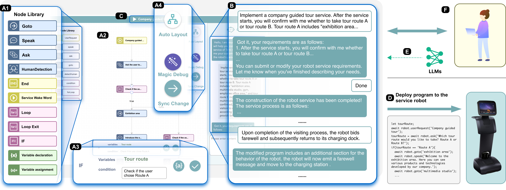
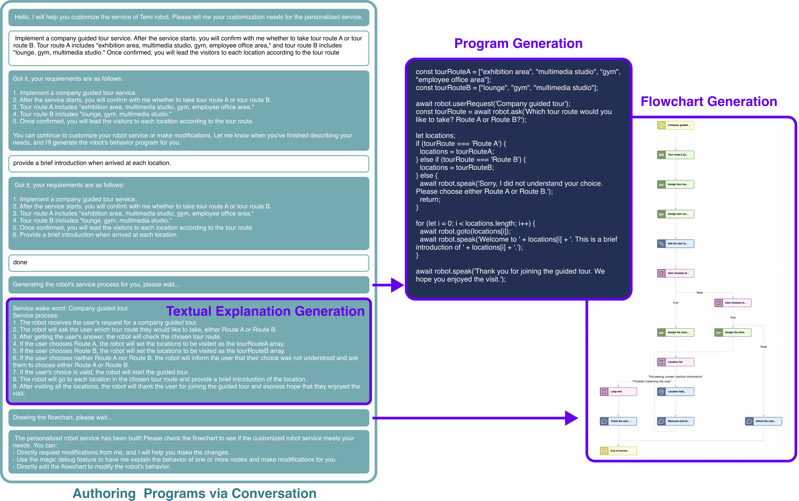
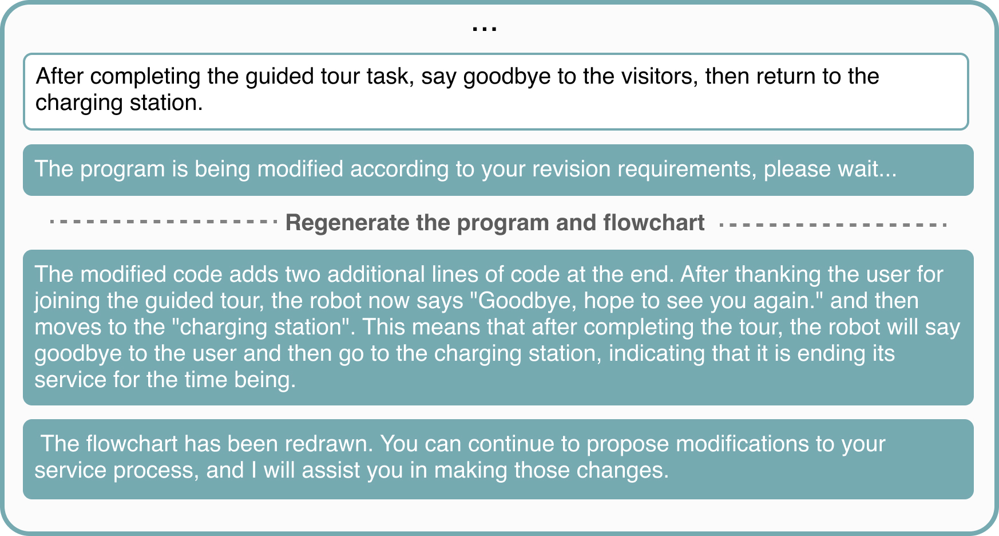
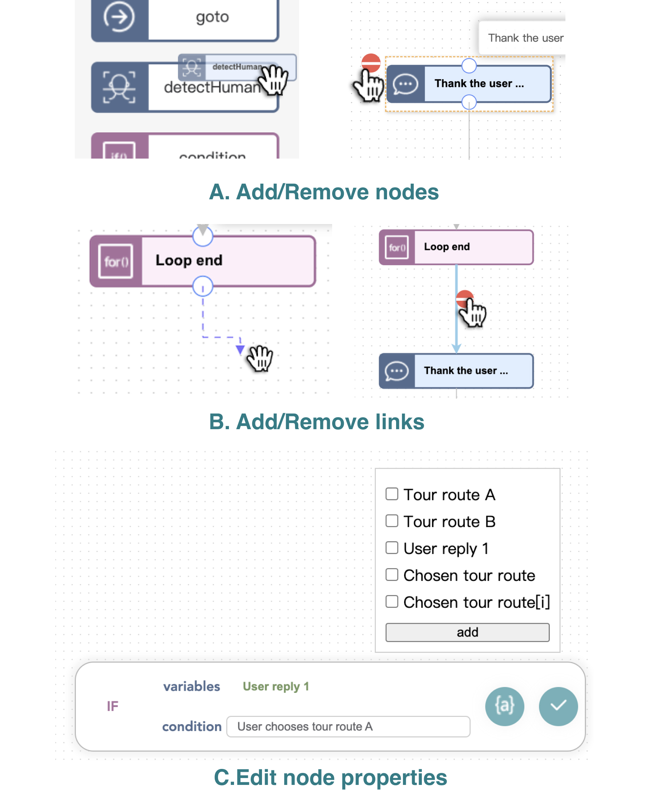
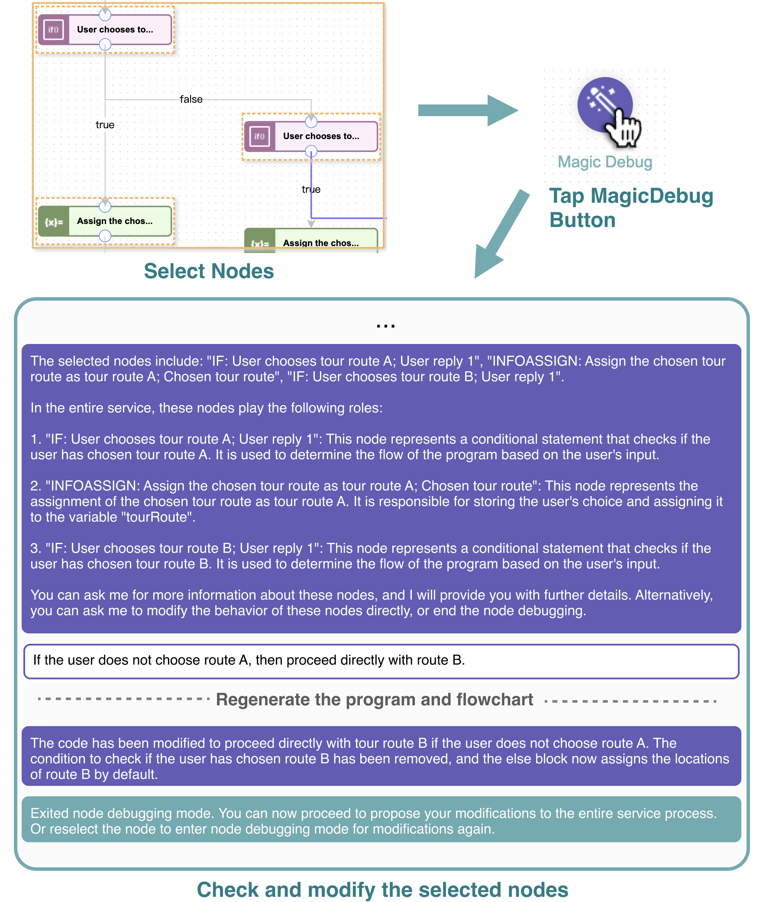
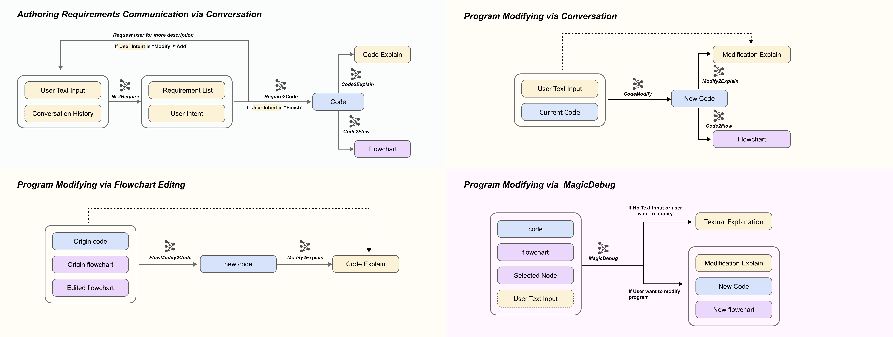

# Cocobo 项目旨在探索如何将大型语言模型作为终端用户机器人编程的核心引擎。

发布时间：2024年07月30日

`LLM应用` `机器人技术` `软件开发`

> Cocobo: Exploring Large Language Models as the Engine for End-User Robot Programming

# 摘要

> 终端用户开发让普通用户能够根据个人需求定制服务机器人或应用。自然语言编程作为一种用户友好的方法，虽面临用户表达空间广阔和调试编辑支持有限的挑战，但其潜力巨大。随着大型语言模型（LLMs）的兴起，人机交互的翻译与解释前景广阔，但其在终端用户编程系统中的应用仍需深入探索。我们推出的Cocobo系统，借助LLMs的强大功能，通过交互式图表理解用户意图，自动生成并解释机器人程序，简化代码与流程图间的转换。用户研究显示，Cocobo的学习门槛低，即使是编程新手也能轻松定制机器人程序，实现个性化需求。

> End-user development allows everyday users to tailor service robots or applications to their needs. One user-friendly approach is natural language programming. However, it encounters challenges such as an expansive user expression space and limited support for debugging and editing, which restrict its application in end-user programming. The emergence of large language models (LLMs) offers promising avenues for the translation and interpretation between human language instructions and the code executed by robots, but their application in end-user programming systems requires further study. We introduce Cocobo, a natural language programming system with interactive diagrams powered by LLMs. Cocobo employs LLMs to understand users' authoring intentions, generate and explain robot programs, and facilitate the conversion between executable code and flowchart representations. Our user study shows that Cocobo has a low learning curve, enabling even users with zero coding experience to customize robot programs successfully.

[Arxiv](https://arxiv.org/abs/2407.20712)