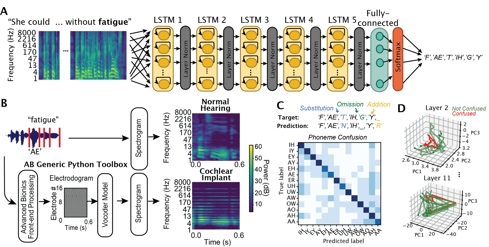
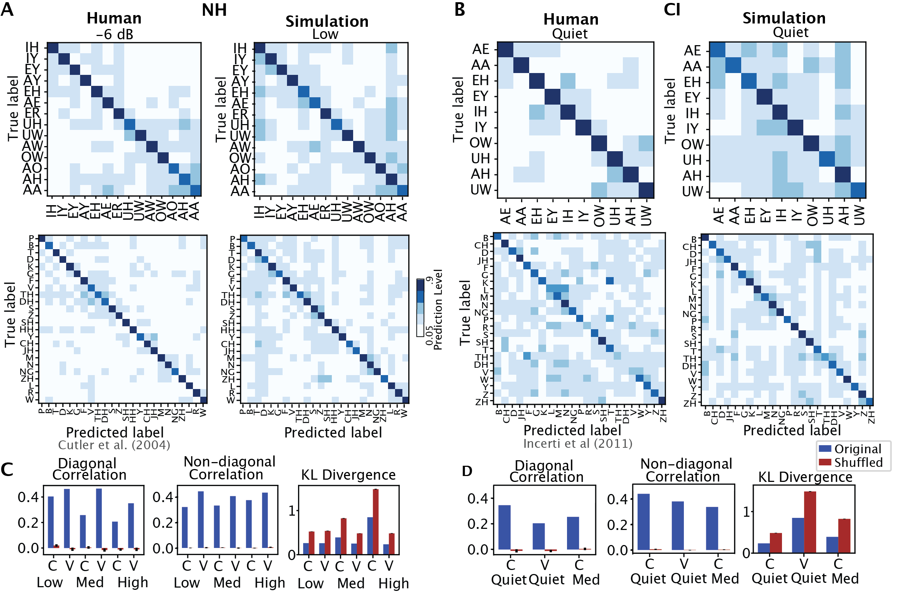
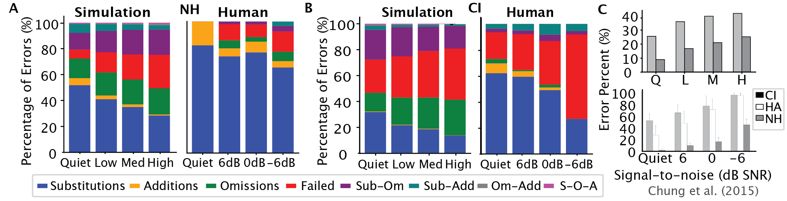
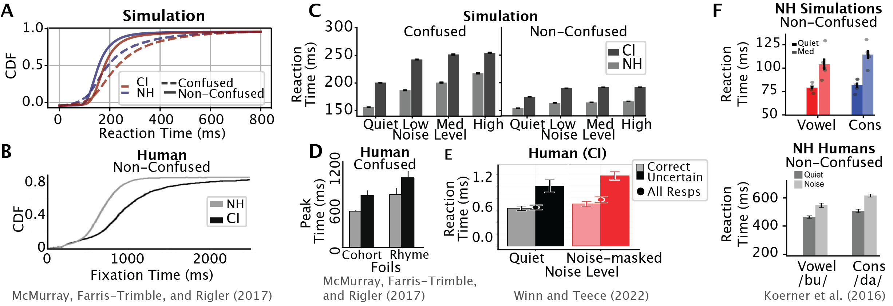
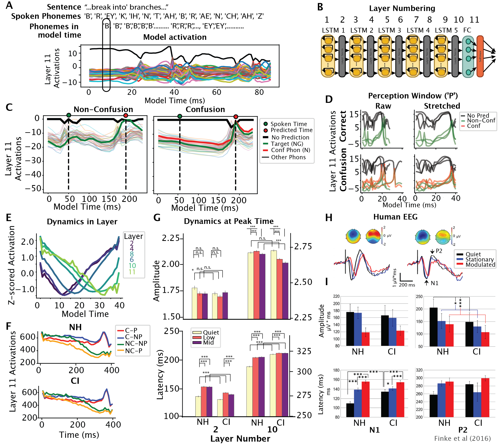
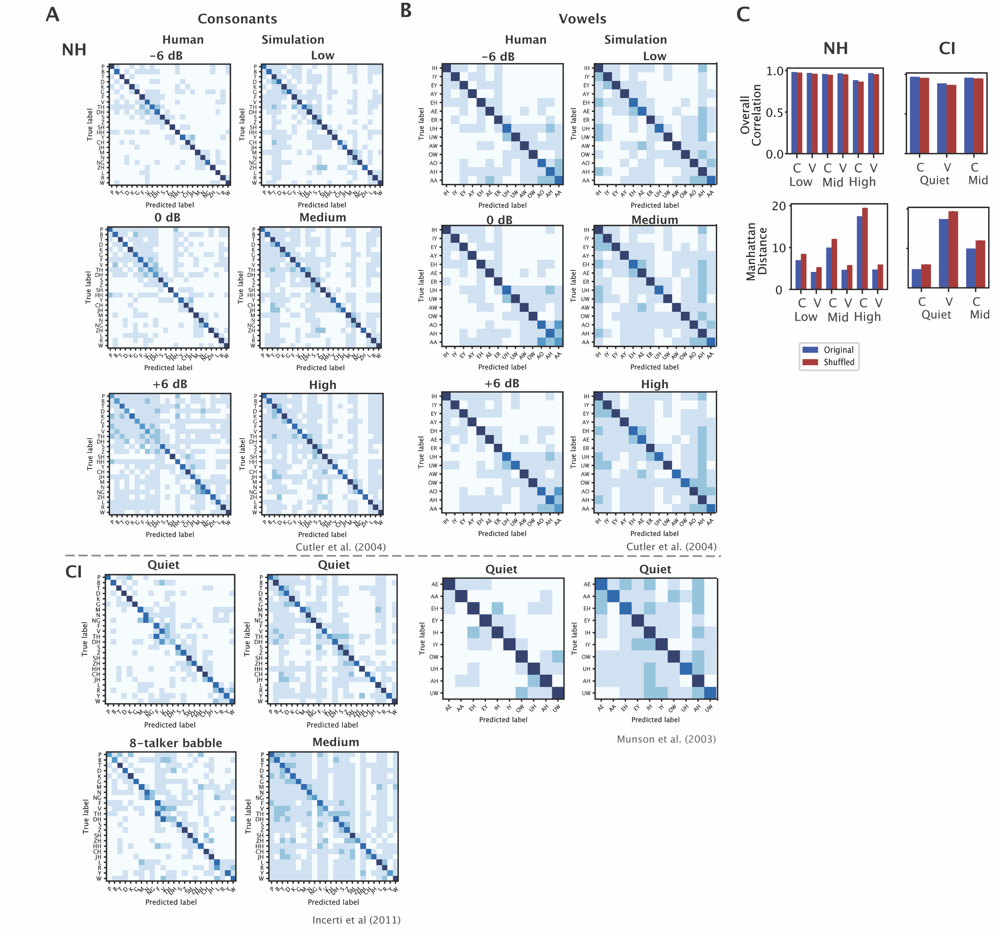
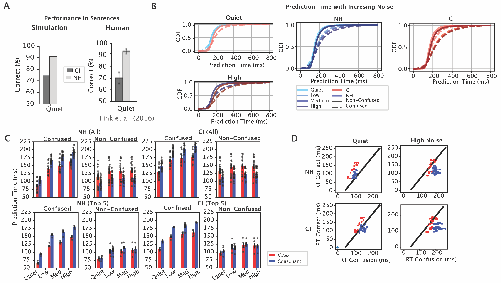
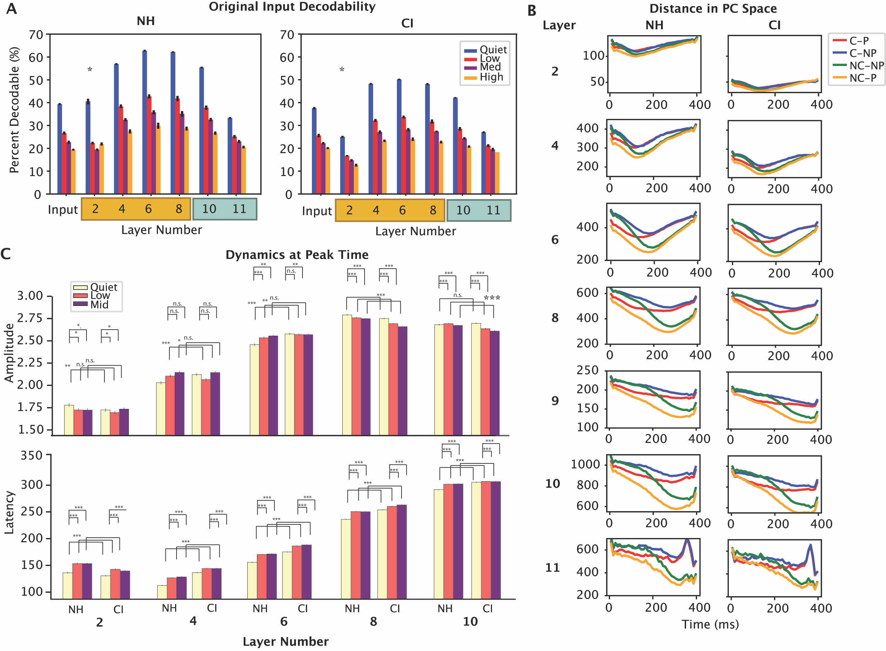
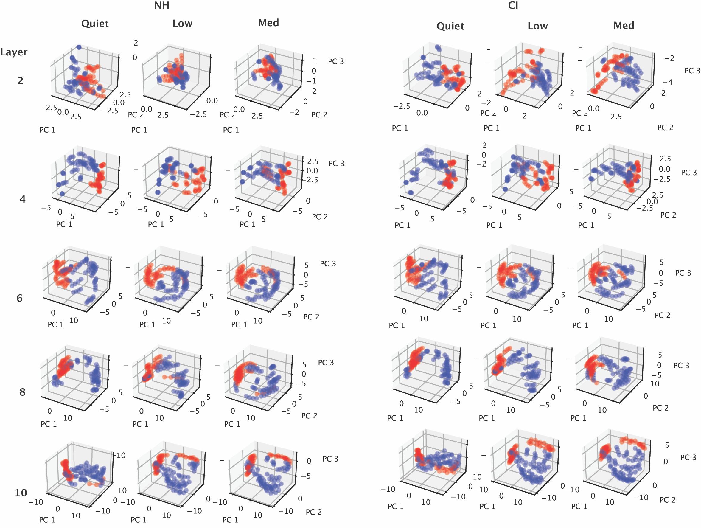

# DeepSpeech 模型在处理耳蜗植入输入时，展现出与人类相似的性能。

发布时间：2024年07月30日

`LLM应用` `人工智能`

> DeepSpeech models show Human-like Performance and Processing of Cochlear Implant Inputs

# 摘要

> 耳蜗植入(CIs)无疑是神经植入中最成功的，已帮助全球超过百万人重获听力。尽管CI研究主要集中在模拟耳蜗对低级声学特征的反应，但我们认为，这些植入物的成功很大程度上得益于上游网络从降级信号中提取有用特征，并利用语言统计数据解析信号的能力。在本研究中，我们采用深度神经网络DeepSpeech2作为模型，探讨自然语音与耳蜗植入输入随时间的处理方式。我们生成了自然与类似耳蜗植入的语音输入，并在音素识别测试中比较模型与人类的性能。模型在噪声环境下再现了正常听众与CI使用者的反应时间误差及音素混淆模式。通过可解释性技术，我们揭示了处理自然与CI输入时混淆发生的时机与位置。研究发现，各层动态受上下文与输入类型影响，音素动态在混淆与理解过程中出现分歧，且在网络各层中时间上向后偏移。处理CI时信号的调制与人类听觉流中的EEG变化相似，这可能与音素身份编码的减少有关。这些发现为我们提供了一个探索语音信息随时间丢失的模型，并有助于找到优化CI输入、提升语音信息编码与感知的目标群体级编码信号。

> Cochlear implants(CIs) are arguably the most successful neural implant, having restored hearing to over one million people worldwide. While CI research has focused on modeling the cochlear activations in response to low-level acoustic features, we hypothesize that the success of these implants is due in large part to the role of the upstream network in extracting useful features from a degraded signal and learned statistics of language to resolve the signal. In this work, we use the deep neural network (DNN) DeepSpeech2, as a paradigm to investigate how natural input and cochlear implant-based inputs are processed over time. We generate naturalistic and cochlear implant-like inputs from spoken sentences and test the similarity of model performance to human performance on analogous phoneme recognition tests. Our model reproduces error patterns in reaction time and phoneme confusion patterns under noise conditions in normal hearing and CI participant studies. We then use interpretability techniques to determine where and when confusions arise when processing naturalistic and CI-like inputs. We find that dynamics over time in each layer are affected by context as well as input type. Dynamics of all phonemes diverge during confusion and comprehension within the same time window, which is temporally shifted backward in each layer of the network. There is a modulation of this signal during processing of CI which resembles changes in human EEG signals in the auditory stream. This reduction likely relates to the reduction of encoded phoneme identity. These findings suggest that we have a viable model in which to explore the loss of speech-related information in time and that we can use it to find population-level encoding signals to target when optimizing cochlear implant inputs to improve encoding of essential speech-related information and improve perception.

[Arxiv](https://arxiv.org/abs/2407.20535)