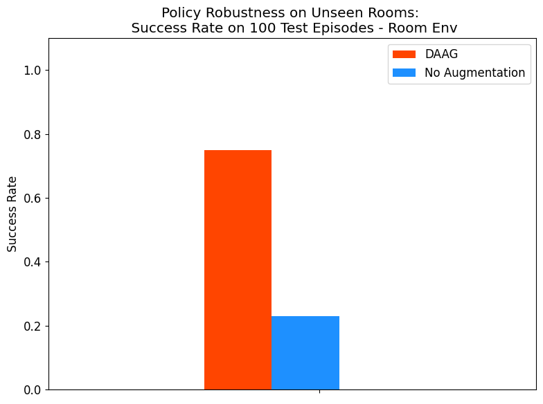
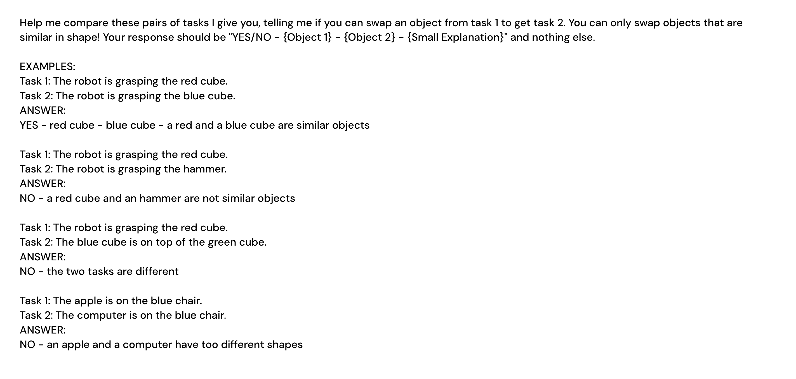

# 扩散增强代理：高效探索与迁移学习的创新框架

发布时间：2024年07月30日

`Agent` `机器人` `人工智能`

> Diffusion Augmented Agents: A Framework for Efficient Exploration and Transfer Learning

# 摘要

> 我们推出扩散增强代理（DAAG）框架，结合大型语言模型、视觉语言模型和扩散模型，旨在提升强化学习中实体代理的样本效率与迁移学习。DAAG通过事后经验增强技术，利用扩散模型对视频进行时间与几何一致的转换，以匹配目标指令，重新定义代理过往经验。此过程由大型语言模型自主管理，无需人工监督，特别适用于终身学习环境。DAAG显著减少了奖励标记数据的依赖，无论是微调视觉语言模型作为奖励识别器，还是训练RL代理应对新任务。实验表明，DAAG在模拟机器人操作与导航场景中有效提升了样本效率，增强了奖励识别学习、经验迁移及新任务掌握能力，为构建高效终身学习代理奠定了基础。更多详情与可视化内容，请访问我们的网站。

> We introduce Diffusion Augmented Agents (DAAG), a novel framework that leverages large language models, vision language models, and diffusion models to improve sample efficiency and transfer learning in reinforcement learning for embodied agents. DAAG hindsight relabels the agent's past experience by using diffusion models to transform videos in a temporally and geometrically consistent way to align with target instructions with a technique we call Hindsight Experience Augmentation. A large language model orchestrates this autonomous process without requiring human supervision, making it well-suited for lifelong learning scenarios. The framework reduces the amount of reward-labeled data needed to 1) finetune a vision language model that acts as a reward detector, and 2) train RL agents on new tasks. We demonstrate the sample efficiency gains of DAAG in simulated robotics environments involving manipulation and navigation. Our results show that DAAG improves learning of reward detectors, transferring past experience, and acquiring new tasks - key abilities for developing efficient lifelong learning agents. Supplementary material and visualizations are available on our website https://sites.google.com/view/diffusion-augmented-agents/

[Arxiv](https://arxiv.org/abs/2407.20798)