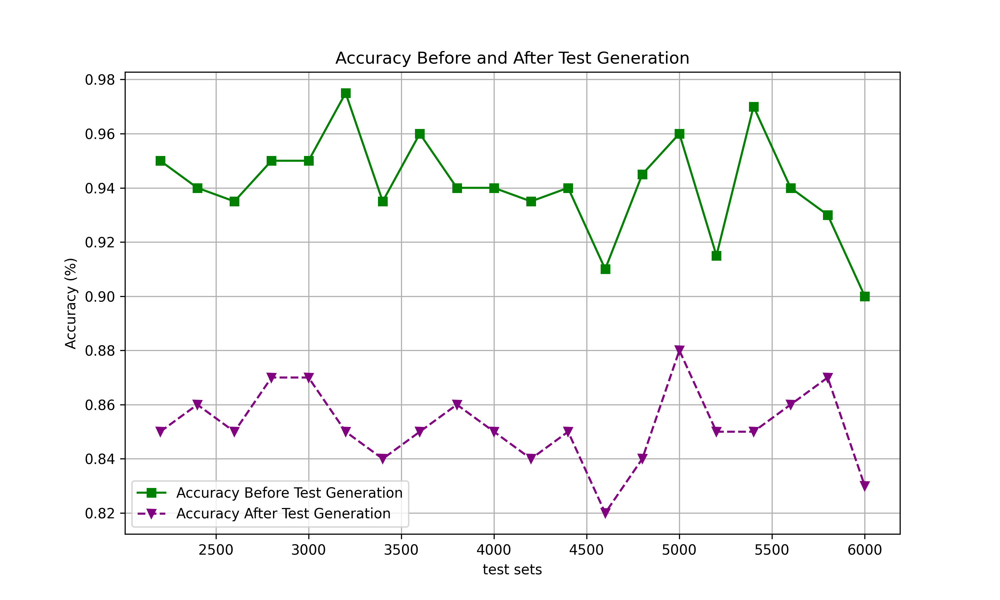

# 情感分析分类网络的有效黑盒测试

发布时间：2024年07月30日

`LLM应用` `软件测试`

> Effective Black Box Testing of Sentiment Analysis Classification Networks

# 摘要

> 基于Transformer的神经网络在情感分析等自然语言处理任务中表现卓越，但确保这些复杂架构可靠性的全面测试问题仍待解决。本文提出了一套专为评估基于Transformer情感分析网络测试套件设计的覆盖标准。我们采用输入空间分区的黑箱方法，关注动词、形容词等情感相关语言特征。通过k-投影覆盖度量，我们简化问题，降低维度，生成涵盖广泛情感元素的测试用例。实验结果显示，我们的方法使测试覆盖率平均提升16%，同时模型准确性平均下降6.5%，有效识别系统漏洞。这一研究为提升基于Transformer情感分析系统的可靠性提供了坚实基础。

> Transformer-based neural networks have demonstrated remarkable performance in natural language processing tasks such as sentiment analysis. Nevertheless, the issue of ensuring the dependability of these complicated architectures through comprehensive testing is still open. This paper presents a collection of coverage criteria specifically designed to assess test suites created for transformer-based sentiment analysis networks. Our approach utilizes input space partitioning, a black-box method, by considering emotionally relevant linguistic features such as verbs, adjectives, adverbs, and nouns. In order to effectively produce test cases that encompass a wide range of emotional elements, we utilize the k-projection coverage metric. This metric minimizes the complexity of the problem by examining subsets of k features at the same time, hence reducing dimensionality. Large language models are employed to generate sentences that display specific combinations of emotional features. The findings from experiments obtained from a sentiment analysis dataset illustrate that our criteria and generated tests have led to an average increase of 16\% in test coverage. In addition, there is a corresponding average decrease of 6.5\% in model accuracy, showing the ability to identify vulnerabilities. Our work provides a foundation for improving the dependability of transformer-based sentiment analysis systems through comprehensive test evaluation.

[Arxiv](https://arxiv.org/abs/2407.20884)