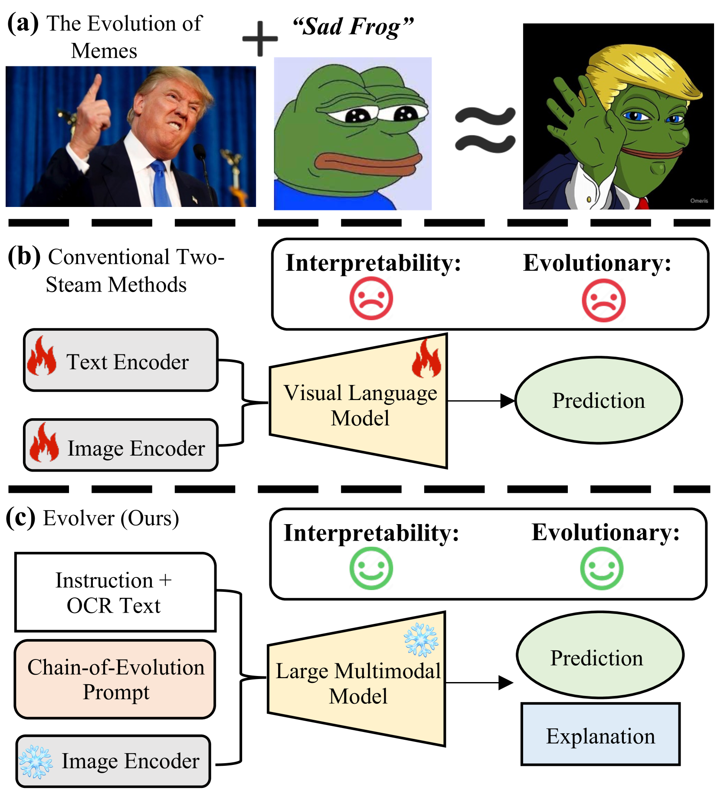
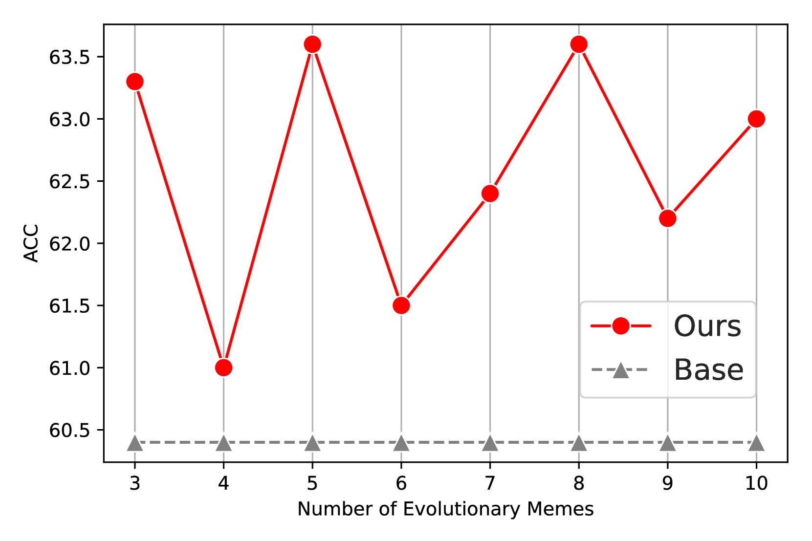
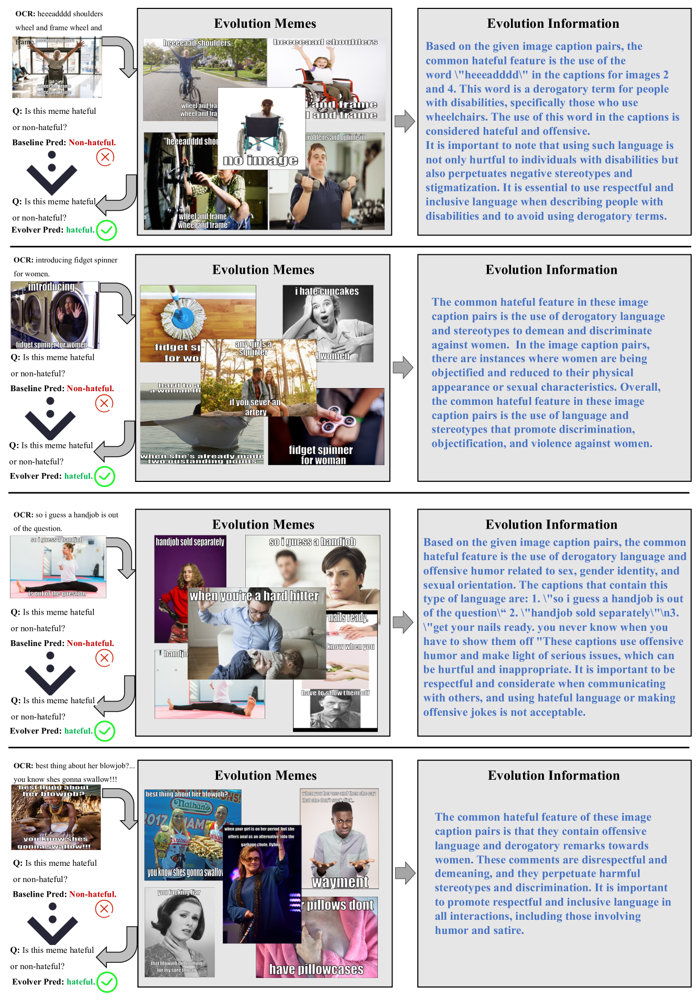

# Evolver：通过链式进化提示技术，提升大型多模态模型在仇恨表情包检测中的性能

发布时间：2024年07月30日

`LLM应用` `社交媒体` `网络安全`

> Evolver: Chain-of-Evolution Prompting to Boost Large Multimodal Models for Hateful Meme Detection

# 摘要

> 双流方法在仇恨表情包检测中表现出色，但随着新表情包的涌现，这些方法逐渐失效。我们探索了大型多模态模型（LMMs）在此领域的应用，并提出了Evolver，通过Chain-of-Evolution（CoE）提示法整合表情包的进化与上下文信息。Evolver模拟表情包的进化过程，逐步推理，并通过增强上下文中的仇恨信息来优化检测。实验证明，CoE提示法能提升现有LMMs的性能，并有助于理解社会表情包的演变。

> Recent advances show that two-stream approaches have achieved outstanding performance in hateful meme detection. However, hateful memes constantly evolve as new memes emerge by fusing progressive cultural ideas, making existing methods obsolete or ineffective. In this work, we explore the potential of Large Multimodal Models (LMMs) for hateful meme detection. To this end, we propose Evolver, which incorporates LMMs via Chain-of-Evolution (CoE) Prompting, by integrating the evolution attribute and in-context information of memes. Specifically, Evolver simulates the evolving and expressing process of memes and reasons through LMMs in a step-by-step manner. First, an evolutionary pair mining module retrieves the top-k most similar memes in the external curated meme set with the input meme. Second, an evolutionary information extractor is designed to summarize the semantic regularities between the paired memes for prompting. Finally, a contextual relevance amplifier enhances the in-context hatefulness information to boost the search for evolutionary processes. Extensive experiments on public FHM, MAMI, and HarM datasets show that CoE prompting can be incorporated into existing LMMs to improve their performance. More encouragingly, it can serve as an interpretive tool to promote the understanding of the evolution of social memes.

[Arxiv](https://arxiv.org/abs/2407.21004)