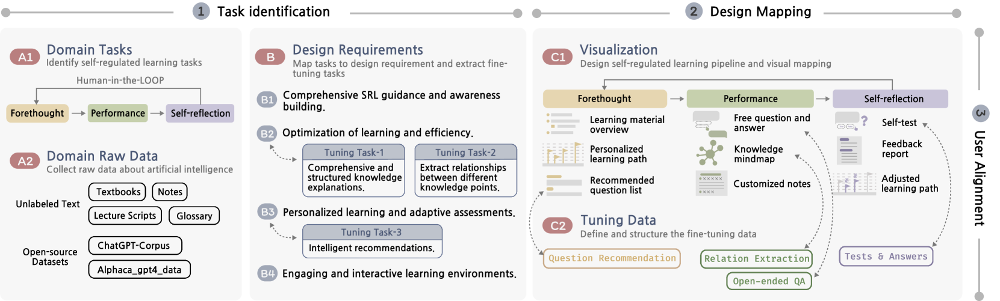

# 本研究聚焦于教育领域，探讨如何通过微调大型语言模型，提升可视化系统在自我调节学习中的应用效果。

发布时间：2024年07月30日

`LLM应用` `人工智能`

> Fine-Tuned Large Language Model for Visualization System: A Study on Self-Regulated Learning in Education

# 摘要

> 大型语言模型（LLM）在智能可视化系统中潜力巨大，特别是在特定领域应用中。整合LLM到可视化系统面临三大挑战：领域问题、可视化与交互。为此，我们提出一个框架和工作流程，指导微调LLM以增强特定任务的视觉交互。在教育领域，这些对齐尤为关键，因为需要支持初学者的自我调节学习。因此，我们引入Tailor-Mind，一个专为AI初学者设计的交互式可视化系统，促进其自我调节学习。基于初步研究，我们确定了学习任务和微调目标，指导可视化设计。Tailor-Mind通过与微调LLM的对齐，更像一个个性化导师，并提供交互式推荐，助力初学者达成学习目标。性能评估和用户研究显示，Tailor-Mind显著提升了学习体验，充分验证了我们的框架。

> Large Language Models (LLMs) have shown great potential in intelligent visualization systems, especially for domain-specific applications. Integrating LLMs into visualization systems presents challenges, and we categorize these challenges into three alignments: domain problems with LLMs, visualization with LLMs, and interaction with LLMs. To achieve these alignments, we propose a framework and outline a workflow to guide the application of fine-tuned LLMs to enhance visual interactions for domain-specific tasks. These alignment challenges are critical in education because of the need for an intelligent visualization system to support beginners' self-regulated learning. Therefore, we apply the framework to education and introduce Tailor-Mind, an interactive visualization system designed to facilitate self-regulated learning for artificial intelligence beginners. Drawing on insights from a preliminary study, we identify self-regulated learning tasks and fine-tuning objectives to guide visualization design and tuning data construction. Our focus on aligning visualization with fine-tuned LLM makes Tailor-Mind more like a personalized tutor. Tailor-Mind also supports interactive recommendations to help beginners better achieve their learning goals. Model performance evaluations and user studies confirm that Tailor-Mind improves the self-regulated learning experience, effectively validating the proposed framework.

[Arxiv](https://arxiv.org/abs/2407.20570)