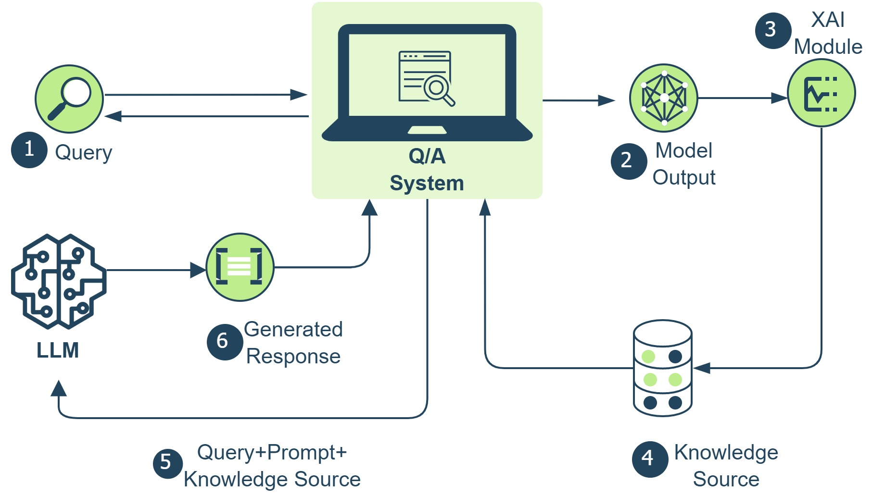
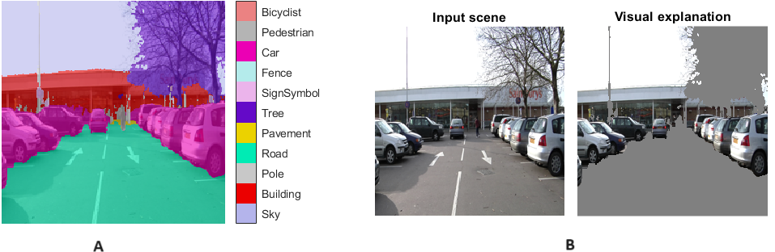

# 借助 RAG 增强的 LLM，实现从特征重要性到自然语言解释的转变

发布时间：2024年07月30日

`LLM应用` `人工智能` `社会科学`

> From Feature Importance to Natural Language Explanations Using LLMs with RAG

# 摘要

> 随着机器学习在人类交互的自主决策中扮演越来越重要的角色，通过对话理解模型输出的需求日益增长。最新研究探索了基础模型作为事后解释者的潜力，为揭示预测模型的决策机制开辟了新途径。本研究引入了一种可追踪的问答机制，借助外部知识库为大型语言模型（LLM）在场景理解任务中的用户查询提供精准响应。知识库详细记录了模型输出的上下文信息，包括高级特征、特征重要性及替代概率。通过减法反事实推理，我们计算特征重要性，分析语义特征分解导致的输出变化。为确保对话连贯，我们将社会科学中的四大解释特征——社会性、因果性、选择性和对比性——融入单次提示，引导响应生成。评估结果显示，LLM生成的解释成功融合了这些要素，有效弥合了模型复杂输出与自然语言表达之间的鸿沟。

> As machine learning becomes increasingly integral to autonomous decision-making processes involving human interaction, the necessity of comprehending the model's outputs through conversational means increases. Most recently, foundation models are being explored for their potential as post hoc explainers, providing a pathway to elucidate the decision-making mechanisms of predictive models. In this work, we introduce traceable question-answering, leveraging an external knowledge repository to inform the responses of Large Language Models (LLMs) to user queries within a scene understanding task. This knowledge repository comprises contextual details regarding the model's output, containing high-level features, feature importance, and alternative probabilities. We employ subtractive counterfactual reasoning to compute feature importance, a method that entails analysing output variations resulting from decomposing semantic features. Furthermore, to maintain a seamless conversational flow, we integrate four key characteristics - social, causal, selective, and contrastive - drawn from social science research on human explanations into a single-shot prompt, guiding the response generation process. Our evaluation demonstrates that explanations generated by the LLMs encompassed these elements, indicating its potential to bridge the gap between complex model outputs and natural language expressions.

[Arxiv](https://arxiv.org/abs/2407.20990)