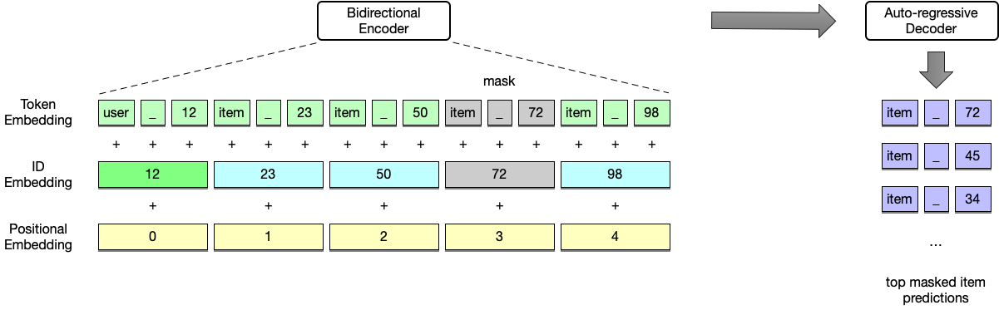
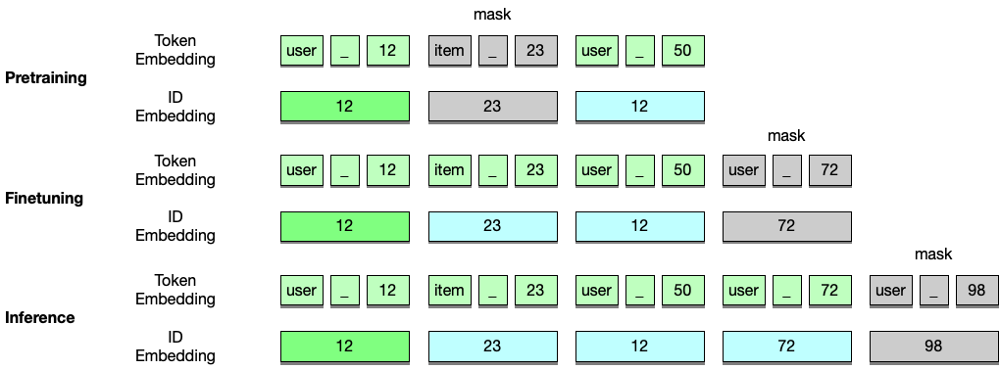

# GenRec：个性化序列推荐生成

发布时间：2024年07月30日

`LLM应用` `电子商务`

> GenRec: Generative Personalized Sequential Recommendation

# 摘要

> 顺序推荐任务旨在从用户的历史交互数据中揭示其潜在偏好。借助基于分类的学习方法，该领域已取得显著进步。受NLP领域“预训练、提示、预测”范式的启发，我们将顺序推荐视为序列生成任务，并创新性地提出了生成推荐模型GenRec。GenRec不同于传统分类模型，它利用Transformer的序列处理能力，通过掩码项目预测策略，深入挖掘双向序列模式。GenRec摒弃了人工硬提示，输入为用户项目文本序列，输出则为推荐项目。该模型轻巧高效，在资源有限环境下也能快速训练，极大地提升了其在实际应用中的可行性，并推动了大型语言模型在推荐领域的普及。实验证明，GenRec在多个真实数据集上表现卓越，刷新了性能记录，同时，其掩码预测机制也显著提升了模型效能。

> Sequential recommendation is a task to capture hidden user preferences from historical user item interaction data. Significant progress has been made in this domain by leveraging classification based learning methods. Inspired by the recent paradigm of 'pretrain, prompt and predict' in NLP, we consider sequential recommendation as a sequence to sequence generation task and propose a novel model named Generative Recommendation (GenRec). Unlike classification based models that learn explicit user and item representations, GenRec utilizes the sequence modeling capability of Transformer and adopts the masked item prediction objective to effectively learn the hidden bidirectional sequential patterns. Different from existing generative sequential recommendation models, GenRec does not rely on manually designed hard prompts. The input to GenRec is textual user item sequence and the output is top ranked next items. Moreover, GenRec is lightweight and requires only a few hours to train effectively in low-resource settings, making it highly applicable to real-world scenarios and helping to democratize large language models in the sequential recommendation domain. Our extensive experiments have demonstrated that GenRec generalizes on various public real-world datasets and achieves state-of-the-art results. Our experiments also validate the effectiveness of the the proposed masked item prediction objective that improves the model performance by a large margin.

[Arxiv](https://arxiv.org/abs/2407.21191)