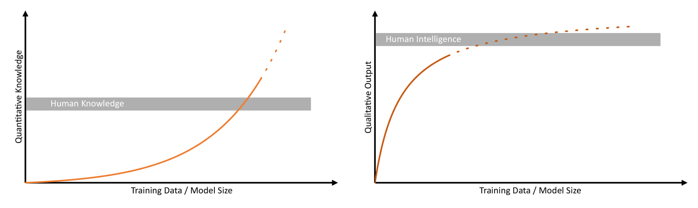

# 怎样衡量大型语言模型的智能水平？

发布时间：2024年07月30日

`LLM理论` `人工智能` `学术研究`

> How to Measure the Intelligence of Large Language Models?

# 摘要

> 随着ChatGPT等大型语言模型的问世，关于其智能、潜力与风险的讨论日益热烈。这些讨论中，不乏对“超人”AI崛起的激烈辩论，即那些远超人类智慧的AI系统。依图灵之见，现今顶尖语言模型已通过其经典测试。不仅如此，这些模型在多项测试中超越人类，成为连接生活、工业与科学的得力助手。然而，它们偶尔会在人类眼中简单至极的任务上失手，其可信度也变得难以捉摸。以学术为例，语言模型能以少量输入撰写令人信服的论文，但因事实一致性问题及文本中的幻觉现象，AI内容在学术界受到诸多限制。面对此景，我们不禁思考：人类智能的评估标准是否适用于AI？实际上，评估标准的选择已对AI智能的认知产生重大影响。我们主张，评估LLMs的智能，不仅需依赖统计指标，更应从定性与定量两方面深入剖析。

> With the release of ChatGPT and other large language models (LLMs) the discussion about the intelligence, possibilities, and risks, of current and future models have seen large attention. This discussion included much debated scenarios about the imminent rise of so-called "super-human" AI, i.e., AI systems that are orders of magnitude smarter than humans. In the spirit of Alan Turing, there is no doubt that current state-of-the-art language models already pass his famous test. Moreover, current models outperform humans in several benchmark tests, so that publicly available LLMs have already become versatile companions that connect everyday life, industry and science. Despite their impressive capabilities, LLMs sometimes fail completely at tasks that are thought to be trivial for humans. In other cases, the trustworthiness of LLMs becomes much more elusive and difficult to evaluate. Taking the example of academia, language models are capable of writing convincing research articles on a given topic with only little input. Yet, the lack of trustworthiness in terms of factual consistency or the existence of persistent hallucinations in AI-generated text bodies has led to a range of restrictions for AI-based content in many scientific journals. In view of these observations, the question arises as to whether the same metrics that apply to human intelligence can also be applied to computational methods and has been discussed extensively. In fact, the choice of metrics has already been shown to dramatically influence assessments on potential intelligence emergence. Here, we argue that the intelligence of LLMs should not only be assessed by task-specific statistical metrics, but separately in terms of qualitative and quantitative measures.

[Arxiv](https://arxiv.org/abs/2407.20828)