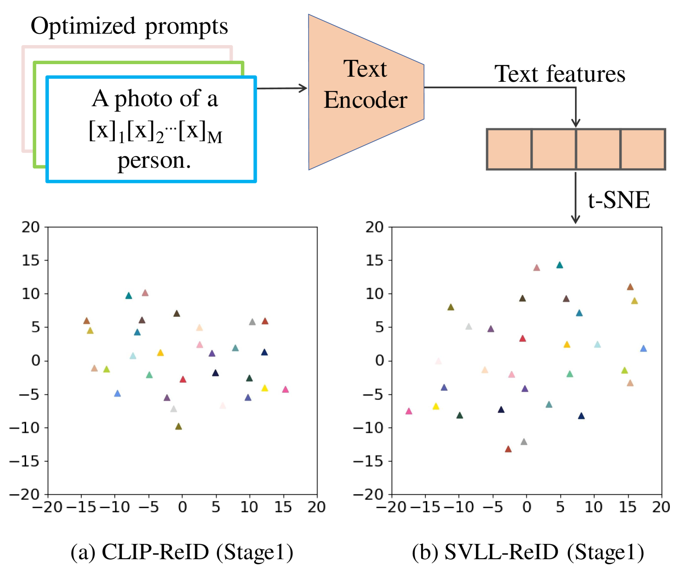
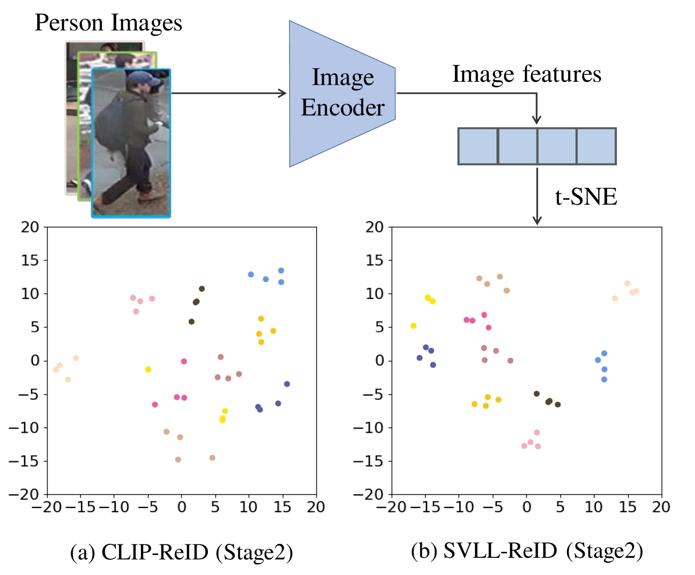
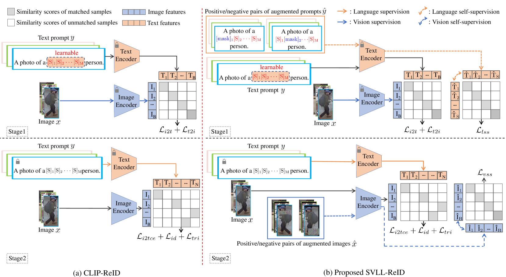
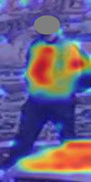
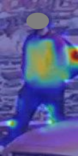
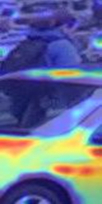
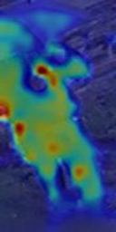
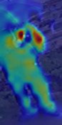

# 图像重识别领域，自监督学习与视觉-语言学习相融合，共同推动技术进步。

发布时间：2024年07月30日

`LLM应用` `计算机视觉` `人工智能`

> Image Re-Identification: Where Self-supervision Meets Vision-Language Learning

# 摘要

> 近期，CLIP 等大规模视觉-语言预训练模型在图像重识别（ReID）领域表现卓越。本研究探索自监督学习如何助力 CLIP 在 ReID 任务中的应用。我们首创 SVLL-ReID，通过两阶段训练整合自监督与预训练 CLIP，以提升 ReID 性能。研究发现：首阶段融入语言自监督能增强文本提示的辨识度；次阶段引入视觉自监督则提升图像特征的判别力。这表明，文本提示学习与图像特征学习分别受益于语言与视觉自监督。这些优势共同推动 SVLL-ReID 性能的提升。实验显示，在无具体文本标签的六个 ReID 基准数据集上，SVLL-ReID 性能超越现有技术。相关代码即将在 GitHub 公开。

> Recently, large-scale vision-language pre-trained models like CLIP have shown impressive performance in image re-identification (ReID). In this work, we explore whether self-supervision can aid in the use of CLIP for image ReID tasks. Specifically, we propose SVLL-ReID, the first attempt to integrate self-supervision and pre-trained CLIP via two training stages to facilitate the image ReID. We observe that: 1) incorporating language self-supervision in the first training stage can make the learnable text prompts more distinguishable, and 2) incorporating vision self-supervision in the second training stage can make the image features learned by the image encoder more discriminative. These observations imply that: 1) the text prompt learning in the first stage can benefit from the language self-supervision, and 2) the image feature learning in the second stage can benefit from the vision self-supervision. These benefits jointly facilitate the performance gain of the proposed SVLL-ReID. By conducting experiments on six image ReID benchmark datasets without any concrete text labels, we find that the proposed SVLL-ReID achieves the overall best performances compared with state-of-the-arts. Codes will be publicly available at https://github.com/BinWangGzhu/SVLL-ReID.

[Arxiv](https://arxiv.org/abs/2407.20647)