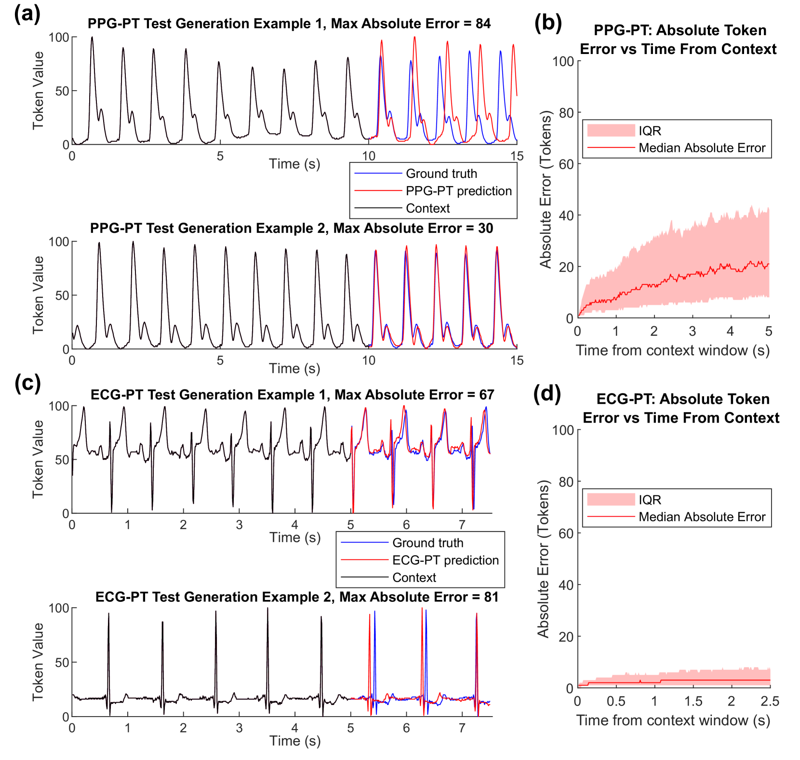
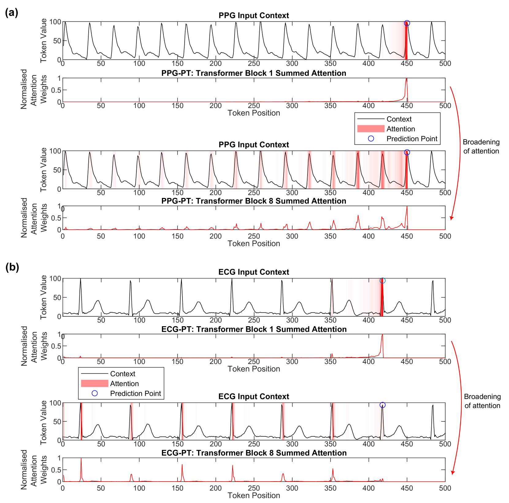
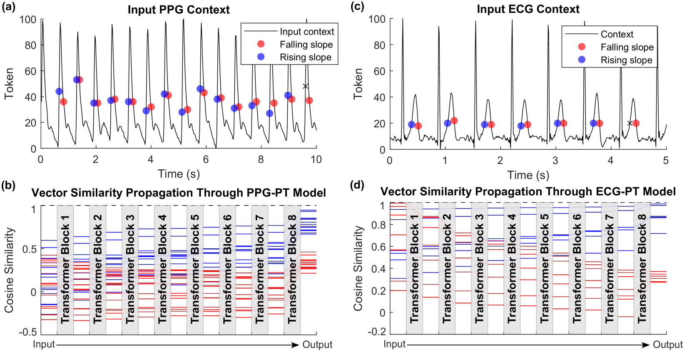
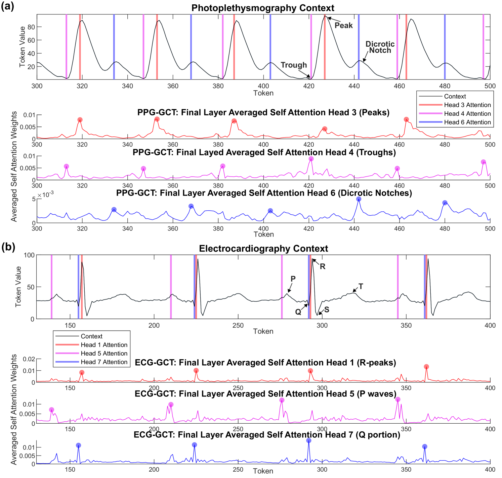
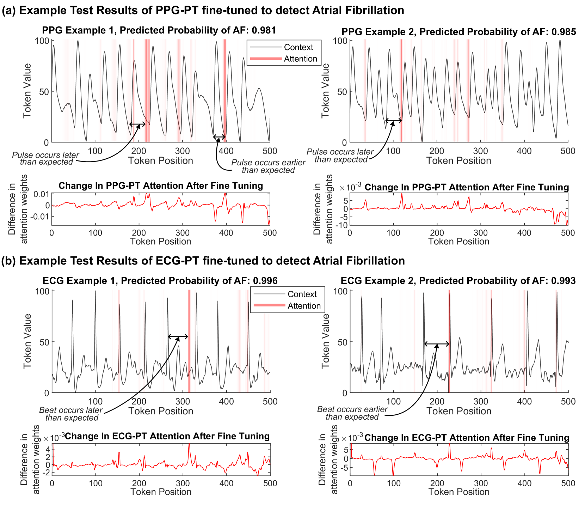

# 心脏时间序列数据的可解释预训练变换器

发布时间：2024年07月30日

`LLM应用` `人工智能`

> Interpretable Pre-Trained Transformers for Heart Time-Series Data

# 摘要

> 仅解码器的变换器构成了GPT系列大型语言模型的核心。我们将其框架应用于心脏时间序列数据，开发了PPG-PT和ECG-PT两个预训练心脏模型。这些模型不仅表现出色，而且完全透明：它们通过聚焦于心脏周期中的关键点进行预测，并在深层中扩展注意力；相同值的令牌在不同周期点形成独立集群；每个注意力头针对特定生理特征做出反应。此外，这些模型易于微调，例如在心房颤动分类任务中，仅需11分钟即可达到高AUC值，且微调后的模型同样具备解释性，能够精准识别心房颤动的相关信号。

> Decoder-only transformers are the backbone of the popular generative pre-trained transformer (GPT) series of large language models. In this work, we apply the same framework to periodic heart time-series data to create two pre-trained general purpose cardiac models, namely PPG-PT and ECG-PT. We demonstrate that both such pre-trained models are fully interpretable. This is achieved firstly through aggregate attention maps which show that the model focuses on similar points in previous cardiac cycles in order to make predictions and gradually broadens its attention in deeper layers. Next, tokens with the same value, that occur at different distinct points in the ECG and PPG cycle, form separate clusters in high dimensional space based on their phase as they propagate through the transformer blocks. Finally, we highlight that individual attention heads respond to specific physiologically relevent features, such as the dicrotic notch in PPG and the P-wave in ECG. It is also demonstrated that these pre-trained models can be easily fine-tuned for tasks such as classification of atrial fibrillation. In this specific example, the fine-tuning took 11 minutes of computer time, and achieved a leave-one-subject-out AUCs of 0.99 and 0.93 for ECG and PPG respectively. Importantly, these fine-tuned models are also fully explainable, with attention shifting to regions in the context that are strongly indicative of atrial fibrillation.

[Arxiv](https://arxiv.org/abs/2407.20775)