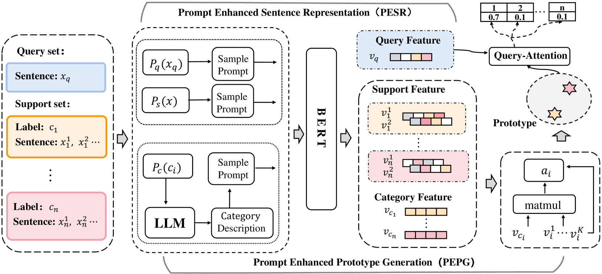
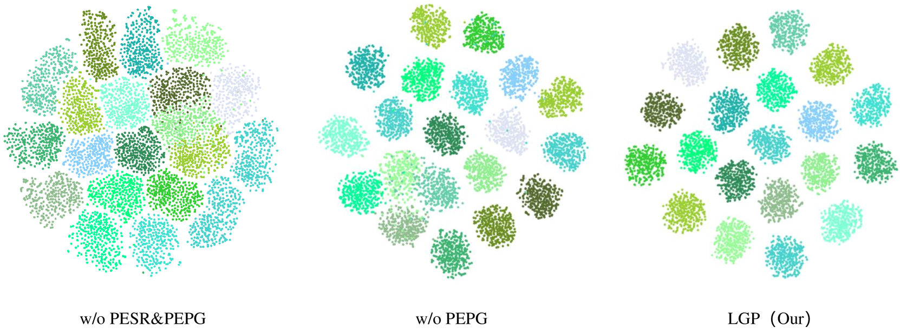
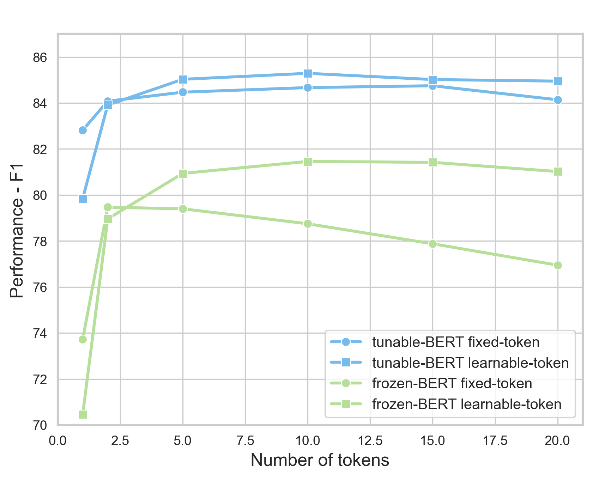

# 标签引导提示助力多标签少样本方面类别检测

发布时间：2024年07月30日

`LLM应用` `机器学习`

> Label-Guided Prompt for Multi-label Few-shot Aspect Category Detection

# 摘要

> 在多标签少样本方面类别检测任务中，我们提出了一种创新的标签引导提示方法，以优化句子和类别的表示。与传统依赖关键词的方法不同，我们的方法通过设计标签特定的提示，结合关键上下文和语义信息，有效避免了类别无关词汇的干扰。此外，通过大型语言模型生成的类别描述，不仅捕捉了方面类别的特征，还指导了类别原型的构建，增强了其区分性。实验结果显示，我们的方法在两个公共数据集上，Macro-F1分数提升了3.86% - 4.75%，显著超越了现有技术水平。

> Multi-label few-shot aspect category detection aims at identifying multiple aspect categories from sentences with a limited number of training instances. The representation of sentences and categories is a key issue in this task. Most of current methods extract keywords for the sentence representations and the category representations. Sentences often contain many category-independent words, which leads to suboptimal performance of keyword-based methods. Instead of directly extracting keywords, we propose a label-guided prompt method to represent sentences and categories. To be specific, we design label-specific prompts to represent sentences by combining crucial contextual and semantic information. Further, the label is introduced into a prompt to obtain category descriptions by utilizing a large language model. This kind of category descriptions contain the characteristics of the aspect categories, guiding the construction of discriminative category prototypes. Experimental results on two public datasets show that our method outperforms current state-of-the-art methods with a 3.86% - 4.75% improvement in the Macro-F1 score.

[Arxiv](https://arxiv.org/abs/2407.20673)