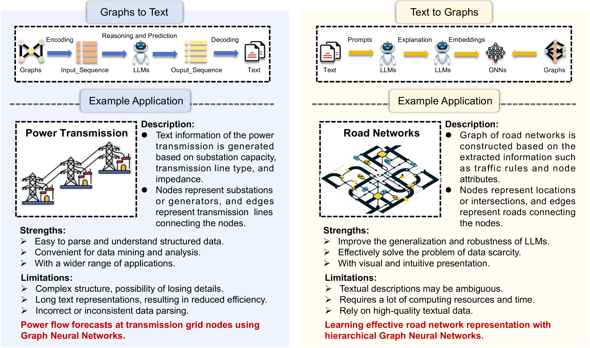
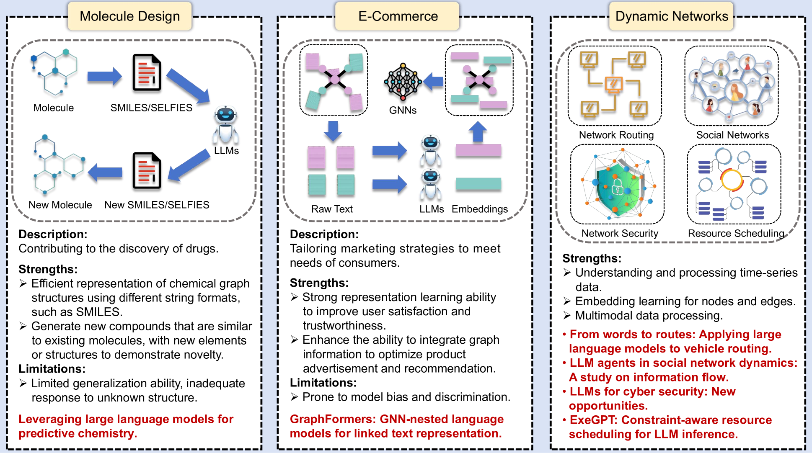
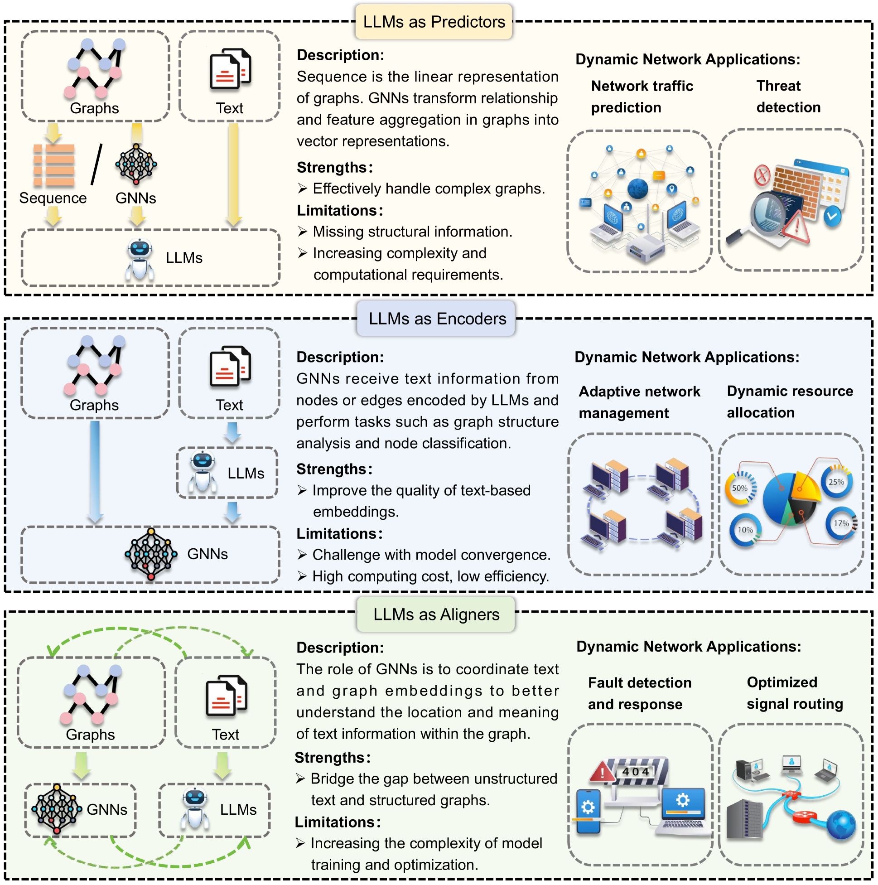
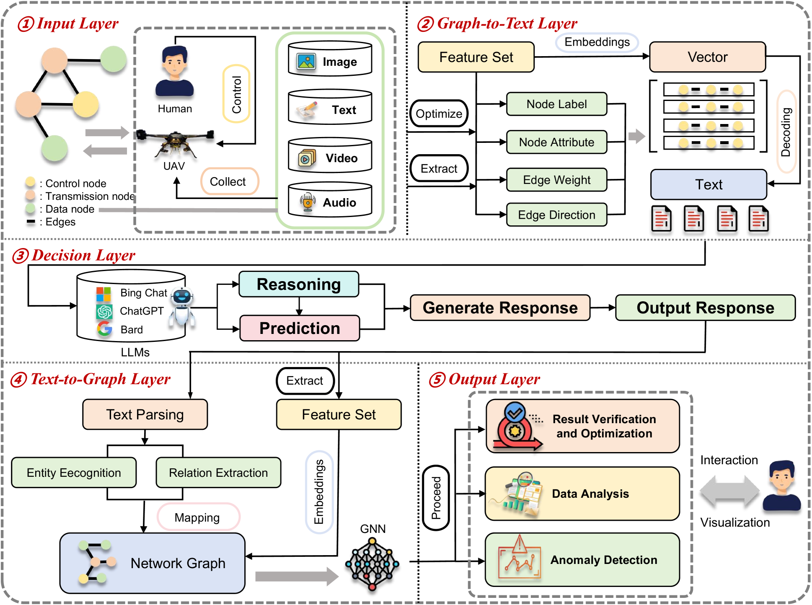
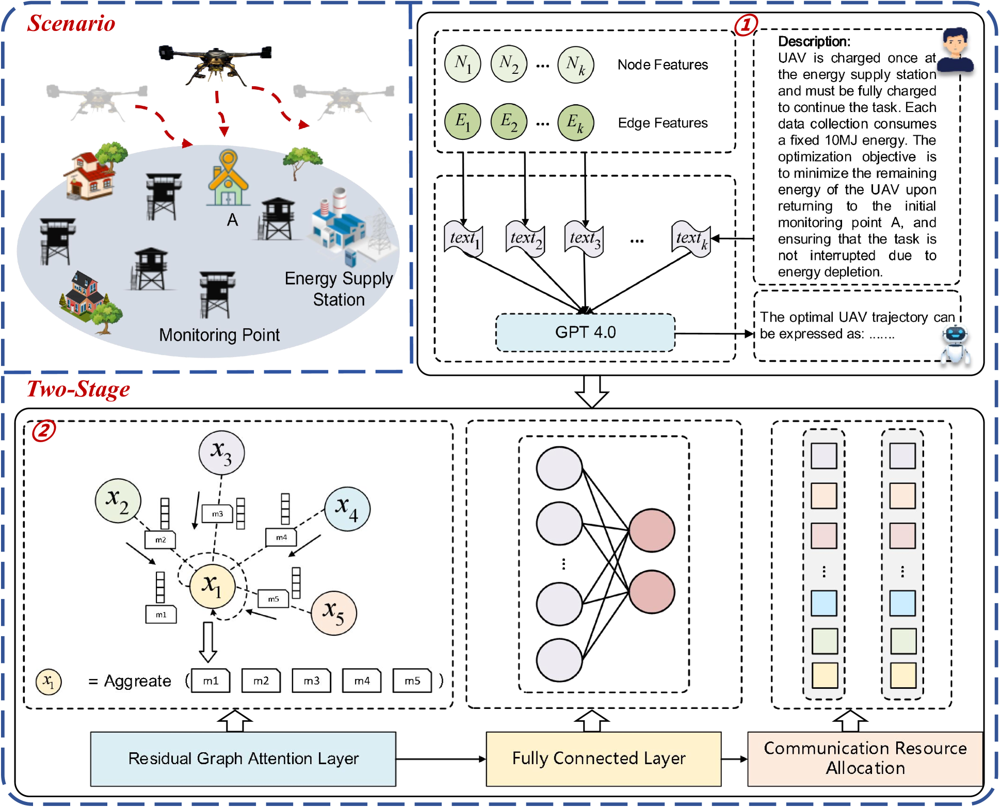

# 动态网络中的 LLM 支持图

发布时间：2024年07月30日

`LLM应用` `网络优化` `无人机技术`

> Large Language Model (LLM)-enabled Graphs in Dynamic Networking

# 摘要

> 生成式AI的最新进展，尤其是大型语言模型（LLMs）的融合，已深刻影响多个行业。同时，提升动态网络性能对于推动技术发展、满足用户在网络相关应用中的日益增长需求至关重要。本文深入探讨了LLMs与动态网络图的结合，聚焦于实际应用与研究。我们首先概述了LLM赋能图的关键技术和应用，并分析了其在动态网络中的优势。随后，从LLMs扮演不同角色的视角，详细介绍了LLM赋能图在动态网络中的应用。基于此，我们提出了一种创新的LLM赋能图框架，用于网络优化，并通过无人机网络案例研究，优化无人机路径和通信资源分配，验证了该框架的实际效果。最后，展望了未来的潜在发展方向。

> Recent advances in generative artificial intelligence (AI), and particularly the integration of large language models (LLMs), have had considerable impact on multiple domains. Meanwhile, enhancing dynamic network performance is a crucial element in promoting technological advancement and meeting the growing demands of users in many applications areas involving networks. In this article, we explore an integration of LLMs and graphs in dynamic networks, focusing on potential applications and a practical study. Specifically, we first review essential technologies and applications of LLM-enabled graphs, followed by an exploration of their advantages in dynamic networking. Subsequently, we introduce and analyze LLM-enabled graphs and their applications in dynamic networks from the perspective of LLMs as different roles. On this basis, we propose a novel framework of LLM-enabled graphs for networking optimization, and then present a case study on UAV networking, concentrating on optimizing UAV trajectory and communication resource allocation to validate the effectiveness of the proposed framework. Finally, we outline several potential future extensions.

[Arxiv](https://arxiv.org/abs/2407.20840)