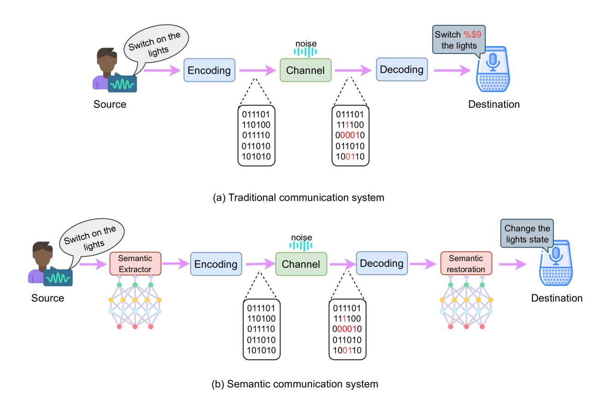
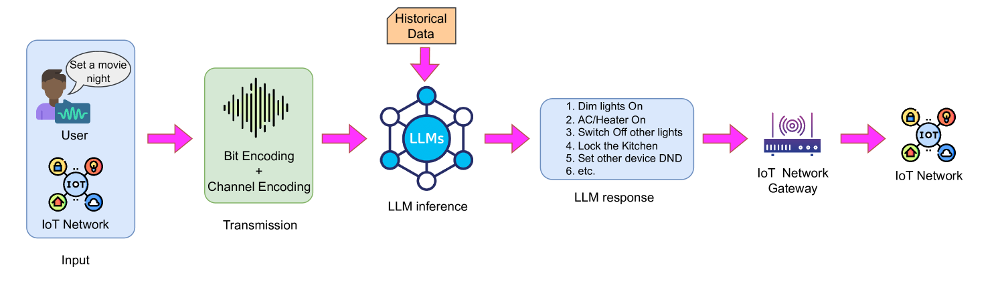
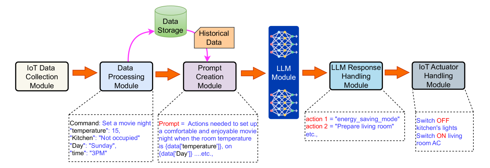

# 边缘物联网网络中，大型语言模型（LLM）助力语义通信

发布时间：2024年07月30日

`LLM应用` `物联网` `边缘计算`

> Large Language Models (LLMs) for Semantic Communication in Edge-based IoT Networks

# 摘要

> 随着5G和6G技术的兴起以及物联网的发展，语义通信因其突破传统通信的香农极限而备受瞩目。同时，大型语言模型（LLM）通过深度学习，能够模拟人类语言的生成与理解。本文探讨了在边缘计算环境下，如何利用LLM进行语义通信，以提升物联网网络的通信效率，并展望了相关应用的前景、挑战与机遇。

> With the advent of Fifth Generation (5G) and Sixth Generation (6G) communication technologies, as well as the Internet of Things (IoT), semantic communication is gaining attention among researchers as current communication technologies are approaching Shannon's limit. On the other hand, Large Language Models (LLMs) can understand and generate human-like text, based on extensive training on diverse datasets with billions of parameters. Considering the recent near-source computational technologies like Edge, in this article, we give an overview of a framework along with its modules, where LLMs can be used under the umbrella of semantic communication at the network edge for efficient communication in IoT networks. Finally, we discuss a few applications and analyze the challenges and opportunities to develop such systems.

[Arxiv](https://arxiv.org/abs/2407.20970)